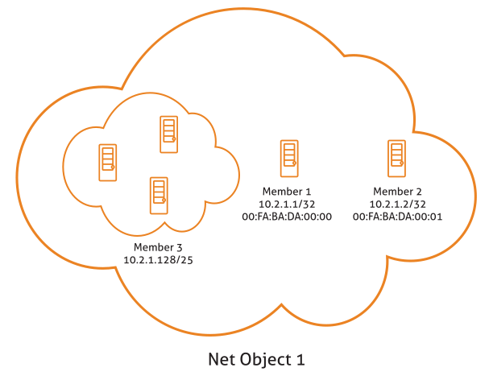
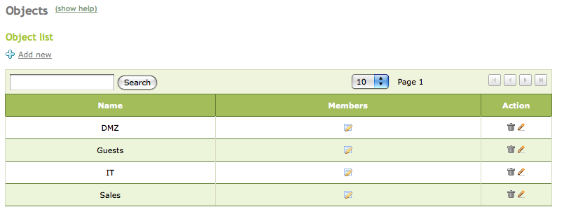
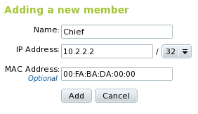
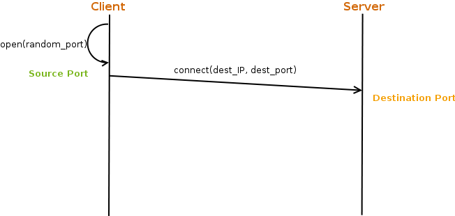
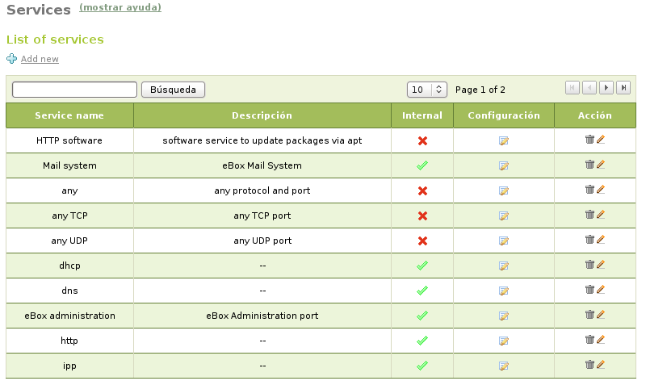

.. _abs-ref:

High-level eBox network abstractions
************************************

.. sectionauthor:: José A. Calvo <jacalvo@ebox-platform.com>
                   Isaac Clerencia <iclerencia@ebox-platform.com>
                   Enrique J. Hernández <ejhernandez@ebox-platform.com>
                   Víctor Jímenez <vjimenez@warp.es>
                   Javier Uruen <juruen@ebox-platform.com>

Network objects
===============

**Network objects** are a way of giving a name to a network
element or a group of elements. They are used to simplify and
subsequently facilitate network configuration management by being
able to select behavior for these objects.

To give an example, they can be used to give a significant name to
an IP address or a group of IP addresses. In the case of the latter, instead
of defining access rules for each of the addresses,
they merely have to be defined for the network object so that all
the addresses belonging to the object take on this
configuration.

   *GRAPHIC:  representation of network objects*

Management of network objects with eBox
---------------------------------------

For object management in eBox, go to the submenu :menuselection:`Objects`
and create new objects with an associated
:guilabel:`name` and a series of members.

   General appearance of the network object module

Objects can be created, modified and deleted. These objects will be used
later by other modules, such as the firewall, the *Web
cache proxy* or the mail service.

Each one will have at least the following values:
:guilabel:`name`, :guilabel:`IP address` and :guilabel:`network
mask` using CIDR notation. The physical address will only make sense
for members with a single physical machine.

The members of an object can overlap the members of another; therefore,
great care must be taken when using them in the remaining modules to
obtain the desired configuration and avoid security problems.

Network services
================

A **network service** is the abstraction of one or more applicable
protocols that can be used in other modules, such as the firewall
or the traffic-shaping module.

The use of the services is similar to that of the objects. It
was seen that with the objects it was possible to make an easy reference to a
group of IP addresses using a significant name. It is also possible to
identify a group of numerical ports that are difficult to remember
and time-consuming to enter several times in different
configurations, with a name in line with its function (more typically, the
name of the level-7 protocol or application using these ports).

   *GRAPHIC: client connection to a server*

Management of network services with eBox
----------------------------------------

For management in eBox, go to the submenu
:menuselection:`Services`, where it is possible to create new services,
which will have an associated name, description and a flag indicating whether
the service is external or internal. A service is internal if the
ports configured for that service are being used in the machine in
which eBox is installed. Furthermore, each service has a series of
members. Each one will have the following values:
:guilabel:`protocol`, :guilabel:`source port` and :guilabel:`destination
port`.

The value *any* can be entered in all of these fields, e.g.
to specify services in which the source port is
indifferent.

Bear in mind that in network services based on the
most commonly-used client/server model, clients often use any random
port to connect to a known destination
port. Well-known ports are considered those located between 0 and 1023,
registered ports the ones located between 1024 and 49151
and private or dynamic ports are those located between 49152 and 65535.

A list of known network services
approved by the IANA [#]_ for UDP and TCP protocols can be found in the
`/etc/services` file.

.. [#] The IANA (*Internet Assigned Numbers Authority*) is responsible
       for establishing the services associated with well-known
       ports. The full list can be found at
       http://www.iana.org/assignments/port-numbers.

The protocol can be TCP, UDP, ESP, GRE or ICMP. There is also a
TCP/UDP value to avoid having to add the same port used for
both protocols twice.

   General appearance of the network service module

Services can be created, modified and deleted. These services will be used
later on in the firewall or traffic shaping by merely referring to
the significant name.

Practical example
^^^^^^^^^^^^^^^^^
Create an object and add the following: a host with no MAC address, a
host with a MAC address and a network address.

To do so:

#. **Action:**
   Access :menuselection:`Objects`. Add **accountancy
   hosts**.

   Effect:
     The **accountancy hosts** object has been created.

#. **Action:**
   Access :guilabel:`Members` of the **accountancy
   hosts** object. Create **accountancy server** member with a network IP
   address, e.g. *192.168.0.12/32*. Create another member
   **backup accountancy server** with another IP address, e.g.
   *192.168.0.13/32*, and a valid MAC address, e.g.
   *00:0c:29:7f:05:7d*. Finally, create the **accountancy
   PC network** member with the IP address of a subnet of your local
   network, e.g. *192.168.0.64/26*. Finally, go to
   :guilabel:`Save changes` to confirm the configuration created.

   Effect:
     The **accountancy hosts** object will contain three permanent members, i.e.
     **accountancy server**, **backup accountancy server** and **accountancy
     PC network**.

.. include:: abstractions-exercises.rst
