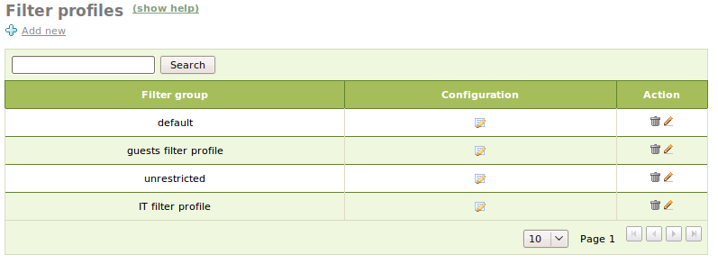
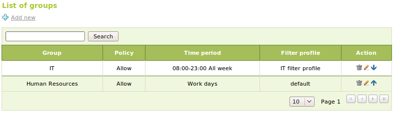
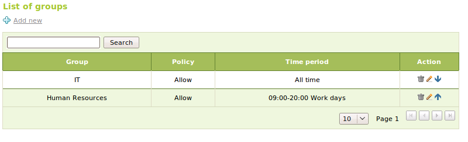

.. _advanced-proxy-ref:

HTTP Proxy advanced configuration
*********************************

.. sectionauthor:: Javier Amor García <javier.amor.garcia@ebox-technologies.com>,
                   Enrique J. Hernández <ejhernandez@ebox-technologies.com>,
                   Javier Uruen Val <juruen@ebox-technologies.com>,

Filter profiles configuration
=============================

You can configure filter profiles in
:menuselection:`Proxy HTTP --> Filter Profiles`.

You can configure and create new profiles that could be used by user groups or network objects.

The configuration options are
exactly the same as the ones we explained for the default profile. There is
just one thing that you have to take into account: it is possible to use
the default profile values in other profiles. To do so, you only need to
click on :guilabel:`Use default configuration`.

Filter profile per object
==========================
You can select a filter profile for a source object. The requests coming from
this source will use the chosen profile instead of the default profile.

To do so you should go to  :menuselection:`HTTP Proxy --> Objects policy` and
change the filter profile in the object's row. This option requires the object's policy is set to **Filter**.

Group based filtering
=====================

You can use user groups as a way to control access and to apply different
filtering profiles. The first step is to either set a global or a network
object policy to any of these policies: **Authorize and allow all**,
**Authorize and deny all** or **Authorize and filter**.

If any of these policies is set, users will have to provide credentials to
be able to use the HTTP proxy.

.. warning::
  Please note that you cannot use HTTP authentication with the transparent proxy
  mode enabled due to protocol limitations.

If you set a global policy that uses authentication you will also be able
to use this global policy for any group. This policy allows you to control the
access of group members and apply a custom filtering profile.

Group policies are managed in the menu entry named
:menuselection:`HTTP Proxy --> Group Policy`. You can allow or deny the access
for a given group. Note that this only affects the browsing. The use of the
content filter for the group depends on whether you have a global policy or
group policy that is set to filter. You can schedule when the group is allowed
to browse. If a group member tries to use the proxy out of the set schedule they
will be denied access.

Each group policy has a priority given by its position in the list (top-bottom
priority). Priority is important because users can be members of several groups.
The policy applied to the user will depend on the priority.

You can also select which filtering profile will be applied to the group.

Group-based filtering for objects
=================================

Remember that you can configure custom policies for network objects that will
override the global policy.

Likewise, in case you pick a policy that enforces authorization, you can also set custom
policies for a group. In this case, group policies only affect to the
permissions for browsing and not to the content filtering. The content filtering
policy is determined by the object policy. Authorization policies are
incompatible with the transparent mode.

Finally, you also have to take into account that you cannot set filtering
profiles to groups in an object policy. This means a group will use the
filtering profile that is set in its group global policy.

Practical Example
^^^^^^^^^^^^^^^^^

The goal of this exercise is to set access policies for two groups: **IT**
and **Accounting**. Members of the **Accounting** group will only be able
to access the Internet during work time, and its filtering profile
threshold will be set to **very strict**. On the other hand, members of the
**IT** group will be able to use the Internet at any time. They will also
skip the censorship of the content filter. However, they will not be able
to access those domains that are explicitly denied to all the
workers. For the sake of clarity, the needed users and groups are already
created.

These are steps you have to take:

#. **Action:**
   Go to eBox, click on :menuselection:`Module Status` and enable
   the :guilabel:`HTTP Proxy`.

   Effect:
    Once changes have been saved, users will need to authenticate with
    their login and password in order to surf the Internet.

#. **Action:**

   Go to `HTTP proxy -> Filter profiles`. Add a list of forbidden domains
   to the default profile. You can do this by clicking on the
   :guilabel:`Configuration` cell of the default profile, and then,
   clicking on the tab labeled :guilabel:`Domains filtering`. You
   can now add *youtube.com* and *popidol.com* to the :guilabel:`Domains rules`
   section.

   Go back to `HTTP proxy -> Filter Profiles`. Add two new profiles for your
   groups, **IT** and **Accounting**.

   The **Accounting** profile must enforce a very strict threshold on the
   content filter. We will stick to the defaults for the other options.
   To do so, you have to check the :guilabel:`Use default profile
   configuration` field  in :guilabel:`Domains Filtering` and
   :guilabel:`File Extensions filtering`.

   The **IT** profile will allow unfiltered access to everything but
   the forbidden domains. To enforce this policy, you need to check the
   :guilabel:`Use default profile configuration` field in :guilabel:`Domains
   Filtering`. You can grant free access for everything else by setting the
   content filter threshold to *Disabled*.

   Effect:
    We will enforce the required policy.

#. **Action:**

   Now you have to set a schedule and a filtering profile for groups. You can
   go to :menuselection:`HTTP Proxy --> Group Policy`.

   Click on :guilabel:`Add new`, select the *Accounting* group. Set the schedule
   from Monday to Friday, from 9:00 to 18:00. And select the *Accounting*
   profile.

   Likewise, you have to set a policy for the **IT** group. In this case, you
   don't have to add any restriction to the schedule.

   Effect:
     Once the changes have been saved, you can test if the configuration works
     as expected. You can use the proxy authentication with a user from each
     group. You will know that it is working properly if:

    * You can actually access *www.playboy.com* using the credentials
      of an *IT* user . However, if you use the credentials of an *Accounting*
      user, you are denied access.

    * You are not allowed to access any of the banned domains from any of the
      groups.

    * If you set the date in eBox to weekend, and you cannnot surf the Internet
      with an *Accounting** user, but you can with an *IT* user.

.. include:: advancedproxy-exercises.rst
