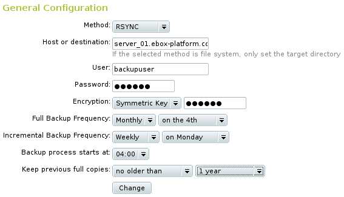
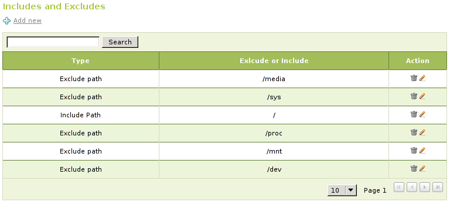
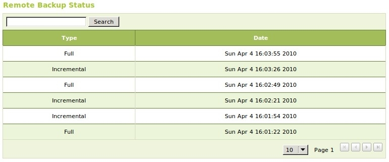
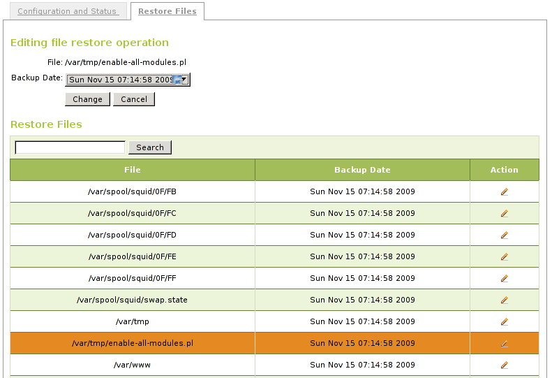
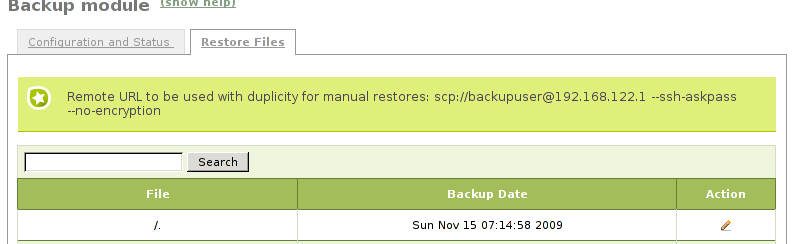
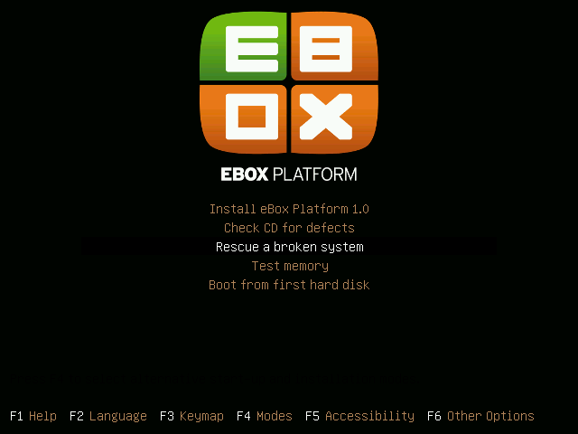
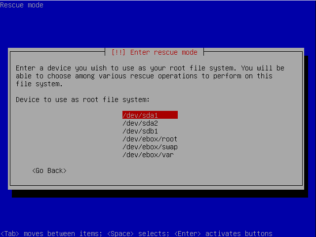
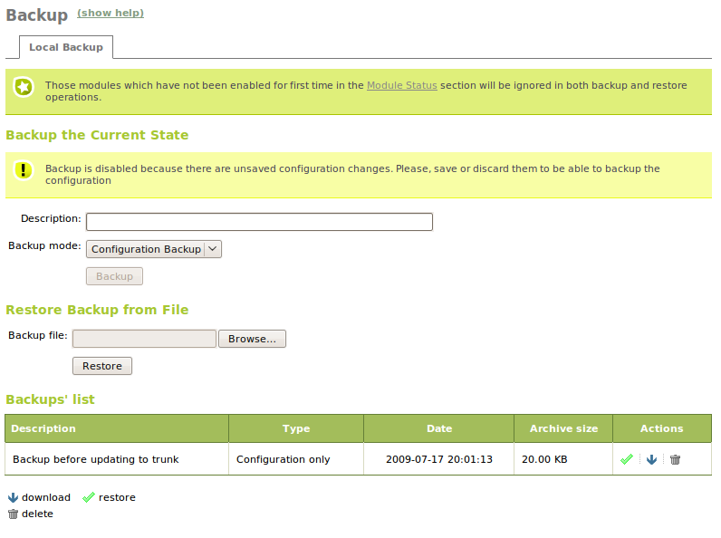

Backup
******

.. sectionauthor:: José Antonio Calvo <jacalvo@ebox-platform.com>
                   Enrique J. Hernández <ejhernandez@ebox-platform.com>
                   Jorge Salamero <jsalamero@ebox-platform.com>
                   Javier Uruen Val <juruen@ebox-platform.com>

The backup system design
------------------------

A data loss is an eventual accident that you have to be prepared to deal with.
Hardware failures, software bugs or human mistakes can cause an irreparable
loss of important data.

It is an unavoidable task to design a well tested **procedure to make, check
and restore backups**, taking into consideration both configuration-only and
full backups.

One of the first decisions we have to make is whether we are going to make
**full backups**, what is an exact copy of the data or **incremental backups**
that are copies of the differences from the first backup. Incremental backups
use less space but need some computation to restore the copy. A combination
of often incremental backups plus eventual full copies is the most usual
choice but this will depend on your needs and available storage resources.

.. TODO: Graphic with differences between full backup and incremental backup

Another important choice is whether to make the backups on the same host or
to use a remote host. A remote host gives more security because of being on a
different server. A hardware failure, software bug, human mistake or a security
compromise shouldn't affect the integrity of a remote backup. To minimize risks,
the remote backup server should be used exclusively for this purpose. Two
non-dedicated servers making backups of each other is definitely a bad idea, a
compromise in one of them leads to a compromise in the other one leaving you
without a safe backup copy.

Backup configuration with eBox
------------------------------

First of all, we need to decide if we are going to store our backups locally or
remotely. In case of using the latter we also need to specify what protocol will
be used to connect to the remote server.

   Select Configuration

.. FIXME: Update the shot with new Encryption field

:guilabel:`Method`:
  The current supported methods are *eBox Backup Storage (EU)*, *eBox
  Backup Storage (US Denver)*, *eBox Backup Storage (US West Coast)*,
  *FTP*, *SCP* and *File System*. Note that depending on the method
  you select you will have to provide more or less information such as
  the remote host address or user and password. All methods except
  *File System* are used to access remote servers. This means you will
  have to provide proper credentials to connect to the server. You may
  create an account in our store [#]_ for *eBox Backup Storage*
  methods, use this service to have a quick and safe remote location
  to store your data. If you use any of *eBox Backup Storage* methods
  you will not need to introduce the remote server address as eBox
  will have it configured automatically. On the other hand, if you
  select, *FTP* or *SCP* you will need to provide the remote server
  address.

.. [#] eBox Technologies store at https://store.ebox-technologies.com

.. warning::
      If you use *SCP*, you will need to execute `sudo ssh user@server` and
      accept the remote server's fingerprint to add it to the list of SSH
      known hosts. If you don't do this, the backup software will fail to
      connect to the server.

:guilabel:`Host or Destination`:
  For *FTP* and *SCP* you will need to provide the remote host name or IP
  address to connect. In case of using *File System*, introduce a local file
  system path. If you use a *eBox Backup Storage* method, then only the
  relative path is required.

:guilabel:`User`:
  User name to authenticate in the remote host.

:guilabel:`Password`:
  Password to authenticate in the remote host.

:guilabel:`Encryption`:
  You may cipher your backup data using a symmetric key by introducing
  it in the host, or you may select an already created GPG key to
  provide asymmetric encryption to your data.

:guilabel:`Full Backup Frequency`:
  This is used to tell the module how often a full backup is carried out. Values
  are: *Daily*, *Weekly*, *Monthly*.

:guilabel:`Number of full copies to keep`:
  This value is used to limit the number of full copies that are stored. This is
  an important value and you should understand what actually means. It is
  related to the *Full Backup Frequency*. If you set the frequency to *Weekly*, and
  the number of full copies to 2, your oldest backup copy will be two weeks old.
  Similarly, if you set it to *Monthly* and 4, your oldest backup copy will be 4
  months old. Set this value according to how long you wish to store backups and
  how much disk space you have.

:guilabel:`Incremental Backup Frequency`:
  This value is also related to *Number of full copies to keep*. A
  normal backup setting might consist of taking incremental copies
  between full copies. Incremental copies should be done more
  frequently than full copies. This means that if you make weekly full
  copies, incremental copies should be set to daily, but it does not
  make sense to set it to same frequency as the full copies. To
  understand better this field let's see an example:

  :guilabel:`Full Backup Frequency` is set to
  weekly. :guilabel:`Number of full copies to keep` is set
  to 4. :guilabel:`Incremental Backup Frequency` to daily. This means
  that you will end up having 4 weekly full backups, and between every
  weekly backup you will have daily backups. That is a month worth of
  backed up data. And it also means that you could restore any
  arbitrary day of that month.

:guilabel:`Backup process starts at`:
  This field is used to set the time at when the backup process starts. It is
  a good idea to set it to times when nobody is in the office as it can consume a
  lot of upload bandwidth.

Configuring what directories and files are backed up
~~~~~~~~~~~~~~~~~~~~~~~~~~~~~~~~~~~~~~~~~~~~~~~~~~~~

The default configuration will backup the whole file system. This means that in
the event of a disaster you will be able to restore the machine completely. It is
a good idea not change this configuration unless the space on your remote server
is very limited. A full backup of an eBox machine with all its modules takes
around 300 MB.

   Include and exclude list

The default list of excluded directories is: `/mnt`, `/dev`, `/media`, `/sys`,
and `/proc`. It is usually a bad idea to include those directories, and in some
cases, the backup process will fail.

The default list of included directories is: `/`.

You can also exclude file extension using shell characters. For example, if you
want to skip *AVI* files from the backup, you can select *Exclude regexp*
and add `*.avi`.

Checking backup status
~~~~~~~~~~~~~~~~~~~~~~

You can check the status of your backup under the section *Remote Backup
Status*. In that table, you will see the type of backup, full or
incremental, and the date when it was taken.

   Backup status

How to start a backup process manually
~~~~~~~~~~~~~~~~~~~~~~~~~~~~~~~~~~~~~~

The backup process is started automatically at configured time. However,
if you need to start a backup process manually, you can run::

    # /usr/share/ebox-ebackup/ebox-remote-ebackup --full

Or, to  start an incremental backup::

    # /usr/share/ebox-ebackup/ebox-remote-ebackup --incremental

Restoring files
~~~~~~~~~~~~~~~

There are two ways of restoring a file. It depends on the size and type of the
file or directory that you need to restore.

It is possible to restore files directly from the eBox interface. In the section
:menuselection:`Backup --> Restore Files` you have access to the list of all the remote files and
directories, and also the available dates to be restored. Use this method with
small data files, if they are too big it will take too long and you won't be
able to use the web interface during the process of the operation. You must be
very careful with the type of file you are restoring. It is usually safe to
restore data files that are not used by applications at the moment of the
restoring process. This data files will be placed under  `/home/samba/`.
However, it is very dangerous to restore system directories such as `/lib`,
`/var`, `/usr` while the system is running. **Do not** do that unless you know what
you are doing.

   Restore file

Big files and system directories must be restored manually. Depending on the use
of the file, you can restore it safely while your system is running. However,
for system directories you will have to use a rescue CD and proceed as we
explain later.

In any case, you must know how the underneath used software works. **duplicity**
is tool used by eBox. The process to restore a file or directory is actually
very simple. You must run the following command::
  
  duplicity restore --file-to-restore -t 3D <file or dir to restore> <remote url and args> <destination>

.. [#] *duplicity*: Encrypted bandwidth-efficient backup using the
       rsync algorithm <http://duplicity.nongnu.org/>.

The flag *-t* is used to select the backup date to restore. In this case, *3D*
means to restore a copy that is three days old. Using *now* you can restore the
latest available copy.

You can fetch the *<remote url and args>* on the top note in the section
:guilabel:`Restore Files` in the eBox interface.

   Remote url and arguments

For example, if you need to recover the file
`/home/samba/users/john/balance.odc` you would run the following
command::
    
    # duplicity restore --file-to-restore home/samba/users/john/balance.odc \
      scp://backupuser@192.168.122.1 --ssh-askpass --no-encryption /tmp/balance.odc

The above command would restore the file in `/tmp/balance.odc`. If you need to
overwrite a file or directory during a restoring operation you will need to add
the flag *--force*, otherwise duplicity will refuse to overwrite.

How to recover on a disaster
----------------------------

Knowing the procedure and having the abilities and experience to successfully
restore a backup in a critical situation is as important as making backups.
You should be able to restore services as soon as possible when a disaster
interrupts the systems.

To recover from a total disaster, you would have to boot the system using rescue
CD-ROM that includes the backup software duplicity. We will be using *grml*.

.. [#] *grml* <http://www.grml.org/>.

Download the *grml* image and boot the machine with it. You can use the
parameter *nofb* if you have issues with your screen size.

   Boot grml

Once the boot process has finished you can start a shell by pressing
:kbd:`return`.

   Start a shell

If your network is not properly configured, you can run the command
`netcardconfig` to configure it.

Now you need to mount the hard disk where files will be restored. In this case,
we suppose we have our root partition in `/dev/sda1`. So we need to run::
    
    # mount /dev/sda1 /mnt

The above command will mount the partition under the `/mnt` directory. During
this example, we make a full restore. And to do that we remove all existing
directories in the partition. Of course, you could just remove and restore one
directory if you need to do so.

To remove the existing files to proceed with the full restore, run::

    # rm -rf /mnt/*

We need to install duplicity if it's not already installed with::

    # apt-get update
    # apt-get install duplicity

Before restoring a full backup we need to restore `/etc/passwd` and
`/etc/group`. Otherwise, we can end up with a wrong file owner. The main
issue is that *duplicity* saves the user and group names of a file and not
its numerical values. We will run into problems if we restore the file with
a system that has different UID or GID number. To avoid this we can just
overwrite `/etc/passwd` and `/etc/group` on the rescue system first. Run::

    # duplicity restore --file-to-restore etc/passwd \
    # scp://backupuser@192.168.122.1 /etc/passwd --ssh-askpass --no-encryption --force

    # duplicity restore --file-to-restore etc/group \
    # scp://backupuser@192.168.122.1 /etc/group --ssh-askpass --no-encryption --force

.. warning::
    If you use *SCP*, you will need to execute `sudo ssh user@server` to add
    the remote server to the list of SSH known hosts. If you don't do this,
    duplicity will fail to connect. 

Now, we are ready to proceed with the a full restore running *duplicity*
manually::

    # duplicity restore  scp://backupuser@192.168.122.1 /mnt/ --ssh-askpass --no-encryption --force

You have to create the directories excluded from the backup. You should also
clean up the temporal directories.::

    # mkdir -p /mnt/dev
    # mkdir -p /mnt/sys
    # mkdir -p /mnt/proc
    # rm -fr /mnt/var/run/*
    # rm -fr /mnt/var/lock/*

The restoring proccess has finished and you can reboot now.

.. _conf-backup-ref:

Configuration backups
---------------------

In addition, eBox Platform has another way to make configuration backups
and restore them from the interface itself. This method backs up the
configuration of all modules that have been enabled at some point, as well as
the LDAP users and any other additional files required by each of these modules.

The backup can also include the data stored by these modules
(home directories, voicemail, etc.) but from 1.2 onwards this way
has been deprecated in favour of the first explained method because
it can deal better with huge data sets.

To make these backups, you should go, as usual, to
:menuselection:`System --> Backup`. You will not be able to make a new
backup if you have modified the configuration and you have not saved changes
as you can see in the following image.

Once introduced the :guilabel:`name` for the backup, select the backup type
(configuration or full) and click :guilabel:`Backup`. A screen will appear
showing the progress through the modules until it finishes with
**Backup successfully finished**.

After this, if you go back you will see a :guilabel:`Backup list`. Through this
list you will be able to restore, download to your local disk or delete any of
the stored backup copies. Some information like backup type, date and size will
be shown as well.

On :guilabel:`Restore backup from file` you can upload a backup file that
you have in your local disk, for example, from a previous eBox Platform
deployment on a different server, and restore it using :guilabel:`Restore`.

A confirmation will be requested on restore. You should be careful because
all the current configuration will be replaced. This action is similar
to the backup, a screen will appear, showing the progress and notifying
whether the operation was successful or an error occurred.

Command line tools for configuration backups
~~~~~~~~~~~~~~~~~~~~~~~~~~~~~~~~~~~~~~~~~~~~

Two command line tools are provided to export and import the
configuration from the console. They are available in `/usr/share/ebox`
and are `ebox-make-backup` and `ebox-restore-backup`.

**ebox-make-backup** allows you to make configuration backups. Among its
options you can select the backup type to do. One of them is
*bug-report*, which helps developers to debug bugs by including extra
information in the backup. Passwords are replaced in order to maintain user's
privacy. This backup type can't be done through the web interface.
You can see all the options using the `--help` parameter.

`ebox-restore-backup` allows you to restore configuration backups. It also
provides an option to extract information from the backup file. Another
interesting feature is the possibility of making partial restorations, restoring
only some specific modules.
This is very useful when restoring a module from an old version or when
restoring a module failed. You should be careful with the interdependencies
between the modules. For example, if you restore a firewall module backup
that uses objects and services you have to restore those first. But you still
have the option to force the script to ignore the dependencies that you can
use if really required.

To see all options of this program use the `--help` parameter.

.. include:: backup-exercises.rst
