Backup
******

.. sectionauthor:: José Antonio Calvo <jacalvo@ebox-platform.com>
                   Enrique J. Hernández <ejhernandez@ebox-platform.com>
                   Jorge Salamero <jsalamero@ebox-platform.com>

The backup system design
------------------------

A data loss is an eventual accident that you have to be prepared to deal with.
Hardware failures, software bugs or human mistakes can cause an irreparable
loss of important data.

It's an unavoidable task to design a well tested **procedure to make, check
and restore backups**, taking into consideration both configuration-only and
full backups.

One of the first decisions we have to make is whether we are going to make
**full backups**, what is an exact copy of the data or **incremental backups**
that are copies of the differences from the first backup. Incremental backups
use less space but need some computation to restore the copy. A combination
of often incremental backups plus eventual full copies is the most usual
choice but this will depend on your needs and available storage resources.

.. TODO: Graphic with differences between full backup and incremental backup

Another important choice is whether to make the backups on the same host or
to use a remote host. A remote host gives more security because of being on a
different server. A hardware failure, software bug, human mistake or a security
compromise shouldn't affect the integrity of a remote backup. To minimize risks,
the remote backup server should be used exclusively for this purpose. Two
non-dedicated servers making backups of each other is definitely a bad idea, a
compromise in one of them leads to a compromise in the other one leaving you
without a safe backup copy.

The given arguments justify a design where the backup server pulls data from
the backed up server and not the other way around. Access is only possible in
this way, keeping the backups secure. The purpose of this design is to avoid
that an unauthorized access on the main server can reach the backup server.

Backup configuration with eBox
------------------------------

A very complex backup system can be deployed over any eBox Platform
host, but we began introducing some preliminary backup support so
you can configure through the interface a simple incremental backup to
a local disk.

*rdiff-backup* [#]_ is the chosen tool to make the copies. The copies
are incremental but a bit different from how they are usually made. This
tool, instead of having an initial copy plus differences on top, has
a full copy of the last version and differences backwards. Thanks to
this feature, we can access and restore the last copy in a straightforward
manner.  It uses the *rsync* [#]_ protocol to compare source and destination,
transfering only the differences and making an efficient usage of the
bandwith. It also uses *SSH*, which simplifies the deployment over the
network.

.. [#] *rdiff-backup* <http://rdiff-backup.nongnu.org/>.
.. [#] *rsync* <http://rsync.samba.org/>.

Although we could make the backups on the same hard disk where is the system,
this option is not recommended because in the case of a hard disk failure, the
backup copy could be damaged. The first step is to install an additional disk
on the server. Hard disks are usually identified by the system as `/dev/sdx`
giving a letter to *x* for each disk: a, b, c, etc.

The following step is to create a partition and a file system on the hard disk.
The file `/proc/partitions` shows details about the connected disks and the
partitions they have. The following example is a host where the system is
on the first hard disk (`/dev/sda`) using LVM [#]_ and a second disk (`/dev/sdb`)
still without partitions::

    # cat /proc/partitions
    major minor  #blocks  name

       8        0  8388608 sda  <- first disk
       8        1   248976 sda1 <- first partition on the first disk
       8        2  8136922 sda2 <- second partition on the first disk
       8       16  1048576 sdb  <- second disk still without partitions
     254        0  4194394 dm-0 <- first LVM volume
     254        1   524288 dm-1 <- second LVM volume
     254        2  2097152 dm-2 <- third LVM volume

.. [#] :ref:`LVM-section`

To create a partition we are going to run the command **cfdisk**, followed by
the disk name, on the example presented above, `/dev/sdb`. This is a critial
step. We have to be especially careful to not modify the partitions on the
system disk because we could break it::

    # cfdisk /dev/sdb

Using the bottom menu, we create the partition:

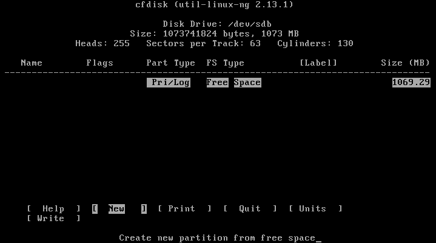

   Select *[New]*

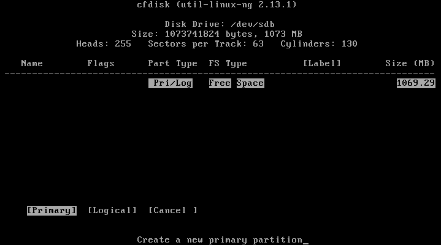

   Select partition type *[Primary]*

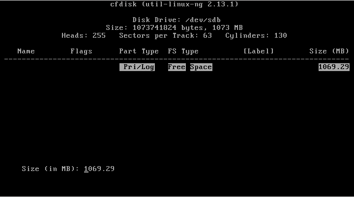

   Select the default size *Size (in MB)* (full disk)

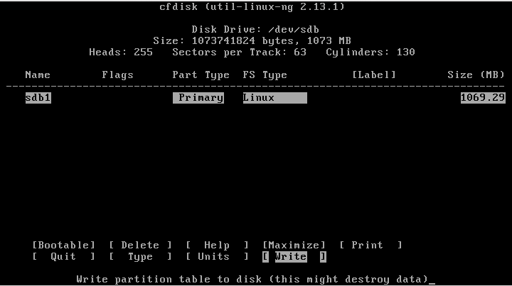

   Save changes on the partition table with *[Write]*

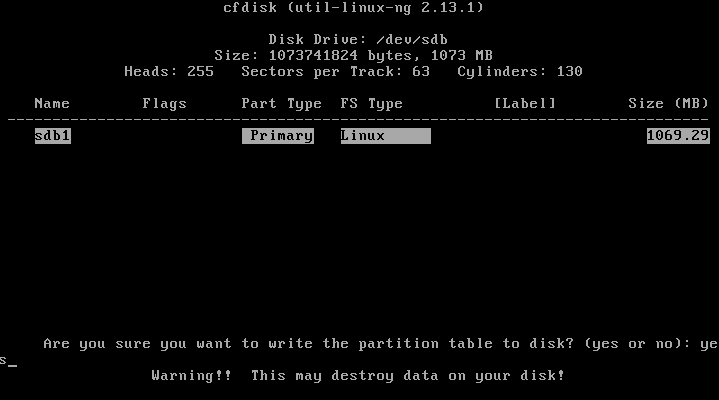

   Confirm changes with *yes*

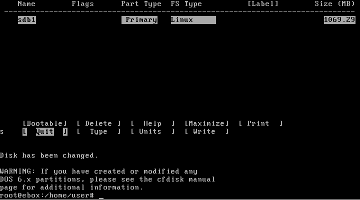

   Finish with *[Quit]*

Now we can see the newly created partition in the example as `/dev/sdb1`::

    # cat /proc/partitions
    major minor  #blocks  name

       8        0  8388608 sda  <- first disk
       8        1   248976 sda1 <- first partition on the first disk
       8        2  8136922 sda2 <- second partition on the first disk
       8       16  1048576 sdb  <- second disk
       8       17  1044193 sdb1 <- first partition on the second disk (recently created)
     254        0  4194394 dm-0 <- first LVM volume
     254        1   524288 dm-1 <- second LVM volume
     254        2  2097152 dm-2 <- third LVM volume

It is time to create the file system on the new partition. Again we have to be
very careful in order to create the file system on the right partition,
otherwise we would destroy all the existing data in other partition. In this
example we are going to use the *ext3* filesystem with the *dir_index* parameter
for better performance::

    # mkfs.ext3 -O dir_index /dev/sdb1
    Filesystem label=
    OS type: Linux
    Block size=4096 (log=2)
    Fragment size=4096 (log=2)
    65280 inodes, 261048 blocks
    13052 blocks (5.00%) reserved for the super user
    First data block=0
    Maximum filesystem blocks=268435456
    8 block groups
    32768 blocks per group, 32768 fragments per group
    8160 inodes per group
    Superblock backups stored on blocks:
            32768, 98304, 163840, 229376

    Writing inode tables: done
    Creating journal (4096 blocks): done
    Writing superblocks and filesystem accounting information: done

    This filesystem will be automatically checked every 31 mounts or
    180 days, whichever comes first.  Use tune2fs -c or -i to override.

We can create the mount point now::

    # mkdir /mnt/backup

Add the following line to your `/etc/fstab` file so it mounts it at boot time::

    /dev/sdb1       /mnt/backup      ext3    noatime        0       1

And finally mount it and you are ready::

    # mount /mnt/backup

Once you have the hard disk where you will store the backup, you can enable
the backup module from :menuselection:`Module Status`. Once enabled, click on
:guilabel:`Save Changes` and go to :menuselection:`Backup`. There
are three parameters we can configure here.

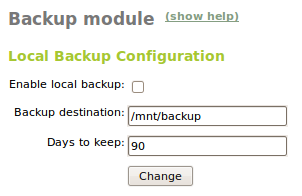

   **ebox-ebackup** configuration

:guilabel:`Backup path`:
  This is the path where you have mounted the disk where the backup is going
  to be stored. Defaults to `/mnt/backup/`.

:guilabel:`Days to keep`:
  This is the number of days from when the backups are going to be rotated.
  Copies older than this number of days will be deleted after the next
  successful copy.

After clicking :guilabel:`Save Changes`, you can check if the first copy has
finished and the current state of the backup with the following command::

    # rdiff-backup -l /mnt/backup/
    Found 0 increments:
    Current mirror: Wed May 20 21:56:32 2009

Note that the current module version still lacks the posibility to configure
which directories are being included in the backup and all of them are included
except `/dev`, `/proc` and `/sys` which are generated by the system at boot time.
There is a *rdiff-backup* log on `/mnt/backup/ebox-backup.log`.

How to recover on a disaster
----------------------------

Knowing the procedure and having the habilities and experience to successfully
restore a backup in a critial situation is as important as making backups.
You should be able to restore services as soon as posible when a disaster
interrupts the systems.

Restoring a file or a directory is as easy as running `rdiff-backup` with the
`-r` parameter giving `now` for the last copy or the number of days we want to
go back with the backup, followed by the origin and the destination where the
files will be restored::

    # rdiff-backup -r now /mnt/backup/etc/ebox /etc/ebox
    # rdiff-backup -r 10D /mnt/backup/home/samba/users/john /home/samba/users/john

On a total disaster, you would have to boot the system using a CD-ROM like the
eBox Platform installer (or any other Ubuntu installer) in *rescue mode* and
use the option *Rescue a broken system*.

.. figure:: images/backup/ebox_restore_01.png
   :scale: 70
   :alt: Boot with *Rescue a broken system*
   :align: center

   Boot with *Rescue a broken system*

At the beginning, you will have to follow the same steps than on system install.
Those questions only set up the temporary system without modifying the
installed one. Continue until the rescue menu appears.

In this menu, select the partition where `/boot` is if you have the partition
scheme recommended by the developers (`/boot` + LVM). Otherwise, select the
partition where `/` is mounted. In this case, you will already have
the system mounted under `/target` and you will only have to mount the
remaining partitions.

.. figure:: images/backup/ebox_restore_02.png
   :scale: 50
   :alt: Select `/dev/sda1`
   :align: center

   Select `/dev/sda1`

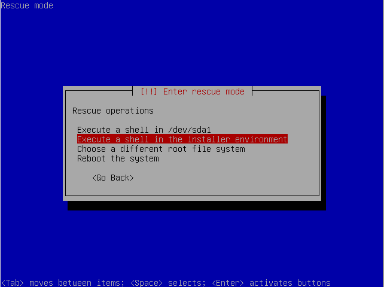

   Select *Execute a shell in the installer environment*

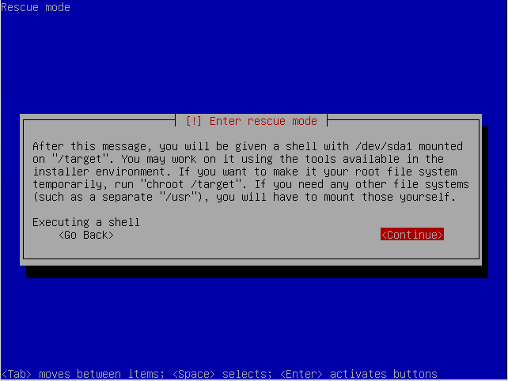

   An info message

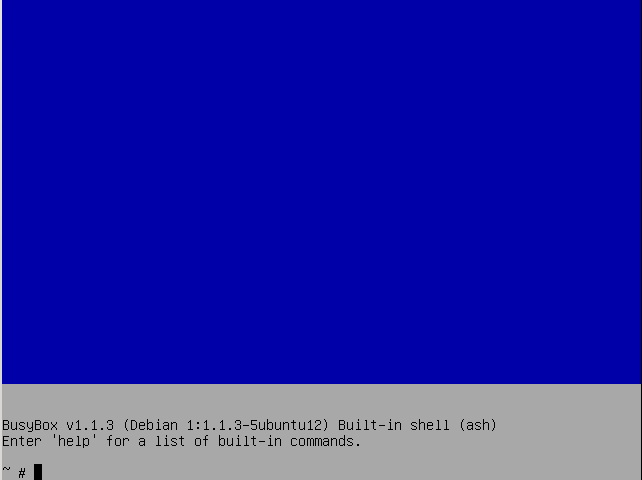

   A restricted *shell*

First of all, we have to create a mount point for the backup hard disk and mount
it. The partition in the example is `/dev/sdb1` with an *ext3* file system::

    # mkdir /mnt/backup
    # mount -t ext3 /dev/sdb1 /mnt/backup

Now you have to create another mount point for the system root and mount it.
Once mounted, delete everything to start from a clean environment::

    # mkdir /mnt/ebox
    # mount -t ext3 /dev/ebox/root /mnt/ebox
    # rm -fr /mnt/ebox/*

If you had other partitions which needed to be restored as well, like
usually happens with `/var`, just do the same. Also with the
other partitions if they have been compromised (`/home`, `/var/vmail`,
etc.)::

    # mkdir /mnt/ebox/var
    # mount -t xfs /dev/ebox/var /mnt/ebox/var
    # rm -fr /mnt/ebox/var/*

And now you can restore the backup::

    # cd /mnt/backup/
    # cp -ra * /mnt/ebox/

There are some issues that have to be dealt with to get the system booting.
You have to create the directories excluded from the backup. You should also
clean up the temporal directories and the *rdiff-backup* metadata file::

    # mkdir -p /mnt/ebox/dev
    # mkdir -p /mnt/ebox/sys
    # mkdir -p /mnt/ebox/proc
    # rm -fr /mnt/ebox/var/run/*
    # rm -fr /mnt/ebox/var/lock/*
    # rm -fr /mnt/ebox/rdiff-backup-data

Now you just need to restore the `/boot` partition mounted on `/target`. If 
you are using the same partition for `/boot` and `/` you must skip this step or
you will lose your files in `/`. The commands for restore the `/boot` partition 
are::

    # rm -fr /target/*
    # mv /mnt/ebox/boot/* /target/

If you had mounted more partitions under `/mnt/ebox`, unmount them::

    # umount /mnt/ebox/var

Create `/var/run` and `/var/lock` which are needed to boot the system.
Finally, unmount and exit::

    # mkdir -p /mnt/ebox/var/run
    # mkdir -p /mnt/ebox/var/lock
    # umount /mnt/ebox
    # exit

The restoring proccess has finished and you can reboot now.

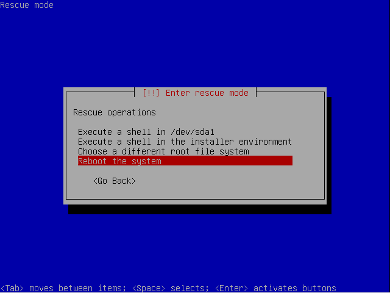

   Select *Reboot the system*

Configuration backups
---------------------

In addition, eBox Platform has another way to make configuration backups
and restore them from the interface itself. This method backs up the
configuration of all modules that have been enabled at some point, as well as
the LDAP users and any other additional files required by each of these modules.

The backup can also include the data stored by these modules
(home directories, voicemail, etc.) but from 1.2 onwards this way
has been deprecated in favor of the first explained method because
it can deal better with huge datasets.

To make these backups, you should go, as usual, to
:menuselection:`System --> Backup`. You will not be able to make a new
backup if you have modified the configuration and you have not saved changes
as you can see in the following image.

.. image:: images/backup/ebox_backup.png
   :scale: 60
   :alt: Make a backup
   :align: center

Once introduced the :guilabel:`name` for the backup, select the backup type
(configuration or full) and click :guilabel:`Backup`. A screen will appear
showing the progress through the modules until it finishes with
**Backup successfully finished**.

After this, if you go back you will see a :guilabel:`Backup list`. Through this
list you will be able to restore, download to your local disk or delete any of
the stored backup copies. Some information like backup type, date and size will
be shown as well.

On :guilabel:`Restore backup from file` you can upload a backup file that
you have in your local disk, for example, from a previous eBox Platform
deployment on a different server, and restore it using :guilabel:`Restore`.

A confirmation will be requested on restore. You should be careful because
all the current configuration will be replaced. This action is similar
to the backup, a screen will appear, showing the progress and notifying
whether the operation was successful or an error occurred.

Command line tools for configuration backups
--------------------------------------------

Two command line tools are provided to export and import the
configuration from the console. They are available in `/usr/share/ebox`
and are `ebox-make-backup` and `ebox-restore-backup`.

**ebox-make-backup** allows you to make configuration backups. Among its
options you can select the backup type to do. One of them is
*bug-report*, which helps developers to debug bugs by including extra
information in the backup. Passwords are replaced in order to maintain user's
privacy. This backup type can't be done through the web interface.
You can see all the options using the `--help` parameter.

`ebox-restore-backup` allows you to restore configuration backups. It also
provides an option to extract information from the backup file. Another
interesting feature is the posibility of making partial restorations, restoring
only some specific modules.
This is very useful when restoring a module from an old version or when
restoring a module failed. You should be careful with the interdependencies
between the modules. For example, if you restore a firewall module backup
that uses objects and services you have to restore those first. But you still
have the option to force the script to ignore the dependencies that you can
use if really required.

To see all options of this program use the `--help` parameter.

.. include:: backup-exercises.rst
