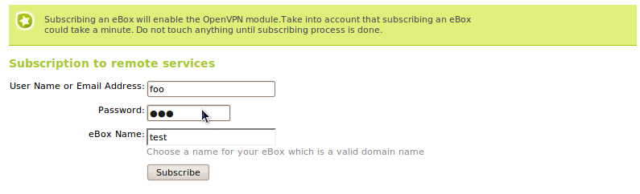
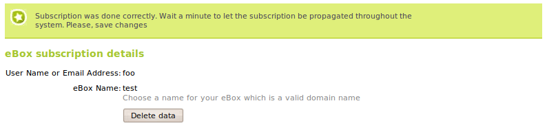
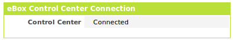
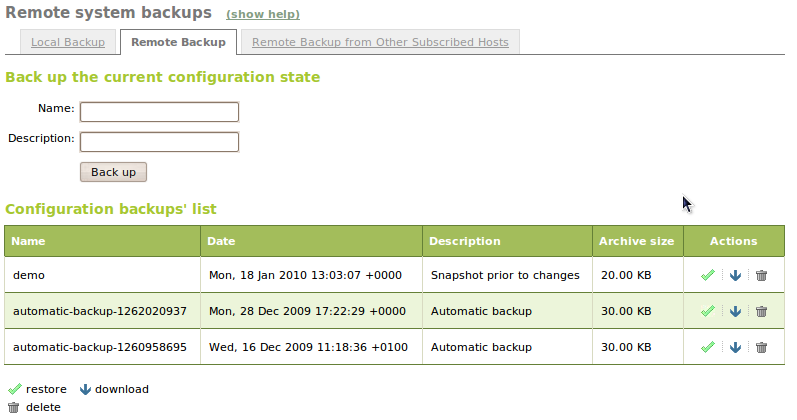
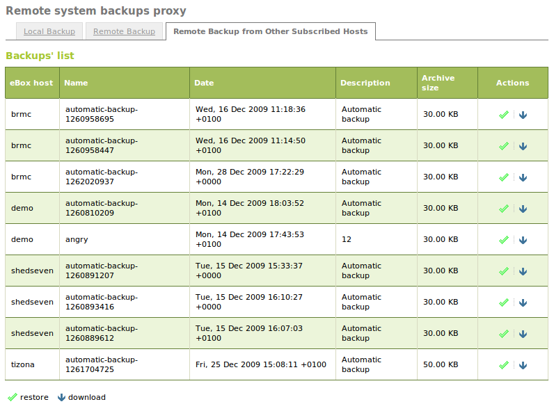

Control Center Client
*********************

.. sectionauthor:: Enrique J. Hernández <ejhernandez@ebox-platform.com>

**eBox Control Center** is a fault-tolerant solution that allows
centralized real-time monitoring and administration of multiple eBox
Platform installations. It includes features such as remote,
centralized and secure administration of groups of eBox installations,
automatic remote configuration backup, network monitoring and
customized reports. [#]_

.. [#] http://www.ebox-technologies.com/products/controlcenter/

Here we describe the client side configuration with eBox.

Subscribing eBox to the Control Center
--------------------------------------

In order to configure eBox to subscribe to the Control Center, you
must install `ebox-remoteservices` package which is installed by
default if you have used eBox installer. In addition to this, the
Internet connection should be available. Once everything is ready, go
to :menuselection:`Control Center` and fill the following fields:

User Name or Email Address:
  You must set the user name or the email address you use to sign in
  the Control Center Web site.

Password:
  The same pass phrase you use to sign in the Control Center Web site.

eBox Name:
  The unique name for your eBox within Control Center. This name is
  displayed from the control panel and it must be a valid domain name.
   Each eBox should have a different name, if two eBoxes use the same
  name for connecting to the Control Center, just one will be
  connected.

   Subscribing eBox to the Control Center

After entering the data, the subscription will take about a minute. Be
sure after subscribing, save changes. This process sets a VPN
connection to the Control Center, therefore it enables **vpn**
module. [#]_

.. [#] For more information about VPN module, go to :ref:`vpn-ref`
       section.

   After subscribing eBox to the Control Center
 
If the connection is working nicely with eBox Control Center, then a
widget will be shown in the dashboard indicating the connection was
done established correctly.

   Connection widget to the Control Center

Configuration backup to the Control Center
------------------------------------------

One of the features using the Control Center is the automatic
configuration backup [#]_ is stored in eBox Control Center. This backup is
done daily if any change has been done in eBox configuration. Go to
:menuselection:`System --> Backup --> Remote Backup` to check the
configuration backups that have been done. You may perform a manual
configuration backup, if you want to be sure a current configuration is
backed up correctly in eBox Control Center.

.. [#] The configuration backup in eBox is explained in
       :ref:`conf-backup-ref` section

   
   Remote configuration backup

You may restore, delete or download that configuration backup from the Control
Center. Additionally, to improve the disaster recovery, you may restore
or download the configuration backup from other subscribed eBoxes
using your name/email address and password pair. To do so, go to the
:menuselection:`System --> Backup --> Remote Backup from Other
Subscribed Hosts` tab.

   
   Remote configuration backup from other subscribed hosts

