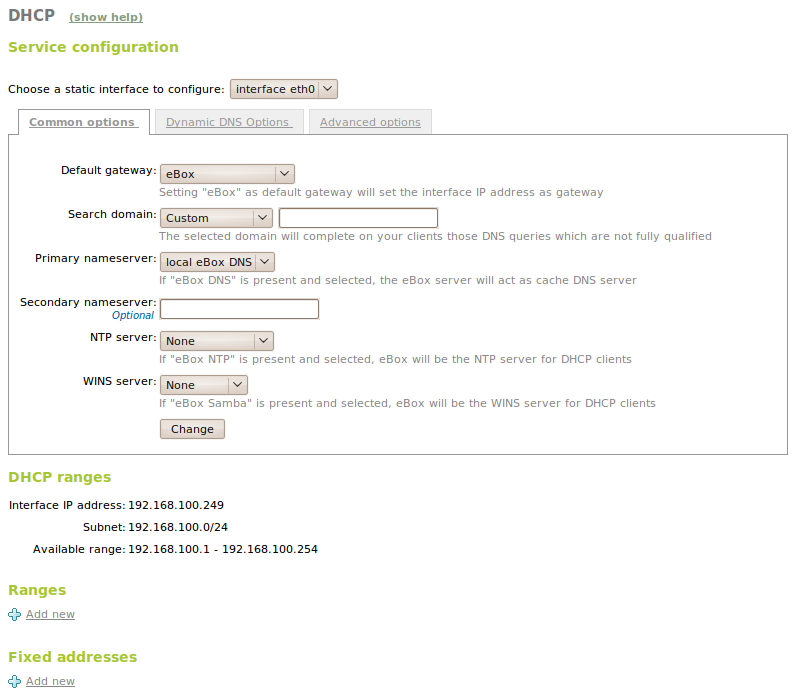
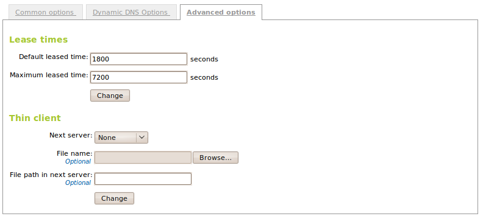
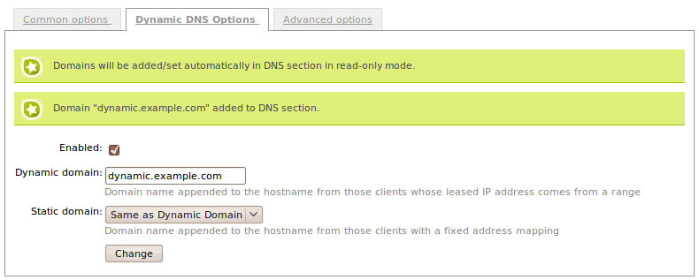

.. _dhcp-ref:

Network configuration service (DHCP)
************************************

.. sectionauthor:: José A. Calvo <jacalvo@ebox-platform.com>
                   Isaac Clerencia <iclerencia@ebox-platform.com>
                   Enrique J. Hernández <ejhernandez@ebox-platform.com>
                   Víctor Jímenez <vjimenez@warp.es>
                   Jorge Salamero <jsalamero@ebox-platform.com>
                   Javier Uruen <juruen@ebox-platform.com>

As indicated, **DHCP** (*Dynamic Host Configuration Protocol*) is a
protocol that enables a device to request and obtain an IP address
from a server with a list of available addresses to assign.

The DHCP service [#]_ is also used to obtain many other parameters, such as the
*default gateway*, the *network mask*, the *IP addresses for the
name servers* or the *search domain*, among others. Hence,
access to the network is made easier, without the need for
manual configuration done by clients.

.. [#] eBox uses "*ISC DHCP Software*" (https://www.isc.org/software/dhcp)
       to configure the DHCP service.

When a DHCP client connects to the network, it sends a
*broadcast* request and the DHCP server responds to valid requests
with an IP address, the lease time granted for that IP and the
parameters explained above. The request usually happens during
the client booting period and must be completed before
going on with the remaining network services.

There are two ways of assigning addresses:

Manual:
  Assignment is based on a table containing physical address
  (*MAC*)/IP address mappings, entered manually by the administrator.
Dynamic:
  The network administrator assigns a range of IP addresses for a request-
  and-grant process that uses the lease concept with a controlled
  period in which the granted IP remains valid. The server keeps
  a table with the previous assignments to try to reassign the same IP
  to a client in successive requests.

DHCP server configuration with eBox
===================================

To configure the DHCP service with eBox, at least one statically
configured interface is required. Once this is available, go to the
:menuselection:`DHCP` menu, where the DHCP server can be configured.

   Overview of DHCP service configuration

As indicated above, some network parameters can be sent with the
IP address. These parameters can be configured in the
:menuselection:`Common options` tab.

Default gateway:
  This is the gateway to be used by the client if it is unaware of
  another route to send the package to its destination. Its value can
  be :guilabel:`eBox`, a gateway already configured in the
  :menuselection:`Network --> Gateways` section or a :guilabel:`custom
  IP address`.

Search domain:
  In a network with hosts named in line with *<host>.sub.domain.com*,
  the search domain can be configured as "sub.domain.com". Hence, when
  seeking to resolve an unsuccessful domain name, another attempt can
  be made by adding the search domain to the end of it or parts of it.

  For example, if *smtp* cannot be resolved as a domain,
  *smtp.domain.com* will be tried on the client host.

  The search domain can be entered or one configured in the DNS
  service can be selected.

Primary name server:
  This is the DNS server [#]_ that the client will use when a name is to be
  resolved or an IP address needs to be translated into a name. Its
  value can be :guilabel:`local eBox DNS` (if the eBox DNS server is to be
  queried, take into account **dns** module must be enabled) or an IP
  address of another DNS server.

.. [#] Go to :ref:`dns-chapter-ref` section for more details about
       this service.

Secondary name server:
  DNS server that the client will use if the primary one is not
  available. Its value must be the IP address of a DNS server.

NTP server:
  This is the **NTP** (Network Transport Protocol) [#]_ server that the
  client will use when it wants to synchronize its clock using the
  network. Its value can be none, :guilabel:`local eBox NTP` (take into account
  **ntp** module must be enabled) or a :guilabel:`custom` NTP server.

.. [#] Check out :ref:`ntp-chapter-ref` section for details about the
       time synchronization service

WINS server:
  This is the **WINS** (Windows Internet Name Service) [#]_ server the
  client will use to resolve NetBIOS names. Its value can be none,
  :guilabel:`local eBox` (take into account **samba** must be enabled)
  or a :guilabel:`custom` one.

.. [#] WINS is the implementation for **NBNS** (NetBIOS Name
       Service). For more information about it, check out
       :ref:`filesharing-chapter-ref` section.

The common options display the ranges of addresses distributed by DHCP
and the addresses assigned manually. For the DHCP service to be
active, there must be at least one range of addresses to be
distributed or one static assignment. If not, the DHCP server will
**not** serve IP addresses even if the service is listening on all the
network interfaces.

The ranges of addresses and the static addresses available for assignment
from a certain interface are determined by the static address
assigned to that interface. Any free IP address from the corresponding
subnet can be used in ranges or static assignments.

Adding a range in the :guilabel:`Ranges` section is done by entering a
:guilabel:`name` by which to identify the range and the values to be
assigned within the range appearing above.

Static assignments of IP addresses are possible to determined physical
addresses in the :guilabel:`Fixed Addresses` section. An address
assigned in this way cannot form part of any range. You may add an
optional :guilabel:`description` for that assignment as well.

   Appearance of the advanced configuration for DHCP

The dynamic granting of addresses has a deadline before which
renewal must be requested (configurable in the
:menuselection:`Advanced options` tab) that varies from 1,800 seconds
to 7,200 seconds. Static assignments do not expire and, therefore, are
unlimited leases.

A **Lightweight Client** is a special machine with no hard drive that is booted via
the network by requesting the booting image (operating system) from
a lightweight client server.

eBox allows the PXE server [#]_ to which the client must connect to be configured. The
PXE service, which is responsible for transmitting everything required for the
lightweight client to be able to boot its system, must be configured
separately.

.. [#] **Preboot eXecution Environment** is an environment to boot
   PCs using a network interface independent of the
   storage devices (such as hard drives) or operating
   systems installed.
   (http://en.wikipedia.org/wiki/Preboot_Execution_Environment)

The PXE server may be an IP address or a name, in which case the path
to the boot image or eBox must be indicated, in which case
the image file can be loaded.

.. _dynamic-dns-updates-ref:

Dynamic DNS updates
^^^^^^^^^^^^^^^^^^^

The DHCP server has the ability to dynamically update the DNS server
[#]_. That is, the DHCP server will update in real time the **A** and
**PTR** records to map an IP address to a host name and vice versa
when an IP address is leased and released. The way that is done, it
depends on the DHCP server configuration.

.. [#] The :rfc:`2136` explains how to do dynamic updates in the
       Domain Name System

eBox provides dynamic DNS feature integrating **dhcp** and **dns**
modules from the same box in :menuselection:`Dynamic DNS Options` tab. In
order to enable this feature, the DNS module must be enabled as
well. You may provide a :guilabel:`Dynamic domain` and a
:guilabel:`Static domain`, which both will be added automatically to
the DNS configuration. The dynamic domain maps the host names whose IP
address corresponds from a range and the associated name follows this
pattern: *dhcp-<leased-IP-address>.<dynamic-domain>*. Regarding to the
static domain, the host name will follow this pattern:
*<name>.<static-domain>* being the name the one you set on
:guilabel:`Fixed addresses` table. Take into account that any DHCP
client name update is ignored from eBox.

   Dynamic DNS updates configuration

The update is done using a secure protocol [#]_ and, currently, only
direct mapping is supported.

.. [#] Communication is done using **TSIG** (Transaction SIGnature) to
       authenticate the dynamic update requests using a shared secret
       key.

Practical example
^^^^^^^^^^^^^^^^^

Configure the DHCP service to assign a range of 20 network addresses.
Check from another client host using *dhclient* that it works
properly.

To configure **DHCP**, the **Network** module must be enabled and
configured. The network interface on which the DHCP server is to be
configured must be static (manually assigned IP address) and the range to
assign must be within the subnet determined by the network mask
of that interface (e.g. range 10.1.2.1-10.1.2.21 of an interface
10.1.2.254/255.255.255.0).

#. **Action:**
   Enter eBox and access the control panel. Enter
   :menuselection:`Module status` and enable the **DHCP** module by marking its
   checkbox in the :guilabel:`Status` column.

   Effect:
     eBox requests permission to overwrite certain files.

#. **Action:**
   Read the changes of each of the files to be modified and
   grant eBox permission to overwrite them.

   Effect:
     The :guilabel:`Save changes` button has been enabled.

#. **Action:**
     Enter :menuselection:`DHCP` and select the interface on which the server is to be
     configured. The gateway may be eBox itself, one of the eBox gateways,
     a specific address or none (no routing to other networks).
     Furthermore, the search domain (domain added to all DNS names that
     cannot be resolved) can be defined along with at least one DNS server
     (primary DNS server and optionally a secondary one).

     eBox then indicates the range of available
     addresses. Select a subset of 20 addresses and in
     :guilabel:`Add new` give a significant name to the
     range to be assigned by eBox.

#. **Action:**
   Save the changes.

   Effect:
     eBox displays the progress while the changes are being applied. Once this is
     complete it indicates as such.

     eBox now manages the DHCP server configuration.

#. **Action:**
     From another PC connected to this network, request a dynamic IP from the range
     using **dhclient**::

	$ sudo dhclient eth0
	There is already a pid file /var/run/dhclient.pid with pid 9922
	killed old client process, removed PID file
	Internet Systems Consortium DHCP Client V3.1.1
	Copyright 2004-2008 Internet Systems Consortium.
	All rights reserved.
	For info, please visit http://www.isc.org/sw/dhcp/

	wmaster0: unknown hardware address type 801
	wmaster0: unknown hardware address type 801
	Listening on LPF/eth0/00:1f:3e:35:21:4f
	Sending on   LPF/eth0/00:1f:3e:35:21:4f
	Sending on   Socket/fallback
	DHCPREQUEST on wlan0 to 255.255.255.255 port 67
	DHCPACK from 10.1.2.254
	bound to 10.1.2.1 -- renewal in 1468 seconds.

#. **Action:**
     Verify from :menuselection:`Dashboard` that the
     address appearing in the *widget* :guilabel:`DHCP leases` is displayed.

.. include:: dhcp-exercises.rst
