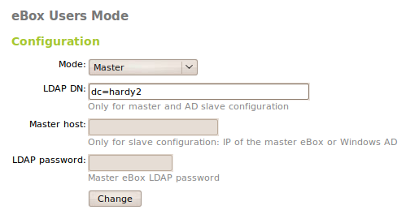
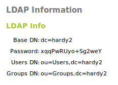
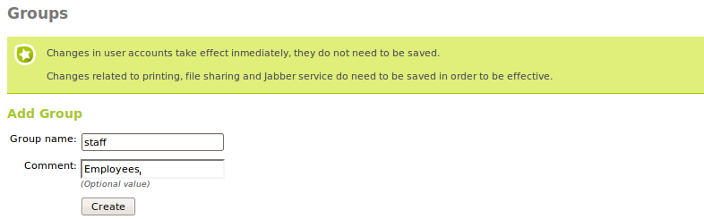
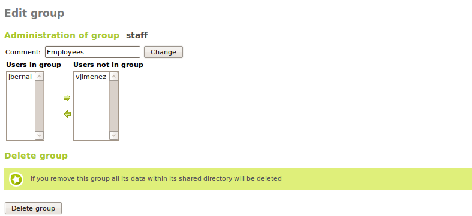
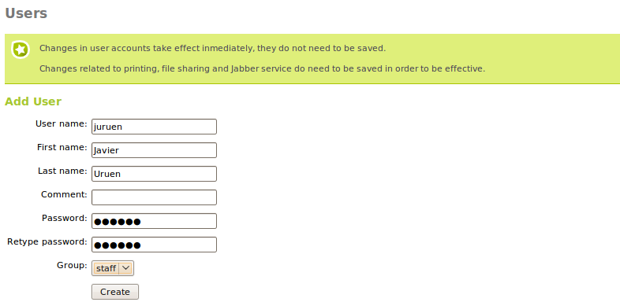
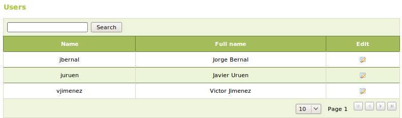
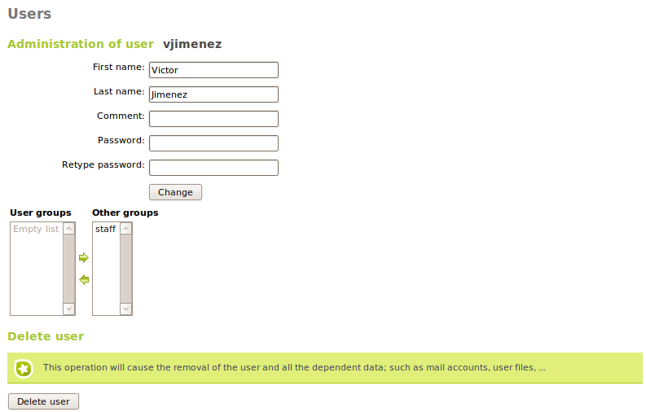
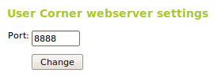
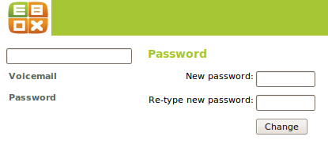

Directory service (LDAP)
************************

.. sectionauthor:: José A. Calvo <jacalvo@ebox-platform.com>
                   Isaac Clerencia <iclerencia@ebox-platform.com>
                   Enrique J. Hernández <ejhernandez@ebox-platform.com>
                   Javier Uruen <juruen@ebox-platform.com>

**Directory services** are used to store and sort the data relating to
organizations (in this case, users and groups). They
enable network administrators to handle access to resources by
users by adding an abstraction layer between the resources and their
users. This service gives a data access interface. It also
acts as a central, common authority through which users can be
securely authenticated.

A directory service can be considered similar to the yellow
pages. Its characteristics include:

* The data is much more often read than written.
* Hierarchical structure that simulates organizational architecture.
* Properties are defined for each type of object, standardized by the IANA [#]_,
  on which access control lists (ACLs) can be defined.

.. [#] *Internet Assigned Numbers Authority* (IANA) is responsible for
   assigning public IP addresses, top level domain (TLD) names,
   etc. http://www.iana.org/

There are many different implementations of the directory service,
including NIS, OpenLDAP, ActiveDirectory, etc. eBox uses
**OpenLDAP** as its directory service with *Samba* technology for
*Windows* domain controller and to share files and printers.

Users and groups
================

Normally, in the management of any size of organization there is
the concept of **user** or **group**. For easier shared
resource administration, the difference is made between
users and their groups. Each one may have different
privileges in relation to the resources of the organization.

Management of users and groups in eBox
--------------------------------------

Modes
^^^^^

As it has been explained, eBox has a modular design, allowing an administrator
to distribute services among several machines in the network. In order for this
to be feasible, the **users and groups** module supports a master/slave
architecture to share users between different eBoxes.

By default, and unless indicated otherwise in the
:menuselection:`Users and Groups --> Mode` menu entry, the module will set up
a master LDAP directory. By default, the Distinguished Name (DN) of
the directory is set according to the current hostname, if a different one is
desired, it can be set in the :guilabel:`LDAP DN` text entry.

Other eBoxes can be configured to use a master as the source of their users,
thus becoming directory slaves. In order to do this, the *slave* mode has to be
selected in :menuselection:`Users and Groups --> Mode`. The slave setup requires
two extra parameters, the IP or hostname of the master directory and its LDAP
password. This password is not the eBox one, but the one generated automatically
when enabling the **users and groups** module. Its value can be obtained in the
*Password* field in :menuselection:`Users and Groups --> LDAP Info` in the
master eBox.

There is one extra requirement before registering a slave in a master. The
master has to be able to resolve the slave's hostname via DNS. There are
different ways to achieve this. The easiest one is adding an entry for the
slave in the master's `/etc/hosts`. Other option is to set up the DNS service
in eBox, including the slave hostname and IP address.

If the **firewall** module is enabled in the master eBox, it has to be configured
in a way that allows incoming LDAP traffic from the slaves. By default, the
firewall denies this traffic, so make sure to perform the necessary adjustments
on the firewall before proceeding.

Once these parameters are set and the slave hostname can be resolved from the
master, the slave can be registered in the master by enabling the
**users and groups** module in :menuselection:`Module Status`.

Slaves create a replica of the master directory when they register for the
first time, and that replica is kept up to date automatically when new users
and groups are added. A list of the slaves can be seen in the master in
:menuselection:`Users and Groups --> Slave Status`.

.. image:: images/directory/slave-status.png
   :scale: 80

Modules that work with users such as **mail** or **samba** can be installed now
in the slaves and they will use the users available in the master eBox. Some
modules require some actions to be executed when new users are added, such as
**samba**, which needs to create the home server. In order to do this, the
master will notify the slaves about new users and groups when they are created,
giving a chance to slaves to perform the appropriate actions.

There might be problems executing these actions in some circumstances,
for example if one of the slaves is down. In this case the master will
remember that there are pending actions to be performed and will retry
periodically. The user can also check the status of the slaves in
:menuselection:`Users and Groups --> Slave Status` and force a retry
manually.  A slave can be deleted in this section as well.

There is an important limitation in the current master/slave architecture. The
master eBox cannot have any module depending on **users and groups**
installed, for example, **samba** or **mail** among others. If the master has
any of these modules installed, they have to be uninstalled before trying to
register a slave on it.

If at some point the mode of operation of the **users and groups** module needs
to be changed, it can be done running this command::

  # sudo /usr/share/ebox-usersandgroups/ebox-usersandgroups-reinstall

when it executed will completely remove the LDAP directory, deleting all the current
users and groups and reinstall it from scratch so it can be set up in a
different mode.

Users and groups creation
^^^^^^^^^^^^^^^^^^^^^^^^^

A group can be created from the :menuselection:`Users and Groups -->
Groups` menu in the master eBox. A group is identified by its name and
can contain a description.

Through :menuselection:`Users and Groups --> Groups`, the existing groups
are displayed for edition or deletion.

While a group is being edited, the users belonging to the group can be
chosen. Some options belonging to the installed eBox modules with some
specific configuration for the user groups can be changed too.

The following are possible with user groups, among others:

* Provide a directory to be shared between users of a group.
* Provide permission for a printer to all users of a group.
* Create an alias for an e-mail account that redirects to all users of a
  group.
* Assign access permission to the different eGroupware applications for
  all users of a group.

The users are created from the :menuselection:`Users and Groups -->
Users` menu, where the following data must be completed:

User name:
  Name of the user in the system, which will be the name used for
  identification in the authentication processes.
First Name:
  User's first name.
Last Name:
  User's last name.
Comment:
  Additional data on the user.
Password:
  Password to be used by the user in the authentication
  processes. This info must be provided twice to avoid misspellings in
  this vital data.
Group:
  The user can be added to a group during its creation.

From :menuselection:`Users and Groups --> Users`, a list of users can be
obtained, edited or deleted.

While a user is being edited, all the previous data can be changed,
except for the user name. The data regarding the installed eBox modules
that have some specific configuration for users can also be changed, as
well as the list of groups to which the user belongs.

It is possible to edit a user to:

* Create an account for the Jabber server.
* Create an account for file or PDC sharing with a customized quota.
* Provide permission for the user to use a printer.
* Create an e-mail account for the user and *aliases* for it.
* Assign access permission to the different eGroupware applications.
* Assign a phone extension to the user.

In a master/slave setup, the basic fields of users and groups can be edited
in the master, while any further attributes pertaining to a given module
installed in a slave have to be edited in that slave.

.. _usercorner-ref:

User Corner
-----------

The user data can only be modified by the eBox administrator, which
becomes non-scalable when the number of users managed becomes
large. Administration tasks, such as changing a user's password, may
cause the person responsible to waste a lot of time. Hence the need
for the **user corner**. This corner is an eBox service that allows
users to change their own data.  This function must be enabled like
the other modules. The user corner is listening in another port
through another process to increase system security.

Users can enter the user corner through:

  https://<eBox_ip>:<user_corner_port>/

Once users have entered their user name and password, changes can be made
to their personal configuration. The features provided so far are:

* Change current password
* User voicemail configuration
* Configure an external personal account to fetch mail to synchronize
  with the user's mailbox in the eBox mail server.

Practical example A
^^^^^^^^^^^^^^^^^^^

Create a group in eBox called **accountancy**.

.. FIXME: This is wrong with new master/slave arch

To do so:

#. **Action:** Enable the **users and groups** module. Enter
   :menuselection:`Module status` and enable the module if it is
   not enabled.

   Effect:
     The module is enabled and ready for use.

#. **Action:**
   Access :menuselection:`Users and Groups --> Groups`. Add **accountancy** as a group. The
   **comments** parameter is optional.

   Effect:
     The **accountancy** group has been created. The changes do not have
     to be saved, as any action on LDAP is instant.

Practical example B
^^^^^^^^^^^^^^^^^^^

Create the user **peter** and add him to the **accountancy** group.

To do so:

#. **Action:**
   Access :menuselection:`Users and Groups --> Users`. Complete
   the different fields for the new user. The user
   **peter** can be added to the **accountancy** group from this screen.

   Effect:
     The user has been added to the system and to the **accountancy** group.

Check from the console that the user has been correctly added:

#. **Action:**
   In the console, run the command::

    # id peter

   Effect:
    The result should be something like this::

     uid=2003(pedro) gid=1901(__USERS__)
     groups=1901(__USERS__) ,2004(accountancy)

.. include:: directory-exercises.rst
