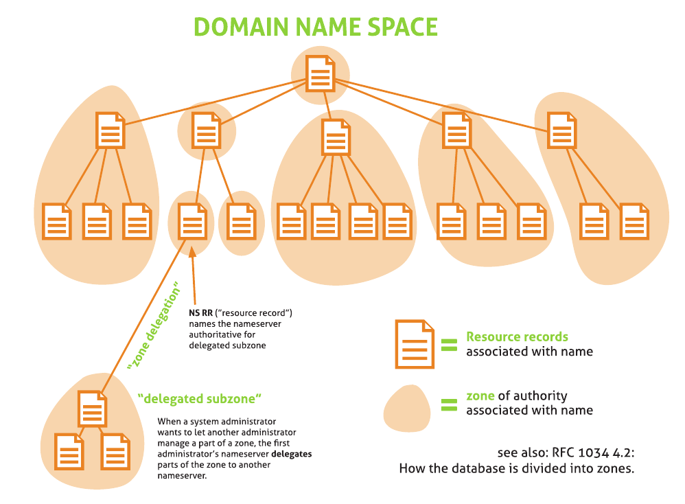
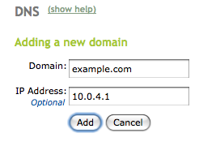
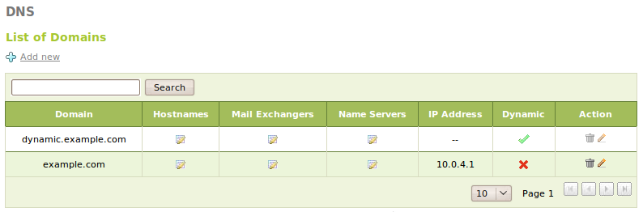
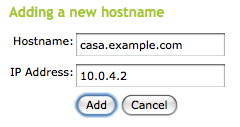
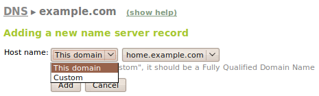

Name resolution service (DNS)
*****************************

.. sectionauthor:: José A. Calvo <jacalvo@ebox-platform.com>
                   Isaac Clerencia <iclerencia@ebox-platform.com>
                   Enrique J. Hernández <ejhernandez@ebox-platform.com>
                   Víctor Jiménez <vjimenez@warp.es>
                   Jorge Salamero <jsalamero@ebox-platform.com>
                   Javier Uruen <juruen@ebox-platform.com>

As explained, the function of the **DNS** *(Domain Name System)* is to
convert hostnames that are readable and easy to remember by users
into IP addresses and vice versa. The name domain system is
a tree architecture, the aims of which are to avoid the
duplication of data and to facilitate the search for domains. The service
listens to requests in port 53 of the UDP and TCP transport protocols.

DNS cache server configuration with eBox
========================================

A name server can act as a cache [#]_ for queries that it cannot
respond to. In other words, it will initially query the appropriate
server, as it is based on a database without data, but the cache will
subsequently reply, with the consequent decrease in response
time.

.. [#] A cache is a collection of duplicated data from an original
   source, where the original data is expensive to obtain or compute compared to the
   cost of reading the cache (http://en.wikipedia.org/wiki/Cache).

At present, most modern operating systems have a local library
to translate the names that is responsible for storing
its own domain name cache with the requests made by
system applications (browser, e-mail clients, etc.).

Practical example A
^^^^^^^^^^^^^^^^^^^

Check the correct operation of the cache name server.
What is the response time with regard to the same request *www.example.com*?

#. **Action:**
   Access eBox, enter :menuselection:`Module status` and
   enable the **DNS** module by marking the checkbox in the
   :guilabel:`Status` column.

   Effect:
     eBox requests permission to overwrite certain files.

#. **Action:**
   Read the changes of each of the files to be modified and
   grant eBox permission to overwrite them.

   Effect:
     The :guilabel:`Save changes` button has been enabled.

#. **Action:**
   Go to :menuselection:`Network --> DNS` and add a new
   :guilabel:`Domain name server` with value 127.0.0.1.

   Effect:
     eBox is established to translate names to IP
     and vice versa.

#. **Action:**
   Save the changes.

   Effect:
     eBox displays the progress while the changes are being applied. Once this is
     complete it is indicated as such.

     eBox now manages the DNS server configuration.

#. **Action:**
    Use the :guilabel:`Domain name
    resolution` tool available in :menuselection:`Network -->
    Diagnosis` to check the operation of the cache, querying the
    domain *www.example.com* consecutively and checking the response
    time.

DNS server configuration with eBox
==================================

DNS has a tree structure and the source is known as '.' or root. Under
'.' are the TLDs *(Top Level Domains)*, such as org, com, edu, net, etc.
When searching in a DNS server, if it does not know the answer, the tree
is recursively searched until it is found. Each '.' in an address (e.g.
*home.example.com*) indicates a different branch of the DNS tree and a different
query area. The name will be traversed from right to left.

.. _dns-tree-fig:

   DNS tree

As you may see on figure :ref:`dns-tree-fig`, each zone has an
authority name server [#]_. When a client performs a query to a name
server, it delegates the resolution to the name server pointed by a
**NS** record which claims to be authoritative for that zone. For
instance, a client queries for *www.home.example.com* IP address to a
name server which is authoritative for *example.com*. As the name
server has a record which indicates the authoritative name server for
*home.example.com* zone (the NS record), then it delegates the answer
to that server who should know the IP address for that host.

.. [#] A DNS server is the authority for a domain when it has
   all the data to resolve the query for that
   domain.

Another important aspect is reverse resolution (*in-addr.arpa*), as
it is possible to translate an IP address to a domain
name. Furthermore, as many aliases (or canonical names) as required
can be added to each associated name and the same IP address
can have several associated names.

Another important characteristic of the DNS is the **MX**
record. This record indicates the place where the e-mails to be
sent to a certain domain are to be sent. For
example, where an e-mail is to be sent to someone@example.com, the
e-mail server will ask for the MX record of *example.com*
and the service will reply that it is *mail.example.com*.

The configuration in eBox is done through the
:menuselection:`DNS` menu. In eBox, as many DNS domains as required
can be configured.

To configure a new domain, drop down the form by clicking on
:guilabel:`Add new`. From here, the :guilabel:`domain name` and an
optional :guilabel:`IP address` which the domain will refer to can be
configured.

.. FIXME: Use Zapp to show the shot

When a new domain is added, you may have noticed a field called
:guilabel:`dynamic` is set to false. A domain is set as dynamic when
it is updated automatically by a process without restarting the
server. A typical example for this is a DHCP server which updates the
DNS records when it leases/releases an IP address for a host. Check out
:ref:`dynamic-dns-updates-ref` section for details about this
configuration with eBox. Currently, if a domain is set as dynamic, then
no manual configuration can be done using eBox interface.

Once a correct domain has been created, e.g. *home.example.com*,
it is possible to complete the :guilabel:`hostnames` list for
the domain. As many IP addresses as required can be added
using the names decided. Reverse resolution is added
automatically. Furthermore, as many aliases as required can also be
used for each mapping.

eBox set automatically the authoritative name server for the
configured domains to **ns** host name. If none is set, then 127.0.0.1
is set as authoritative name server for those domains. If you want to
configure the authoritative name server manually for your domains
(**NS** records), go to :guilabel:`name servers` and choose one of the
configured host names for that domain or set a custom one. In a
typical scenario, you may configure a **ns** host name using as IP
address one of the configured in :menuselection:`Network -->
Interfaces` section.

As an additional feature, e-mail server names can be added
through :guilabel:`mail exchangers`
by selecting a name for the domains in which eBox is
the authority or an external one. Furthermore,
a :guilabel:`preference` can be given, the lowest value of which gives
highest priority, i.e. an e-mail client will first try
the server with the lowest preference number.

.. image:: images/dns/05-dns-mx.png
   :scale: 70

.. FIXME: Use Zapp to show the shot

For a more in-depth look into the operation of the DNS, let us see what happens depending
on the query made through the **dig** diagnosis tool located
in :menuselection:`Network --> Diagnosis`.

If a query is made for one of the domains added, eBox will reply with the
appropriate answer immediately. Otherwise, the DNS server will query the
root DNS servers and will reply to the user as soon as it gets an answer.
It is important to be aware of the fact that the name servers configured in
:menuselection:`Network --> DNS` are used by client applications to
resolve names, but are not used in any way by the DNS server. If you want
eBox to resolve names using its own DNS server, you have to set up
127.0.0.1 as primary DNS server in the aforementioned section.

.. _dns-exercise-ref:

Practical example B
^^^^^^^^^^^^^^^^^^^

Add a new domain to the DNS service. Within this domain, assign
a network address to a host name. From another host, check that
it resolves correctly using the **dig** tool.

#. **Action:** 
   Check that the DNS service is active through
   :menuselection:`Dashboard` in the :guilabel:`Module status`
   *widget*. If it is not active, enable it in :menuselection:`Module
   status`.

#. **Action:**
     Enter :menuselection:`DNS` and in :guilabel:`Add
     new` enter the domain to be managed. A
     table will drop down where hostnames, mail
     servers for the domain and the domain address itself
     can be added.  In :guilabel:`Hostnames` do the same by
     adding the host name and its associated
     IP address.

#. **Action:**
   Save the changes.

   Effect:
     eBox will request permission to write the new files.

#. **Action:**
   Accept the overwriting of these files and save the changes.

   Effect:
     The progress is displayed while the changes are being applied. Once this is
     complete it indicates as such.

#. **Action:**
     From another PC connected to this network, request the name resolution
     using **dig**, where 10.1.2.254 is, for example, the address of eBox
     and mirror.ebox-platform.com the domain to be resolved::

	$ dig mirror.ebox-platform.com @10.1.2.254

	; <<>> DiG 9.5.1-P1 <<>> mirror.ebox-platform.com @10.1.2.254
	;; global options:  printcmd
	;; Got answer:
	;; ->>HEADER<<- opcode: QUERY, status: NOERROR, id: 33835
	;; flags: qr rd ra; QUERY: 1, ANSWER: 1, AUTHORITY: 2, ADDITIONAL: 2

	;; QUESTION SECTION:
	;mirror.ebox-platform.com.      IN      A

	;; ANSWER SECTION:
	mirror.ebox-platform.com. 600   IN      A       87.98.190.119

	;; AUTHORITY SECTION:
	ebox-platform.com.      600     IN      NS      ns1.ebox-platform.com.
	ebox-platform.com.      600     IN      NS      ns2.ebox-platform.com.

	;; ADDITIONAL SECTION:
	ns1.ebox-platform.com.  600     IN      A       67.23.0.68
	ns2.ebox-platform.com.  600     IN      A       209.123.162.63

	;; Query time: 169 msec
	;; SERVER: 10.1.2.254#53(10.1.2.254)
	;; WHEN: Fri Mar 20 14:37:52 2009
	;; MSG SIZE  rcvd: 126

.. include:: dns-exercises.rst
