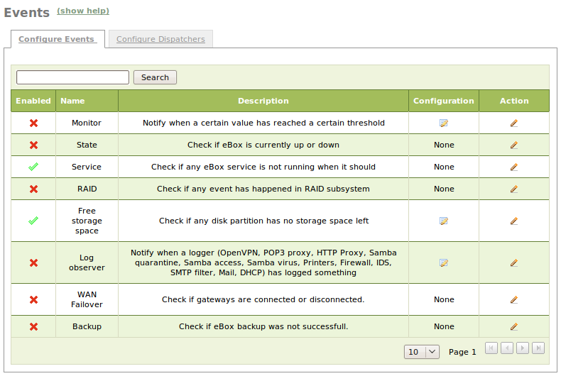
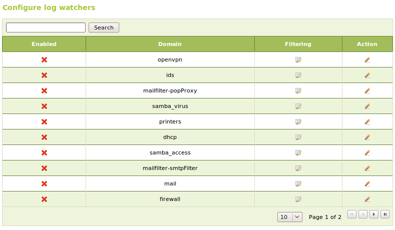
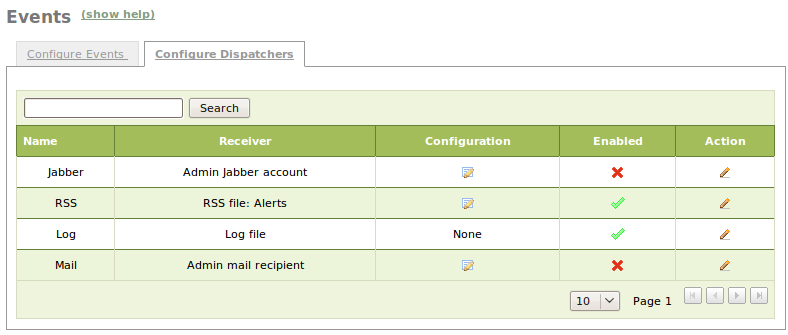

Events and alerts
*****************

The **events** module is a convenient service that allows you to receive
notifications of certain events and alerts that happen in your eBox
machine.

eBox allows you to receive these alerts and events through the following
dispatchers:

- Mail [#]_
- Jabber
- Logs
- RSS

.. [#] The **mail** module needs to be installed and configured.
   (:ref:`mail-service-ref`).

Before enabling any event watcher you have to make sure that the events module
is enabled. Go to :menuselection `Module status` and check the
:guilabel:`events` module.

Unlike in the Logs module, where all services are enabled by default except
the **firewall**, you have to enable those events that might be of your interest.

To enable any events, you have to click on the menu entry 
:menuselection:`Events --> Configure Events`. You can edit an event state by
clicking on the pencil icon. Tick the :guilabel: `Enabled` box and click on
the :guilabel:`Change` button.

   Configure events page

There are some events that need further configuration to work properly. This is
the case for the log and free storage space observers.

The configuration of the free storage observer is pretty straightforward.
The only required parameter is the free space percentage that will
trigger the event when its actual value goes under it.

For the log observer, the first step is to select which domains you want to
generate events from. For every domain, you can add filtering rules that depend
on the domain. Some examples are: denied HTTP requests by the proxy, DHCP leases
for a giving IP, canceled printer jobs, and so on. You can also create an event
filter from an existing log query by clicking on the :guilabel:`Save as an
event button` through :menuselection:`Logs --> Query Logs --> Full Report`.

   Configure Log Observer page

So far, you know how to enable the generation of events and alerts. However,
you also need these events and alerts to be sent to you in order to be read.
That is what event dispatchers are for.
Go to the :menuselection:`Configure dispatchers` tab.

   Configure dispatchers page 

The procedure to enable event dispatchers is similar to enabling event watchers.
You have to configure all the watchers except the log watcher. The latter will
write its output to */var/log/ebox/ebox.log*. The other dispatchers
require further configuration.

Mail:
 You have to set the email address of the recipient (usually the eBox
 administrator). You can also set the subject of the messages.

Jabber:
 You have to set the Jabber server address and port that will be used to send
 the messages. You also have to set the username and password of the user that
 will send the messages. Finally, you have to set the Jabber address of the
 recipient.

RSS:
 You have to decide who will be able to read the RSS feed, and the feed link
 itself. You can make the channel public, private, or authorized by a source IP
 address-based policy. Note that you can also use objects instead of IP
 addresses.

.. _event-exercise-ref:

Practical Example
-----------------

Configure the **events** module to make it show the message *"eBox is up and
running* in ``/var/log/ebox/ebox.log``. This message will be generated
periodically, and every time the **events** module is restarted.

#. **Action:**
   Access the eBox web interface, go to :menuselection:`Module Status` and 
   enable :guilabel:`events`.  

   Effect:
     The :guilabel:`Save Changes` button has turned red.

#. **Action:**
   Go to :menuselection:`Events` and click on the tab labeled 
   :menuselection:`Configure Events`. Click on the pencil icon that is placed
   in the  :guilabel:`Status` column. Check the  
   :guilabel:`Enabled` field and click on:`Change`.

   Effect:
     The events table shows the event as enabled.

#. **Action:**
   Go to the tab labeled :menuselection:`Configure dispatchers`.
   Click on the pencil icon of the row that contains the :guilabel:`Log` event.
   Enable it and click on :guilabel:`Change`.

   Effect:
     The event disptacher table shows the log dispatcher as enabled.

#. **Action:**
   Save changes.

   Effect:
    eBox shows the progress of the saving changes process until it displays a
    message to let you know it is done.

    An event with the message *'eBox is up and running'* will be written in
    `/var/log/ebox/ebox.log`.

#. **Action:**
   From the console on the eBox machine run: 
   `sudo /etc/init.d/ebox events restart`.

   Effect:
     An event with the message *'eBox is up and running'* will be written again in
     `/var/log/ebox/ebox.log`.

.. include:: events-exercises.rst
