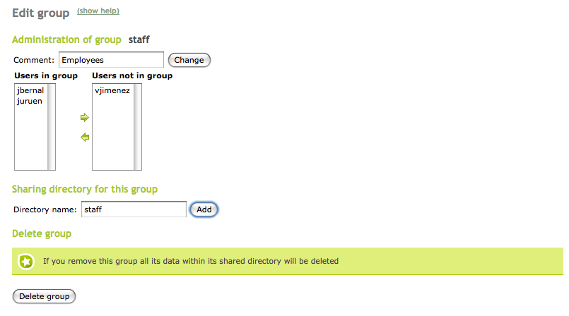
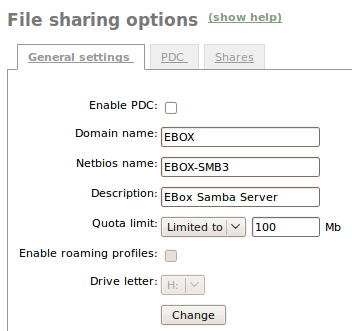
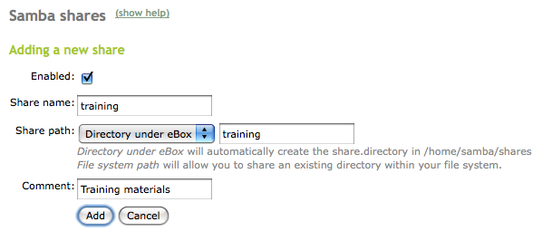
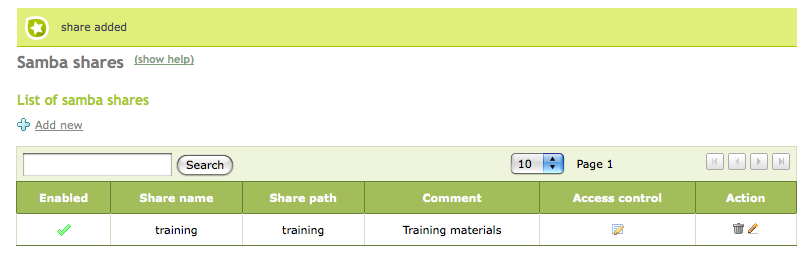
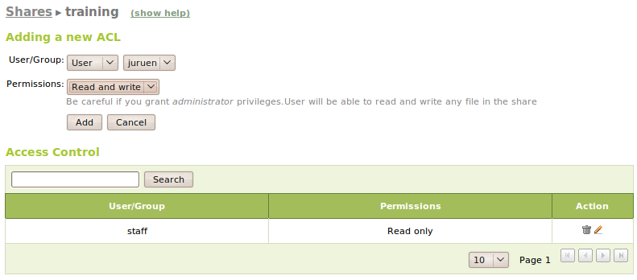
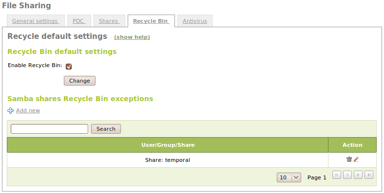
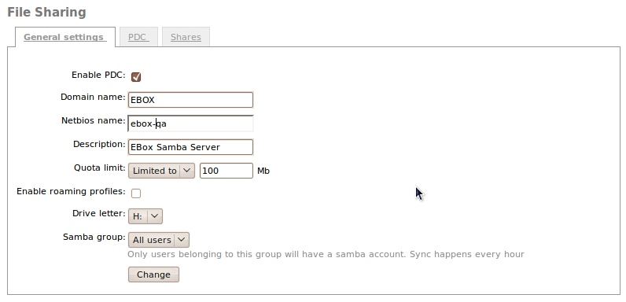
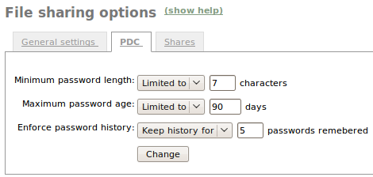
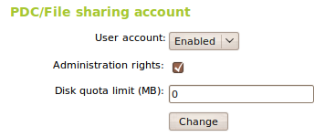
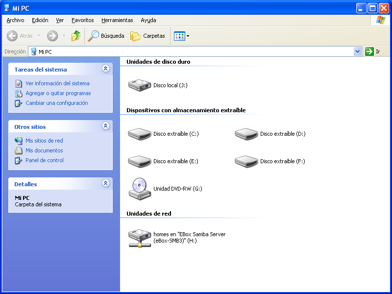

.. _filesharing-chapter-ref:

File sharing service and remote authentication
**********************************************

.. sectionauthor:: José A. Calvo <jacalvo@ebox-platform.com>,
                   Enrique J. Hernández <ejhernandez@ebox-platform.com>,
                   Javier Uruen <juruen@ebox-platform.com>

File sharing
============

The **file sharing** takes place through a network file system. The
systems more widely used are: NFS (*Network File System*) by Sun
Microsystems, which was the first one, AFS (*Andrew File System*) and
CIFS (*Common Internet File System*), also known as SMB (*Server
Message Block*).

The clients operate on files (opening, reading or writing files) as if
they were locally stored in the machine, but the information can
actually be stored in different places, location being completely
transparent to the end user.  Ideally, the client should not know
whether the file is stored in the host itself or it is spread all over
the network. However, this is not possible due to the network delays
and the issues related to concurrent file updates which should not
interfere among them.

SMB/CIFS and its Linux Samba implementation
===========================================

SMB (*Server Message Block*) or CIFS (*Common Internet File System*)
is used to share the access to: files, printers, serial ports
and any other series of communications between nodes in a local
network. It also offers authentication mechanisms between
processes. It is mainly used among computers with Windows. However,
there are also some implementations in other operating systems such
as GNU/Linux using Samba, which implements Windows system protocols
using reverse engineering [#]_.

.. [#] Reverse engineering tries to figure out the communication
       protocols just through observation of their messages.

Given the success of some file sharing systems, Microsoft decided to
rename SMB as CIFS, adding new features to it, such as: symbolic and
hard links and bigger file sizes, as well as avoiding the use of
NetBIOS [#]_ in which SMB is based.

.. [#] **NetBIOS** (*Network Basic Input/Output System*): API that
       allows communication among different computers in a local area
       network. It gives a NetBIOS name and IP address to each one of the
       hosts.

Primary Domain Controller (PDC)
===============================

A **Primary Domain Controller** (PDC) is a domain server for *Windows NT*
versions previous to the *Windows 2000* version. In this
environment, a domain is a system which allows restricted
access to a series of resources with a username and
password. Therefore, it can be used to log in in the system through
remote access control. PDC has also been recreated by Samba inside the SMB
authentication system. In modern *Windows* versions it is denominated
**Domain Controller**.

.. _ebox-samba-ref:

eBox as file server
===================

eBox uses **Samba** SMB/CIFS implementation for Linux as a file server
and *Windows* operative system authentication.

The file sharing services are active when the **File sharing** module
is active, regardless whether you are using eBox as :guilabel:`PDC` or
not.

The file sharing in eBox is integrated with the users and groups. As a
result, each user will have a personal directory and each group can
have a shared directory for all its users.

The personal directory for the user is automatically shared and can only be
accessed  by the user.

Going to :menuselection:`Groups --> Edit Group` a shared directory for
a group can also be created. Every member of this group will have
access to this directory, being able to write his own files and read all the files.

Go to :menuselection:`File Sharing --> General Settings` to configure
the general settings of file sharing service. :guilabel:`Domain` will
refer to the Windows local network name whereas :guilabel:`NetBIOS
Name` will identify eBox inside the *Windows* network. You can also
give a :guilabel:`Description` with the domain characteristics. Apart
from that, and as an optional feature, a :guilabel:`Quota Limit` can
be established. Using :guilabel:`Samba group`, you may optionally set
a group to have a file sharing account instead of all users, the
synchronization is done every hour.

To add a new shared directory, go to :menuselection:`File Sharing -->
Shares` and click :guilabel:`Add new`.

Enabled:
  This option has to be marked whenever the directory needs to be
  shared. Unmarking the option will cause the directory to no longer
  be shared, while keeping the settings.

Share name:
  This refers to the name of the shared directory.

Share path:
  A path can be created either in the eBox directory
  `/home/samba/shares` or using an already existing directory path if
  :guilabel:`File system path` is chosen.

Comment:
  A more detailed description of the share can be provided in
  this field.

:guilabel:`Access Control` can be configured from the shares
list. You can go to :guilabel:`Add New` in order to give reading,
writing and administration permissions to a given user or group. If a
user has administration permission over a share they will
be granted all the permissions over the files created by other
users in this directory.

Going to :menuselection:`Users and Groups --> Groups --> Edit Group` a
shared directory for a group can also be created. Every member of this
group will have access to this directory, being able to read and write
all the files.

If you want to save the deleted files inside a special directory
called `RecycleBin`, just go to :menuselection:`File Sharing --> Recycle
Bin` and check the :guilabel:`Enable Recycle Bin` option. If you
don't want to apply it to all your shares you can add exceptions in the
:guilabel:`Samba shares Recycle Bin exceptions` section. You can also
modify some default settings for this feature, like the name of the
directory, by editing the `/etc/ebox/80samba.conf` file.

Under :menuselection:`File Sharing --> Antivirus` there is also a checkbox
to enable or disable the check for viruses in your shares and the
possibility to add exceptions if there are shares that you don't want to
check. Note that if you want to access the antivirus configuration for the
filesharing module the **samba-vscan** package must be installed in the
system. The Antivirus module must be installed and enabled as well.

SMB/CIFS clients configuration
==============================

Files can be shared between *Windows* and GNU/Linux once the file
sharing service is running.

Windows client
--------------

  The selected domain will be found in :menuselection:`Network Places
  --> All the Network`. The server host with the selected name will
  show the shared resources it has.

  .. image:: images/filesharing/14-windows-shares.png
     :scale: 70
     :align: center

Linux client
------------

  1. Konqueror (KDE)

     When using Konqueror ``smb://`` should be introduced in the location
     bar in order to see the Windows network, where you will be able to
     find the specified domain.

     .. image:: images/filesharing/14-kde-shares.png
        :scale: 70
        :align: center

  2. Nautilus (Gnome)

     When using Nautilus (Gnome) go to
     :menuselection:`Places --> Network --> Windows Network` in order
     to find the specified domain and the eBox server inside.

     .. image:: images/filesharing/14-gnome-shares.png
        :scale: 70
        :align: center

     Taking into account that the personal directories are not shown
     when browsing the server resources, those will need to be
     introduced in the location bar. For example, if you need to have
     access to Peter's personal directory, you will have to introduce
     the following address::

       smb://<ip_de_ebox>/peter

  3. Smbclient

     Besides the graphical interfaces, there is a command line
     client which works in a similar way to FTP clients. Smbclient
     allows actions such as: file downloading and uploading or file
     and directory information gathering among others. This could be
     an example of a session::

       $ smbclient -U joe //192.168.45.90/joe
       > get ejemplo
       > put eaea
       > ls
       > exit
       $ smbclient -U joe -L //192.168.45.90/
       Domain=[eBox] OS=[Unix] Server=[Samba 3.0.14a-Debian]
       Sharename       Type      Comment
       ---------       ----      -------
       _foo            Disk
       _mafia          Disk
       hp              Printer
       br              Printer
       IPC$            IPC       IPC Service (eBox Samba Server)
       ADMIN$          IPC       IPC Service (eBox Samba Server)
       joe         Disk      Home Directories
       Domain=[eBox] OS=[Unix] Server=[Samba 3.0.14a-Debian]
       Server               Comment
       ---------            -------
       DME01                PC Verificaci
       eBox-SMB3            eBox Samba Server
       WARP-T42
       Workgroup            Master
       ---------            -------
       eBox                 eBox-SMB3
       GRUPO_TRABAJO        POINT
       INICIOMS             WARHOL
       MSHOME               SHINNER
       WARP                 WARP-JIMBO

eBox as an authentication server
================================

You have to go to :menuselection:`File Sharing --> General Settings`
and check the :guilabel:`Enable PDC` option in order to have eBox
working as an authentication server (PDC).

If the option :guilabel:`Roaming Profiles` is enabled, the PDC server
will store all the user profiles. Any user profile will contain
general information such as: *Windows* settings, *Outlook* e-mail
accounts or its documents. Every time a user logs in an updated
profile will be sent to them by the PDC server. The user can have
access to his profile information from any computer. Please take into
account the size of the users information when setting up your server
in order to make sure there is enough space.

In addition to that, the :guilabel:`Disk Letter` for the personal
directory can be redefined. When a user logs into the domain his
personal directory will be automatically mapped to a drive with this
letter.

Finally, you can define user policy passwords through
:menuselection:`File Sharing --> PDC`. This is usually an enforcement
by the law.

* :guilabel:`Minimum Password Length`
* :guilabel:`Maximum Password Age`. The password has to be changed
  after this period.
* :guilabel:`Enforce Password History`. Stores a number of
  passwords once modified.

This policy only applies when a password is changed from
Windows. Actually Windows will enforce the policy when a user logs in in
a machine registered in the domain.

PDC Client Configuration
========================

An account with administration rights will be needed in order to
configure a PDC client, this can be done going to
:menuselection:`Users and Groups -->  Users --> File Sharing or PDC
Account`. You can also establish a :guilabel:`Disk Quota`.

Now, go to a different machine in the same LAN (keep in mind that
the SMB/CIFS protocol works using broadcast) that has a CIFS-capable
*Windows* (i.e., *Windows XP Professional*).

Click on :menuselection:`My PC --> Properties`. This will launch
the *Network Id* wizard. We will reboot the server after entering the
administratiion user name and password as well as the domain name
given in the :menuselection:`File Sharing` configuration. The machine
name can be the one already set, as long as it does not collide with
an existing one already in the domain. After finishing the process,
you need to reboot the machine.

Every user can see their disk usage and quota in :menuselection:`My
PC`.

.. include:: filesharing-exercises.rst
