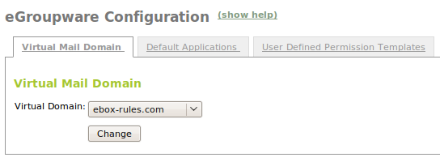
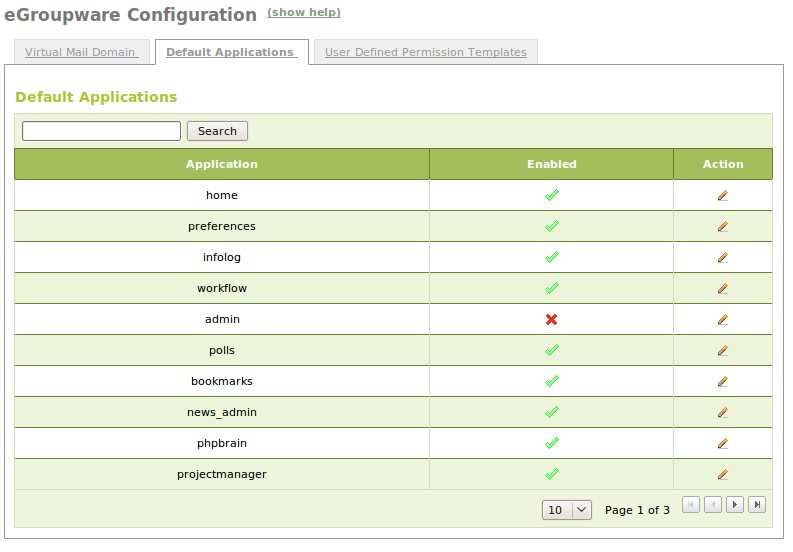
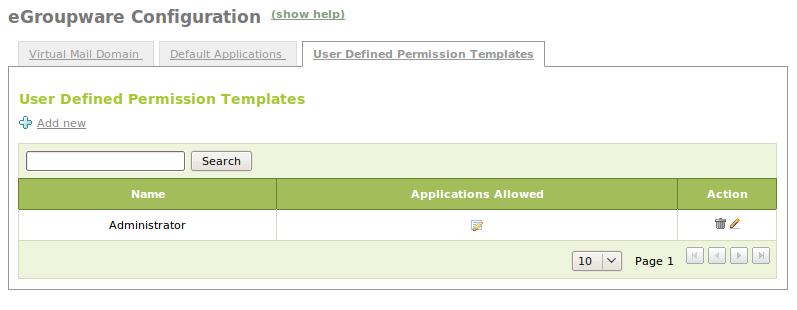
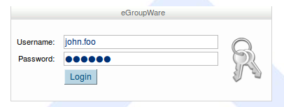

Groupware Service
*****************

.. sectionauthor:: José A. Calvo <jacalvo@ebox-technologies.com>
                   Ignacio Correas <icorreas@ebox-technologies.com>

Groupware, also known as collaborative software, is a set of
applications integrating the work of different users in common projects.
Each user can connect to the system from various working stations on the
local network or from anywhere in the world via the Internet.

Some of the most important functions of groupware tools are:

* Communication between users: mail, chat rooms, etc.
* Information sharing: shared calendars, task lists,
  common address books, knowledge base, file sharing, news, etc.
* Project management, resources, time management, bugtracking, etc.

There is a large number of groupware solutions available on the market.
Among the Open Source alternatives, one of the most popular options is
eGroupWare [#]_ which is the one selected for eBox Platform to implement
such an important feature in business environments.

.. [#] **eGroupware**: *An enterprise ready groupware software for your
       network* http://www.egroupware.org

Setting up eGroupware with eBox Platform is very simple. The
goal is for the user not to need to access the traditional configuration
offered in eGroupware and to allow him to manage all the settings
from eBox interface, unless some advanced customization is needed. In fact,
the password for the configuration of eGroupware is auto-generated [#]_
by eBox and the administrator should use it under her own responsibility:
by taking any wrong action the module might become improperly configured and
left in an unstable status.

.. [#] Note for eGroupware advanced users: The password is stored in
       the file `/var/lib/ebox/conf/ebox-egroupware.passwd` and
       usernames are 'admin' and 'ebox' for header and domain configuration
       respectively.

Groupware service settings with eBox
====================================

Most of eGroupware configuration is performed
automatically by enabling the module and saving the changes.
Without requiring any additional user intervention, eGroupware will
be operating fully integrated with the eBox directory service (LDAP).
All users being added to eBox from that moment on will be able
to log in eGroupware without requiring any other action.

In addition, we can integrate the webmail service
provided by eGroupware with eBox **mail** module.
For this the only action required is to select a pre-existing virtual
domain and to enable the IMAP service, allowing for the reception of mail.
Instructions for creating a mail domain and configuring the IMAP service
are fully explained in chapter :ref:`mail-service-ref`.

For the selection of the domain used by eGroupware, you should access the menu
:menuselection:`Groupware` and the tab :guilabel:`Virtual Mail Domain`.
The interface is shown in the following image. It is only needed to select
the desired domain and click the button :guilabel:`Change`. Although, as
usual, this action does not take effect until the button
:guilabel:`Save Changes` is pressed.

In order for users to be able to use the mail service they will
need to have their own accounts created on it. The image below
(:menuselection:`Users --> Edit User`) shows that during the
configuration of eGroupware a notice is displayed indicating the
name of the mail account that should be used from eGroupware.

.. image:: images/groupware/egw-edit-user.png
   :scale: 80
   :align: center

eGroupware consists of several applications; in eBox you can edit
access permissions to these applications for each user assigning a permission
template, as shown in the image above. There is a default permission template
but you can define other ad-hoc ones.

The default permission template is useful for configuring most of
the users of the system with the same permissions, so that when
a new user is created permissions will be assigned automatically.

To edit the default template go to the menu
:menuselection:`Groupware` and tab
:menuselection:`Default Applications`, as shown in the image.

For small groups of users such as administrators,
you can define a custom permission template and apply it
manually for these users.

To define a new template go to the tab
:guilabel:`User Defined Permission Templates` in the menu
:menuselection:`Groupware` and click on :guilabel:`Add New`. Once
the name is entered it will appear on the table and you can edit the
applications by clicking on :guilabel:`Allowed Applications`, in a
similar way as with the default template.

Be aware that if you modify the default permission template,
changes will only be applied to users that are created
from that moment on. They will not be applied retroactively to users
previously created. The same applies to the user-defined templates:
if there were any users with that template applied on their configuration
you should edit that user's properties and apply the same template again
once it has been modified.

Finally, once you have configured everything, you can access eGroupWare
through the address `http://<ebox_ip>/egroupware` using the
username and password defined in the eBox interface.

eGroupware management is beyond the scope of this manual. For
any question, you should check the official eGroupware user manual.
It is available on-line in the official website and it is also
linked from within the application once you are inside.

Practical example
^^^^^^^^^^^^^^^^^
Enable the Groupware module and check its integration with the mail.

#. **Action:**
    Access eBox, go to :menuselection:`Module Status` and
    activate module :guilabel:`Groupware`, checking the box
    in the column :guilabel:`Status`. You will be informed eGroupware
    configuration is about to change. Allow the operation by pressing the button
    :guilabel:`Accept`. Make sure you have previously enabled the
    modules on which it depends (Mail, Webserver, Users, ...).

    Effect:
      The button :guilabel:`Save Changes` is activated.

#. **Action:**
    Set up a virtual mail domain as shown in the example
    :ref:`mail-conf-exercise-ref`. In this example a user is added
    with her corresponding email account. Steps related to objects
    or forwarding policies in the example are not necessary. Follow the steps
    just until the point in which the user is added.

    Effect:
      The new user has a valid mail account.

#. **Action:**
    Access the :menuselection: `Mail --> General` menu and in the
    :guilabel:`Mail Server Options` tab check the box
    :guilabel:`IMAP Service Enabled` and click :guilabel:`Change`.

    Effect:
      The change is saved temporarily but it will not be effective until
      changes are saved.

#. **Action:**
    Access the :menuselection: `Groupware` menu and in the
    :guilabel:`Virtual Mail Domain` tab select the previously
    created domain and click :guilabel:`Change`.

    Effect:
      The change is saved temporarily but it will not be effective until
      changes are saved.

#. **Action:**
    Save changes.

    Effect:
      eBox shows the progress while applying the changes and informs
      when it is done.

      From now on eGroupware is configured correctly
      to be integrated with your IMAP server.

#. **Action:**
    Access the eGroupware interface (http://<ebox_ip>/egroupware) with
    the user you created earlier. Access the eGroupware mail application
    and send an email to your own address.

    Effect:
      You will receive in your inbox the email you just sent.

.. include:: groupware-exercises.rst
