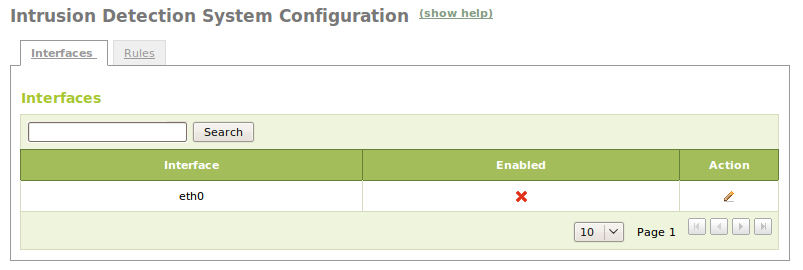
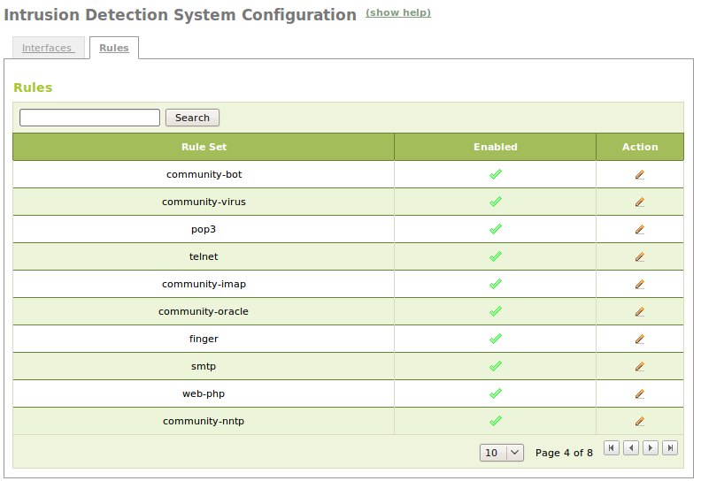

.. _ids-ref:

Intrusion Detection System (IDS)
********************************

.. sectionauthor:: José A. Calvo <jacalvo@ebox-platform.com>

An **intrusion detection system (IDS)** is an application designed to prevent
unwanted access to our machines, mainly attacks coming from the Internet.

The two main functions of an IDS are to **detect** potential attacks or
intrusions, what is done through a set of rules that are matched
against packets of inbound traffic. In addition to **recording** all suspicious
events, it records useful information (such as the source IP address of the
attacker) in a database or file. Combined with the firewall, some IDS
can also **block** intrusion attempts.

There are different types of IDS, the most common one is the Network
Intrusion Detection System (NIDS), which is responsible for checking all the
traffic on a local network. One of the most popular NIDS is Snort [#]_,
which is the tool that eBox integrates to perform this task.

.. [#] **Snort**: A free lightweight network intrusion detection
        system for UNIX and Windows * http://www.snort.org

Setting up an IDS with eBox
===========================

The configuration of the IDS in eBox is very simple.
You only need to activate or deactivate a number of elements. First,
you have to specify which network interfaces you want the IDS to listen on.
After that, you can select different sets of rules to match
with the captured packets. Alerts will be fired in case of positive results.

Both settings are accessed via the :menuselection:`IDS` menu.
On the :guilabel:`Interfaces` tab a table with a list of all network
interfaces that are configured is shown.
By default, all of them are disabled due to the increased network latency
and CPU consumption caused by the traffic inspection.
To enable any of them you can click the pencil icon, check :guilabel:`Enabled`
and press the button :guilabel:`Change`.

On the :guilabel:`Rules` tab you can see a table that is
preloaded with all the Snort rulesets installed on your system
(files under the directory `/etc/snort/rules`). By default, for increased
security, all of them are enabled. But if you want to save CPU time,
it is advisable to disable those that are not of interest, for example, the
ones related to services not available in your network.
The procedure for activating or disabling a rule is the same as for the
interfaces.

IDS Alerts
==========

Now you have the IDS module running. At this point, the only thing you can
do is observe alerts manually in the `/var/log/snort/alert` file.
We are going to see how eBox can make this task easier and more efficient
thanks to its logs and events subsystem.

The IDS module is integrated with the eBox logs, so
if it is enabled, you can query different IDS alerts
through the usual procedure. Likewise, we can configure an event
for any of these alerts in order to notify the system administrator
by any of the different means available.

For more information, see the :ref:`logs-ref` chapter.

Practical example
^^^^^^^^^^^^^^^^^

Enable the *IDS* module and launch a port scanning "attack"
against the eBox machine.

#. **Action:**
    Access the eBox web interface, go to :menuselection:`Module Status` and
    activate the :guilabel:`IDS` module by checking the box in the
    :guilabel:`Status` column. You will be notified of eBox wanting to
    modify the Snort configuration. Allow the operation by pressing the
    :guilabel:`Accept` button.

    Effect:
      :guilabel:`Save Changes` is activated.

#. **Action:**
    Similarly, activate the :guilabel:`Logs` module if it is not
    already activated.

    Effect:
      When the IDS is started, it will be ready to record its alerts.

#. **Action:**
    Access the :menuselection:`IDS` menu and select the :guilabel:`Interfaces`
    tab.
    Enable an interface that is reachable from the
    machine that will launch the attack.

    Effect:
      The change is saved temporarily but it will not be effective until
      changes are saved.

#. **Action:**
    Save the changes.

    Effect:
      eBox shows the progress while it is applying the changes. Once the
      process is completed you are notified.

      From now on, the IDS is analyzing the traffic on
      the selected interface.

#. **Action:**
    Install the **nmap** package on another machine using
    `aptitude install nmap`.

    Effect:
      The **nmap** tool is installed on the system.

#. **Action:**
    From the same machine run the `nmap` command passing only
    the IP address of the interface eBox previously selected as parameter.

    Effect:
      It will make attempts to connect to several ports on the eBox machine.
      You can interrupt the process at any moment by pressing: kbd: `Ctrl-c`.

#. **Action:**
    Access :menuselection:`Logs -> Query logs` and select
    :guilabel:`Full report` for the domain :guilabel:`IDS`.

    Effect:
      Entries related to the attack just performed are listed on the table.

.. include:: ids-exercises.rst
