#######################################
 eBox Platform: unified server for SMEs
#######################################

.. sectionauthor:: José A. Calvo <jacalvo@ebox-platform.com>,
                   Isaac Clerencia <iclerencia@ebox-platform.com>,
                   Enrique J. Hernández <ejhernandez@ebox-platform.com>,
                   Víctor Jímenez <vjimenez@warp.es>,
                   Jorge Salamero <jsalamero@ebox-platform.com>,
                   Javier Uruen <juruen@ebox-platform.com>,

Presentation
************

**eBox Platform** (<http://ebox-platform.com/>) is a unified network server that
offers easy and efficient computer network management for small and medium
enterprises (SMEs). eBox Platform can act as a Network Gateway, a Unified Threat
Manager (UTM) [#]_, an Office Server, an Infrastructure Manager, a Unified
Communications Server or a combination of them. This manual is written for the
|version| version of eBox Platform.

.. [#] **UTM** (*Unified Threat Management*): Term that groups a series of
	functionalities related to computer network security: firewall,
	intrusion detection, antivirus, etc.

All these functionalities are fully integrated and therefore automate most
tasks, prevent manual errors and save time for system administrators. This
wide range of network services is managed through an easy and intuitive web
interface. As eBox Platform has a modular design, you can install in each
server only the necessary modules and easily extend the functionality
according to your needs. Besides, eBox Platform is released under a free
software license (GPL) [#f1]_. The main features are:

.. [#f1] **GPL** (*GNU General Public License*): Software license that
	allows free redistribution, adaptation, use and creation of derivative works
	with the same license.

* Unified and efficient management of the services:

  * Task automation.
  * Service integration.

* Easy and intuitive interface.
* Extensible and adaptable to specific needs.
* Hardware independent.
* Open source software.

The services currently offered are:

* **Network management:**

  * Firewall and router

    * Traffic filtering
    * NAT and port redirection
    * Virtual local networks (VLAN 802.1Q)
    * Support for multiple gateways, load balancing and
      self-adaptation in case of loss of connectivity
    * Traffic shaping (with application-level filtering support)
    * Traffic monitoring
    * Dynamic DNS support

  * High-level network objects and services

  * Network infrastructure

    * DHCP server
    * DNS server
    * NTP server

  * Virtual private networks (VPN)

    * Dynamic auto-configuration of network paths

  * HTTP proxy

    * Cache
    * User authentication
    * Content filtering (with categorized lists)
    * Transparent antivirus

  * Mail server

    * Spam filtering and antivirus
    * Transparent POP3 filter
    * White-, black- and grey-listing

  * Web server

    * Virtual domains

  * Intrusion Detection System (IDS)
  * Certification Authority

* **Groupware:**

  * Shared directory using LDAP (Windows/Linux/Mac)

    * Shared authentication (including Windows PDC)

  * Shared storage as NAS (Network-attached storage)
  * Shared printers
  * *Groupware* server: calendars, address books, ...
  * VoIP server

    * Voicemail
    * Meetings
    * Calls through outside vendor
  * Instant messaging server (Jabber/XMPP)

    * Meetings
  * User corner to allow users to modify their data

* **Reports and monitoring**

  * *Dashboard* to centralize the information
  * Disk, memory, load, temperature and host CPU monitoring
  * Software RAID status and information regarding the hard drive use
  * Network service logs in databases, allowing you to have daily, weekly
    monthly and annual reports
  * Event-based system monitoring

    * Notification via Jabber, mail and RSS

* **Host management:**

  * Configuration and data backup
  * Updates

  * Control Center to easily administer and monitor multiple eBox hosts from
    one central point [#]_

.. [#] For additional information regarding the Control Center, please visit:
       http://www.ebox-technologies.com/products/controlcenter/
       the company behind eBox Platform development.

Installation
************

In principle, eBox Platform is designed to be installed exclusively on
one (real or virtual) machine. This does not prevent you from
installing other unmanaged services, but these must be manually
configured.

eBox Platform runs on *GNU/Linux* operating system with the
*Long Term Support* (LTS) release of *Ubuntu Server Edition* distribution [#]_.
The installation can be done in two different ways:

.. [#] *Ubuntu* is a *GNU/Linux* distribution
       developed by *Canonical* and the community oriented to laptops, desktops
       and servers <http://www.ubuntu.com/>.

.. manual

.. [#] In the ":ref:`ubuntu-console-ref`" section of
       ":ref:`ubuntu-version-ref`" you can find a brief
       description regarding the versioning policy of *Ubuntu*.

* Using the eBox Platform Installer (recommended).
* From an existing *Ubuntu Server Edition* installation. In the
  ":ref:`ubuntu-console-ref`" you can find a description
  of the *Ubuntu* installation process.

In the second case, you need to add the official eBox Platform
repositories and make the installation as explained in
:ref:`ebox-install-ref` of ":ref:`ubuntu-console-ref`".

.. endmanual

.. web

.. [#] You get longer support than on the normal version. With the
       LTS version you get 5 years of support on the server.

* Using the eBox Platform Installer (recommended).
* Installing from an existing *Ubuntu Server Edition* installation.

In the second case, you need to add the official eBox Platform
repositories and to install the packages you are interested in.

.. endweb

Nevertheless, in the first case eBox Platform installation and
deployment is easy as all the dependencies are in a single CD and
in addition, some pre-configuration is made during the
installation process.

eBox Platform installer
=======================

The eBox Platform installer is based on the *Ubuntu* installer and
therefore those who are already familiar with it will find the
installation process very similar.

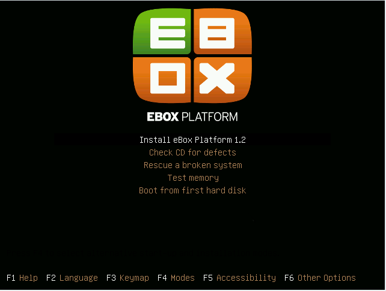

   Installer home screen

After installing the base system and rebooting, you can start installing
eBox Platform. There are two methods for selecting the functionalities
you want to include in your system.

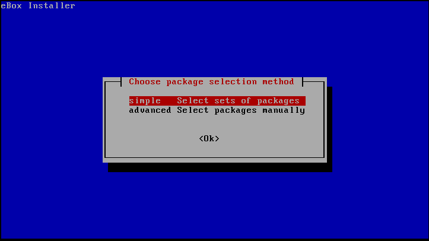

   Selection of the installation method

Simple:
  Depending on the task the server will be dedicated to, you
  can install a set of packages that provides several
  functionalities.
Advanced:
  You can select the packages individually. If a package has
  dependencies on other packages, these will be automatically
  selected later.

If you select the simple installation method, you get a list of
available profiles. As shown in the figure :ref:`profiles-img-ref`,
the mentioned list matches the following paragraphs of this
manual.

.. _profiles-img-ref:

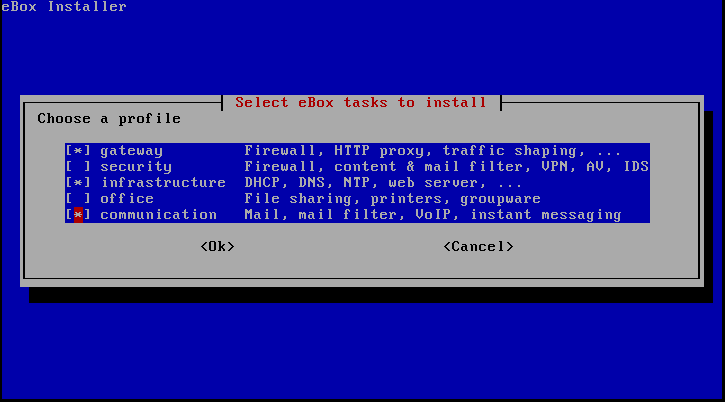

   Selection of the profiles

:ref:`ebox-gateway-ref`:
   eBox is the local network gateway that provides secure and
   controlled Internet access.
:ref:`ebox-utm-ref`:
   eBox protects the local network against external attacks,
   intrusions, internal security threats and enables secure
   interconnection between local networks via Internet or via
   other external networks.
:ref:`ebox-infrastructure-ref`:
   eBox manages the local network infrastructure including the
   following basic services: DHCP, DNS, NTP, HTTP server, etc.
:ref:`ebox-office-ref`:
   eBox is an office server that allows sharing the following
   resources through the local network: files, printers, calendars,
   contacts, authentication, users and groups profiles, etc.
:ref:`ebox-comm-ref`:
   eBox becomes the unified communications server of your
   organization, including mail, instant messaging and voice over IP.

You can select several profiles to combine different functionalities.
In addition, the selection is not final and later you can install and
remove packages according to your needs.

However, if you select the advanced installation method, you get the
complete list of eBox Platform modules and you can select individually
the modules you are interested in. Once you have completed the
selection, also the necessary additional packages will be installed.

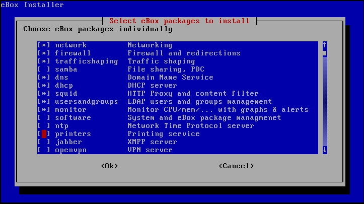

   Selection of the modules

After you have selected the components to install, the installation
process will begin and you will be shown a progress bar with the
installation status.

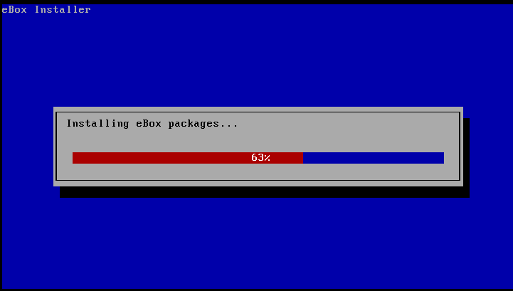

   Installing eBox Platform

Once the installation is completed, you are requested to enter a password to
access the eBox Platform web administration interface:

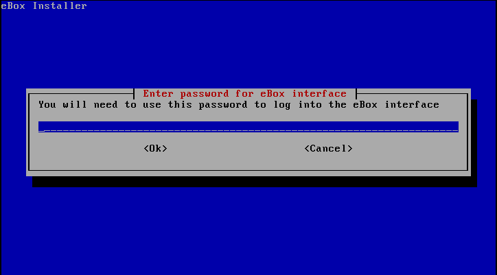

You need to confirm the inserted password:

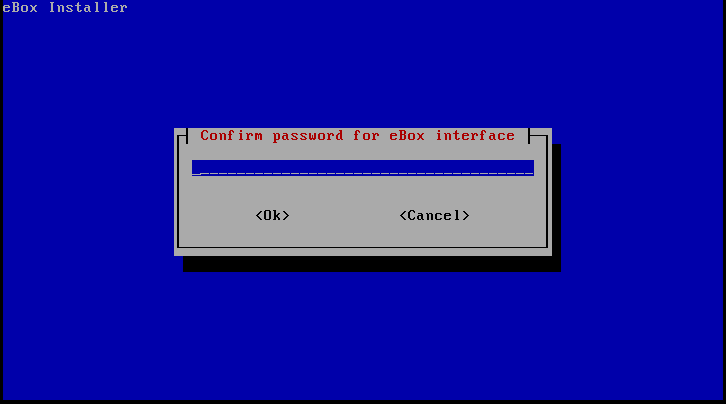

The installer will try to pre-configure some important configuration
parameters. First, it will ask if some of the network interfaces are external
(not within the local network), i.e., used to connect to the Internet. Strict
policies for all incoming traffic through external network interfaces
will be applied. Depending on the role the server plays, there might be
no external interfaces at all.

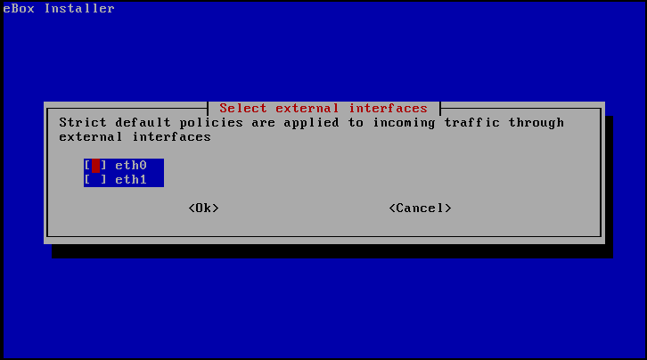

   Selection of the external interface

Second, if you installed the mail module, you will be requested
to enter the default virtual domain that will be the main virtual
domain of the system.

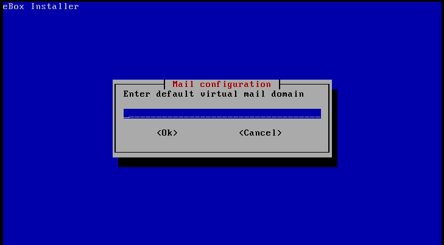

   Primary virtual mail domain

Once you have answered these questions, each module you installed
will be pre-configured and ready to be used via the web interface.

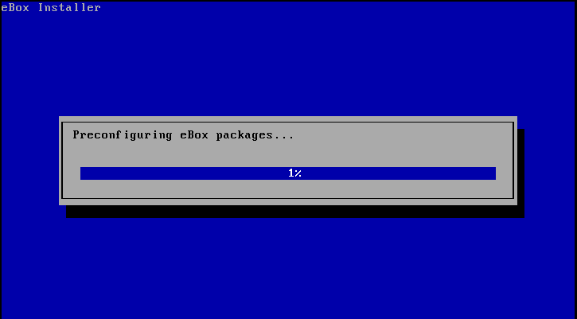

   Configuration progress

After this process is completed, a message informs you about how to connect
to the web interface of eBox Platform.

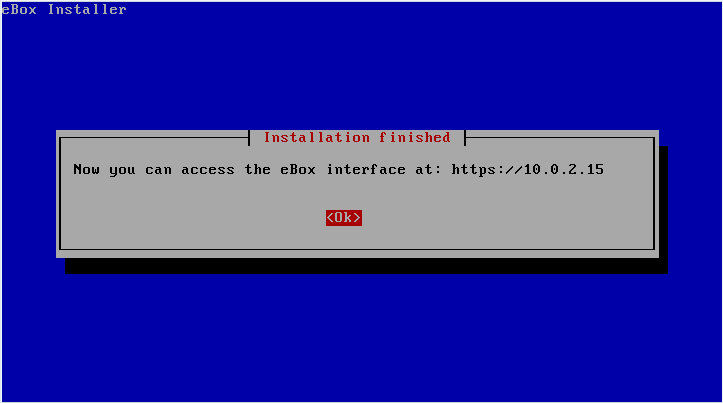

   Installation completed

Once the eBox Platform installation process is completed you get a system
console to authenticate with the user created during the *Ubuntu* installation.
eBox Platform password is exclusive to the web interface and it has nothing
to do with the administrator user password of the host. When you log in to
the console, you will get the following eBox Platform specific message:

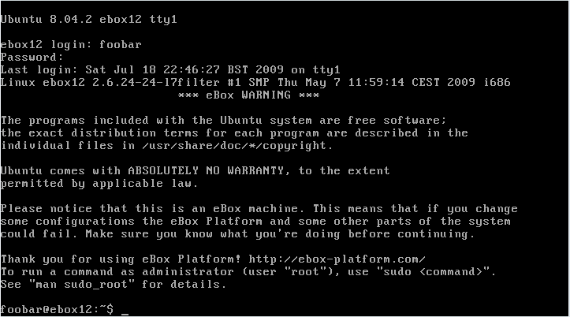

Administration web interface
****************************

Once you have installed eBox Platform, you can access the administration
web interface at the following URL:

  https://network_address/ebox/

Here *network_address* is the IP address or a host name that resolves to
the address where eBox is running.

.. warning::
   
   To access the web interface you should use Mozilla Firefox as they are
   some known issues with another browsers such as Microsoft Internet Explorer.

The first screen will ask for the administrator password:

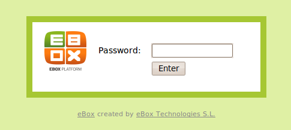

After authentication you get the administration interface that is divided
into three main sections:

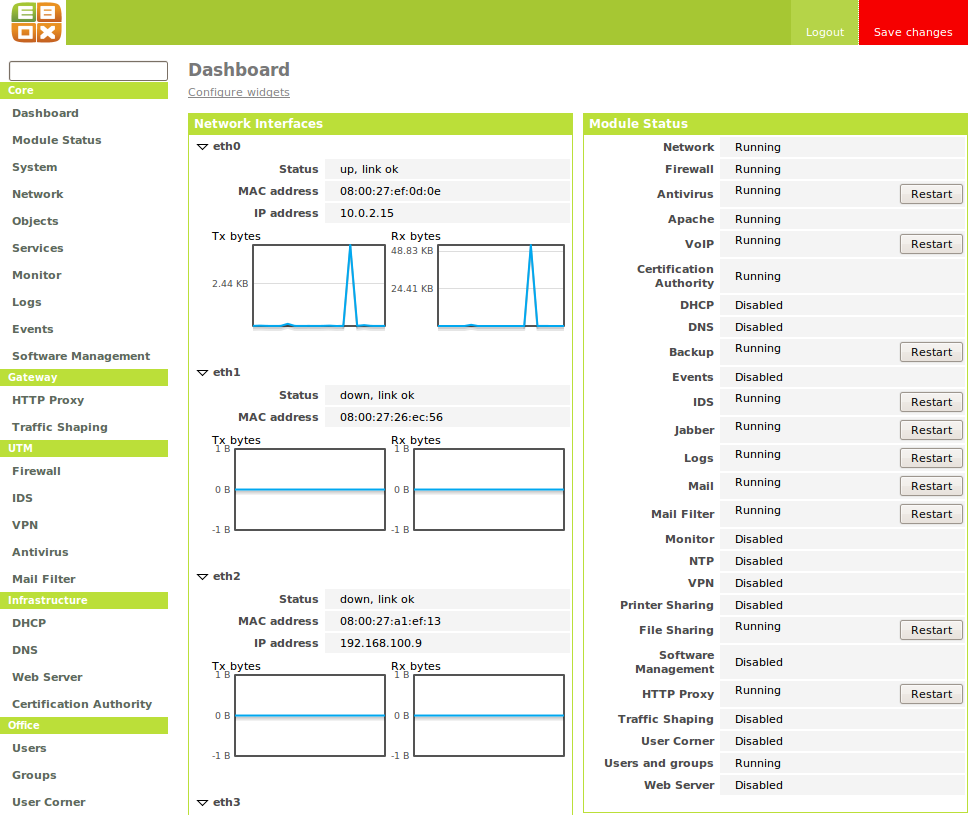

   Main screen

Left side menu:
  Contains links to all **services**, separated by categories, that can
  be configured using eBox. When you select a service, you might get a
  submenu to configure specific details of the selected service.

  .. figure:: images/intro/03-sidebar.png
     :scale: 50
     :alt: Left side menu
     :align: center

     Left side menu

Top menu:
  Contains **actions** to save the changes made to the content, make
  the changes effective and close the session.

  .. figure:: images/intro/04-topbar.png
     :alt: Top menu
     :align: center

     Top menu

Main content:
  The main content is composed of one or several forms or tables with
  information about the **service configuration** and depends on the
  selection made in the left side menu and submenus. Sometimes you will get
  a tab bar at the top of the page: each tab represents a different
  subsection within the section you have accessed.

  .. figure:: images/intro/05-center-configure.png
     :scale: 50
     :alt: Web User Interface configuration forms
     :align: center

     Web User Interface configuration forms

*Dashboard*
===========

The *dashboard* is the initial screen of the web interface. It
contains a number of configurable *widgets*. You can reorganize them
at any moment simply by clicking and dragging the titles.

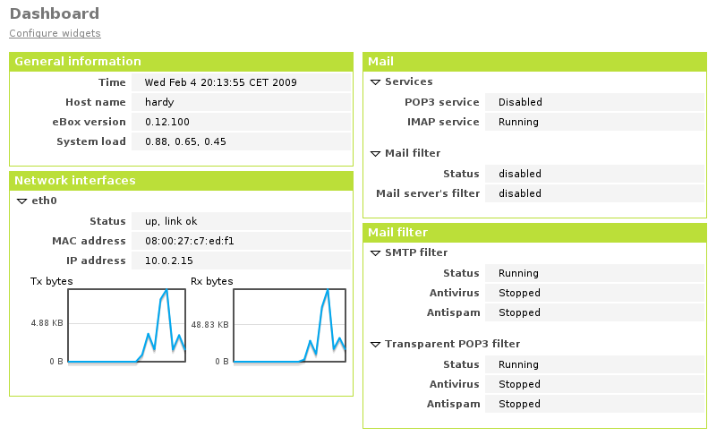

   *Dashboard*

By clicking on :guilabel:`Configure Widgets` the interface
changes, allowing you to remove and add new *widgets*. To add a new
widget, you search for it in the top menu and drag it to the main part
of the page.

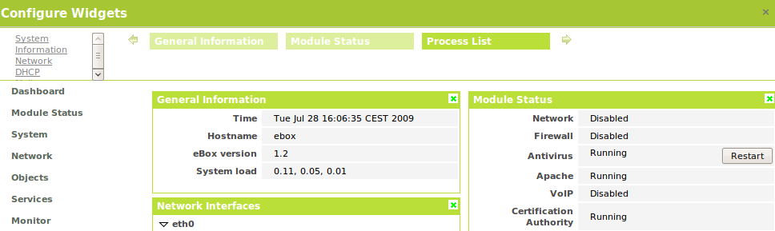

   *Dashboard* configuration

Module status
-------------

There is a very important *widget* within the *dashboard* which shows
the status from all installed modules in eBox.

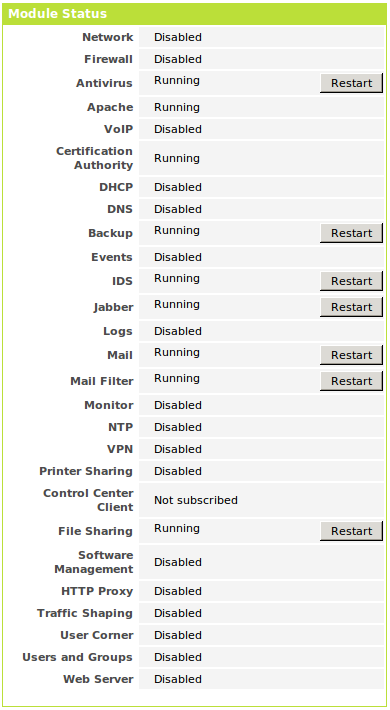

   Module status *widget*

The figure depicts the current status for a service and action to apply on
it. The available status are the following:

Running:
  The service daemons are running to accept connections from the
  network clients. You can restart the service using
  :guilabel:`Restart`.

Running unmanaged: 
  If you haven't configured the service yet, it is
  possible to find it running with the default configuration from the
  distribution. Therefore it is not managed by eBox yet.

Stopped:
  Some problem has happened since the service has to be running but it
  is stopped for some reason. In order to find it out, you
  should check the log files for the service or eBox log file itself
  as :ref:`ebox-working-ref` section describes. You may try to start
  the service by clicking on :guilabel:`Start`.

Disabled:
  The service has been disabled explicitly by the system administrator
  as it is explained in :ref:`module-status-ref`.

Applying configuration changes
==============================

An important detail to take into account is the method eBox uses to
apply the configuration changes made through the interface. First of all,
you have to accept changes in the current form, but, once this is done,
to make these changes effective and apply them on a permanent basis, you must
click on :guilabel:`Save Changes` from the top menu. This button will change to
red if there are unsaved changes. Failure to follow this procedure will result
in the loss of all changes you have made throughout the session once you log
out. There are some special cases when you don't need to save the changes,
but in these cases you will receive a notification.

.. figure:: images/intro/06-savechanges.png
   :scale: 70
   :alt: Save changes
   :align: center

   Save changes

In addition to this, you can revert your changes. Hence if you have
done something that you do not remember or you are unsure to do it,
you can always discard them safely. Take into account, if you have
made changes on the network interfaces configuration or the eBox Web
administration port, then you may lose current connection to eBox, so
you must rewrite the URL in the browser to reach administration
interface again.

.. _module-status-ref:

Modules status configuration
============================

As it is discussed above, eBox is built up with modules. The majority
of the modules are intended to manage network services that you must
enable them through :menuselection:`Module Status`. 

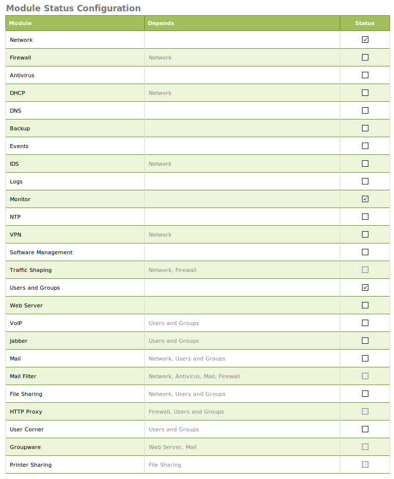

   Module status configuration

Each module may have dependencies on others to work. For instance,
DHCP service needs to have the network module enabled so that it
can serve IP address leases through the configured network
interfaces. Thus the dependencies are shown in :guilabel:`Depends`
column.

Enabling a module for the first time in eBox *jargon* is called
**configure** the module. Configuration is done once per module.
By clicking on :guilabel:`Status` checkbox, you enable the module. If
it is the first time, a dialog is presented to accept to carry out a
set of actions and file modifications that enabling the service
implies [#]_. After that, you may save changes to apply these
modifications. Likewise, you may disable a module by unchecking the
:guilabel:`Status` column for this module.

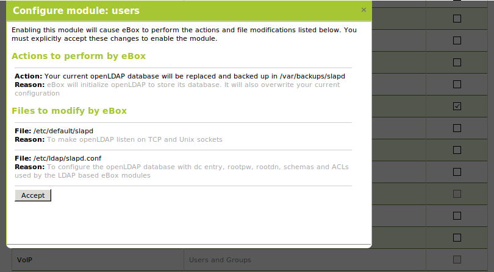

   Confirm dialog to **configure** a module

.. [#] This process is mandatory to comply the Debian Policy
   http://www.debian.org/doc/debian-policy/ 

.. _ebox-working-ref:

How does eBox Platform work?
****************************

eBox Platform is not just a simple web interface to manage the most
common network services [#]_. One of the main goals of eBox Platform
is to unify a set of network services that otherwise would work
independently.

.. [#] In order to understand the magnitude of the project, you can
       visit the independent site **ohloh.net**, where you can find
       an extensive analysis of the eBox Platform code base
       <http://www.ohloh.net/p/ebox/analyses/latest>.

.. figure:: images/intro/integration.png
   :scale: 70
   :alt: Integration of eBox Platform
   :align: center

All configuration of individual services is handled automatically by
eBox. To do this eBox uses a template system. This automation prevents
manual errors and saves administrators from having to know the details
of each configuration file format. As eBox manages automatically these
configuration files, you must not edit the original files as these will
be overwritten as soon you save any configuration changes.

.. manual

In the section :ref:`ebox-internals-ref` you can find a more detailed
explanation of how eBox Platform works internally.

.. endmanual

Reports of events and possible errors of eBox are stored in the
directory `/var/log/ebox/` and are divided in the following files:

`/var/log/ebox/ebox.log`:
  Errors related to eBox Platform.
`/var/log/ebox/error.log`:
  Errors related to the web server.
`/var/log/ebox/access.log`:
  Every access to the web server.

If you want more information about an error that has occurred, you can
enable the debugging mode by selecting the *debug* option in the
`/etc/ebox/99ebox.conf` file. Once you have enabled this option, you
should restart the web server of the interface by using
`sudo /etc/init.d/ebox apache restart`.

Location within the network
***************************

Local network configuration
===========================

eBox Platform can be used in two different ways:

* **Router** and **filter** of the Internet connection.
* Server of different network services.

Both functionalities can be combined in a single host or
divided among several hosts.

The figure :ref:`ebox-net-img-ref` displays the different locations eBox
Platform server can take in the network, either as a link between
networks or a server within the network.

.. _ebox-net-img-ref:

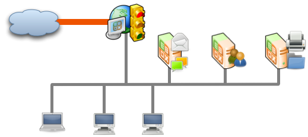

   Different locations within the network

Throughout this documentation you will find out how to configure eBox
Platform as a router and gateway. You will also learn how to configure
eBox Platform in the case it acts as just another server within the network.

Network configuration with eBox Platform
========================================

If you place a server within a network, you will most likely be assigned an IP
address via DHCP protocol. Through :menuselection:`Network --> Interfaces` you
can access each network card detected by the system and you can select between
a static configuration (address configured manually), dynamic configuration
(address configured via DHCP) or a *Trunk 802.1Q* to create VLANs.

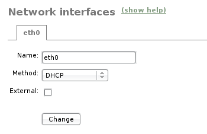

   Network interface configuration

If you configure a static interface, you can associate one or more
:guilabel:`Virtual Interfaces` to this real interface to serve additional IP
addresses. These can be used to serve different networks or the same network with
different address.

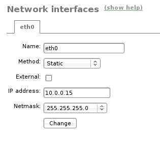

   Static configuration of network interfaces

To enable eBox to resolve domain names, you must indicate the address of one or
several domain name servers in :menuselection:`Network --> DNS`.

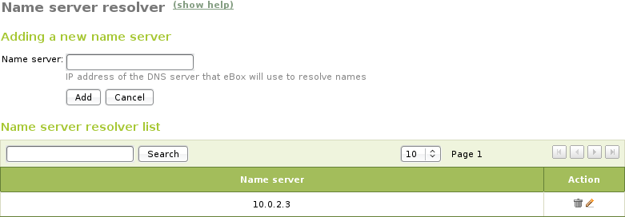

   Configuration of DNS servers

Network diagnosis
=================

To check if you have configured the network correctly, you can use the
tools available in :menuselection:`Network --> Diagnosis`.

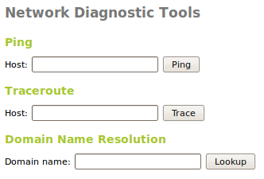

   Network diagnosis tools

**Ping** is a tool that uses the ICMP network diagnosis protocol to observe
whether a particular remote host is reachable by means of a simple "echo
request".

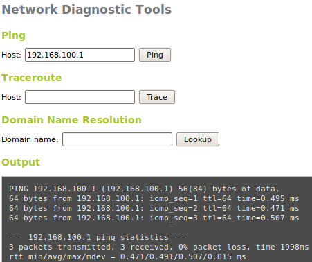

   **Ping** tool

Additionally you can use the **traceroute** tool that is used to determine
the route taken by packages across different networks until reaching a
given remote host. This tool allows to trace the route the packages
follow in order to carry out more advanced diagnosis.

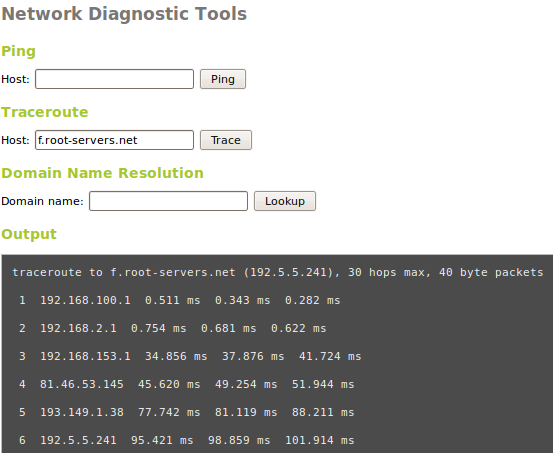

   **Traceroute** tool

Besides, you can use the **dig** tool, which is used to verify the correct
functioning of the name service resolution.

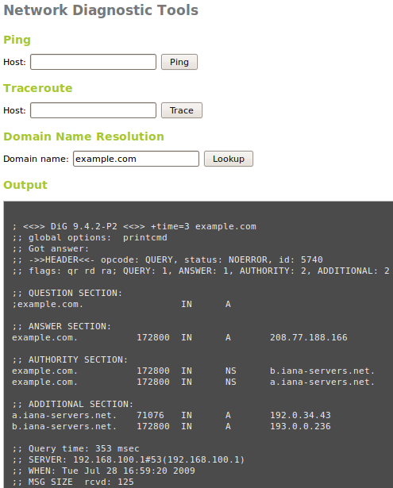

   **Dig** tool

Practical example A
-------------------

Let's configure eBox so that it obtains the network configuration via DHCP.

Therefore:

#. **Action:**
   Access the eBox interface, go to :menuselection:`Network --> Interfaces` and,
   as network interface, select *eth0*. Then choose the *DHCP* method.
   Click on :guilabel:`Change`.

   Effect:
     You have enabled the button :guilabel:`Save Changes` and the network
     interface maintains the entered data.

#. **Action:**
   Go to :menuselection:`Module status` and enable the **Network** module,
   in order to do this, check the box in the :guilabel:`Status` column.

   Effect:
     eBox asks for permission to overwrite some files.

#. **Action:**
   Read the changes that are going to be made in each modified file and grant
   eBox the permission to overwrite them.

   Effect:
   You have enabled the button :guilabel:`Save Changes` and you can enable
   some of the modules that depend on Network.

#. **Action:**
   Save the changes.

   Effect:
     eBox displays the progress while the changes are implemented. Once it
     has finished, you are notified.

     Now eBox manages the network configuration.

#. **Action:**
   Access :menuselection:`Network --> Diagnosis
   tools`. Ping ebox-platform.com.

   Effect:
     As a result, you are shown three successful connection attempts to
     the Internet server.

#. **Action:**
   Access :menuselection:`Network --> Diagnosis
   tools`. Ping the eBox of a fellow classmate.

   Effect:
     As a result, you are shown three successful connection attempts to
     the host.

#. **Action:**
   Access :menuselection:`Network --> Diagnosis tools`. Run a traceroute
   to ebox-technologies.com.

   Effect:
     As a result, you are shown a route of all the intermediate routers
     a packet traverses until it reaches the destination host.

Practical example B
-------------------

For the rest of the exercises of the manual, it is a good practice to
enable the logs.

Therefore:

#. **Action:**
   Access the eBox interface, go to :menuselection:`Module status` and enable
   the **Logs** module. In order to do this, check the box in the
   :guilabel:`Status` column.

   Effect:
     eBox asks for permission to carry out a series of actions.

#. **Action:**
   Read the actions that are going to be made and accept them.

   Effect:
     You have enabled the button :guilabel:`Save Changes`.

#. **Action:**
   Save the changes.

   Effect:

     eBox displays the progress while the changes are implemented. Once it
     has finished, you are notified.

     Now eBox has enabled the logs. You can check them at
     :menuselection:`Logs --> Query logs` in the section
     :ref:`logs-ref`.
