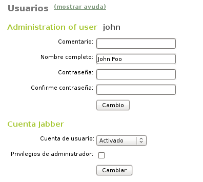
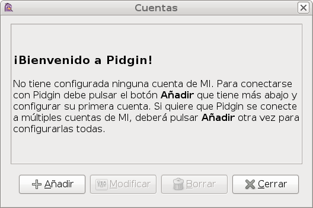
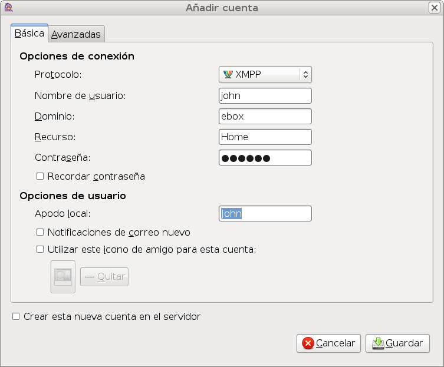
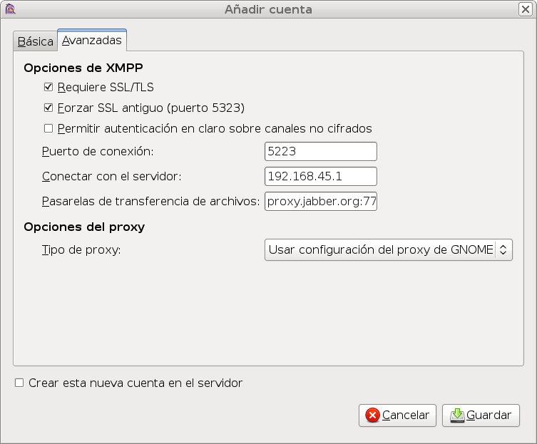

Instant Messaging (IM) Service (Jabber/XMPP)
********************************************

.. sectionauthor:: José A. Calvo <jacalvo@ebox-platform.com>,
                   Enrique J. Hernández <ejhernandez@ebox-platform.com>,
                   Víctor Jiménez <vjimenez@warp.es>
                   Javi Vázquez <javivazquez@ebox-technologies.com>

Instant messaging (IM) applications manage a list of
people with whom one wishes to stay in touch by exchanging messages.
They convert the asynchronous communication provided by email
in a synchronous communication in which participants can communicate
in real time.

Besides the basic conversation, IM has other benefits such as:
* Chat rooms.
* File transfer.
* Shared Whiteboard to view drawings done by a peer in real-time.
* Simultaneous connection from devices with different priorities
(e.g.: from the mobile and the computer, giving preference to one of them
for receiving messages).

Nowadays, there are many instant messaging protocols such as
ICQ, AIM or Yahoo! Messenger, whose operation is essentially privative and
centralized.

However, Jabber/XMPP is a set of protocols and technologies that enable the
development of distributed messaging. This protocol is public, open,
flexible, extensible, distributed and secure. Moreover, although Jabber/XMPP is
still in the process of becoming an international standard, it has been adopted
by Cisco or Google (for its messaging service Google Talk) among others.

eBox employs Jabber/XMPP as its IM protocol. Jabber/XMPP is integrated with user
management through :guilabel:`Jabber Service`. Additionally, eBox uses
**jabberd2** [#]_ as XMPP server.

.. [#] **jabberd 2.x** - *XMPP server* written in C http://jabberd2.xiaoka.com/

Configuring a Jabber/XMPP server with Ebox
------------------------------------------

First, check if the module :guilabel:`users and groups` is enabled, as Jabber depends on it.
If so, go to :guilabel:`Module State` in the eBox Menu and mark the box :guilabel:`jabber`.

.. figure:: images/jabber/jabber.png
   :scale: 80

   Jabber Service general configuration

To configure the server go to :menuselection:`Jabber Service`, setting the
following parameters:

Domain Name:
  Specifying the name of the server, the users' accounts will be *user@domain*.

  .. tip:: *domain* should have an entry in the DNS, so it can be
           resolved.

Connect to other servers:
   We must check this box if we want our users to contact users of external
   servers.  On the contrary, if you want a private server, only for your
   internal network, it should be left unchecked.

Enable Multi User Chat (MUC):
  It enables the chat rooms [#]_ for more than two users, giving the possibility
  to invite users, moderate and administer the room, etc.
  These rooms can be created as permanent or temporary.

SSL Support:
  It specifies whether the communications with the server are encrypted.
  You can disable it, make it mandatory or leave it as optional. If you
  leave SSL encryption as optional, it has to be selected when configuring the
  Jabber client.

.. [#] There is a standard for Jabber/XMPP chat rooms in http://xmpp.org/extensions/xep-0045.html

To register a user in the Jabber/XMPP service, go to
:menuselection:`Users --> Add User` if you want to create a new user account
on the Jabber server, or to :menuselection:`Edit user` if you just want to
enable the Jabber account for an already existing user.

   Setting up a Jabber account for a user

As you can see in the picture, a section called **Jabber account**
will appear, where you can select whether the account is enabled or disabled.
Moreover, you can specify whether the user will have administrator privileges
on the Jabber server. Administrator privileges allow to see which users are
connected to the server, send them messages, set the message displayed when
connecting (MOTD, Message Of The Day) and send a notice to all users connected
(broadcast).

Setting up a Jabber client
--------------------------

For the example of the configuration of a Jabber client, we will use **Pidgin**,
but if you use another client, the next steps should be very similar.

**Pidgin** [#] _ is a multi-protocol client that allows to manage multiple
accounts at the same time. In addition to Jabber/XMPP, Pidgin supports many
other protocols such as IRC, Yahoo! and MSN.

.. [#] Pidgin, the universal chat client http://www.pidgin.im/.

Pidgin is included by default in the desktop version of Ubuntu, and you can find
it in the menu :menuselection:`Internet --> IM client Pidgin`.
When starting Pidgin, if you do not have an account created yet,
the window to manage accounts will appear as shown in the picture.

From this window, you can add new accounts and modify and delete existing
accounts.

Clicking on :guilabel:`Add`, two tabs with the basic and advanced configuration
will appear.

For the basic configuration of your Jabber/XMPP account, start by selecting
the protocol :guilabel:`XMPP`. The name and password should be the same that
the Jabber-enabled users have on eBox. The domain must be the same
than that selected in the configuration of :guilabel:`Jabber Service`.
In the field :guilabel:`Local nick`, write the name you want to show to your
contacts.

In case the domain of the Jabber server is not a domain registered in the
eBox DNS, you will have to provide eBox IP or domain name. You can do this in
the field :guilabel:`Connect with the server` in the tab
:menuselection:`Advanced`.

If you have configured the Jabber service to require SSL, you must check the
boxes: :guilabel:`Requires SSL/TLS` and :guilabel:`Force old SSL`, and set the
:guilabel:`Connection port` to the value 5223.

.. _jabber-exercise-ref:

Practical example
^^^^^^^^^^^^^^^^^
Enable the Jabber service and assign to it a domain name that eBox is able to
resolve.

#. **Action:**
   Go to :menuselection:`Module Status` and enable the module :guilabel:`Jabber`.
   When the info about the actions required in the system is displayed,
   allow them by clicking :guilabel:`Accept`.

   Effect:
     Enabled the button :guilabel:`Save Changes`.

#. **Action:**
   Add a domain with the desired name and whose IP address is equivalent to the
   eBox machine's, in the same way done in :ref:`dns-exercise-ref`.

   Effect:
     You will be able to use the added domain as the domain for your Jabber
     service.

#. **Action:**
   Access the menu :menuselection:`Jabber Service`. In the field
   :guilabel:`Domain Name`, write the domain name just added. Click
   :guilabel:`Apply Changes`.

   Effect:
     :guilabel:`Save Changes` has been enabled.

#. **Action:**
   Save the changes.

   Effect:
     eBox shows the progress while applying the changes. Once done, it is shown.

     The Jabber Service is ready to be used.

.. include:: jabber-exercises.rst
