Instant Messaging (IM) Service (Jabber/XMPP)
********************************************

.. sectionauthor:: José A. Calvo <jacalvo@ebox-platform.com>,
                   Enrique J. Hernández <ejhernandez@ebox-platform.com>,
                   Jorge Salamero Sanz <jsalamero@ebox-platform.com>,
                   Víctor Jiménez <vjimenez@warp.es>,
                   Javi Vázquez <javivazquez@ebox-technologies.com>

Instant messaging (IM) applications manage a list of
people with whom one wishes to stay in touch by exchanging messages.
They convert the asynchronous communication provided by email
in a synchronous communication in which participants can communicate
in real time.

Besides the basic conversation, IM has other benefits such as:

* Chat rooms.
* File transfer.
* Status updates (e.g.: you are busy, on the phone, away or idle).
* Shared whiteboard to view and show drawings with contacts.
* Simultaneous connection from devices with different priorities (e.g.: from
  the mobile and the computer, giving preference to one of them for receiving
  messages).

Nowadays, there are many instant messaging protocols such as
ICQ, AIM, MSN or Yahoo! Messenger, whose operation is essentially privative and
centralized.

However, Jabber/XMPP is a set of protocols and technologies that enable the
development of distributed messaging. These protocols are public, open,
flexible, extensible, distributed and secure. Moreover, although Jabber/XMPP is
still in the process of becoming an international standard, it has been adopted
by Cisco or Google (for its messaging service Google Talk) among others.

eBox employs Jabber/XMPP as its IM protocol integrating users with Jabber accounts.
**jabberd2** [#]_ XMPP server is being used for eBox Jabber/XMPP service.

.. [#] **jabberd2** - *XMPP server* <http://jabberd2.xiaoka.com/>.

Configuring a Jabber/XMPP server with eBox
------------------------------------------

To configure the Jabber/XMPP server in eBox, first check in :guilabel:`Module Status`
if the :guilabel:`Users and Groups` module is enabled, as Jabber depends on it.
Then, mark the :guilabel:`Jabber` checkbox to enable the Jabber/XMPP eBox module.

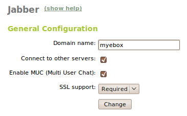

   Jabber General Configuration

To configure the service, go to :menuselection:`Jabber` in the left menu, setting the
following parameters:

:guilabel:`Domain Name`:
  Specifying the domain name of the server. User accounts will be *user@domain*.

  .. tip:: *domain* should have an entry in the DNS server, so it can be
           resolved from the clients.

:guilabel:`Connect to other servers`:
  To allow our users contact users in external servers, and the other way
  around, check this box. Otherwise, if you want a private server for your
  internal network, it should be left unchecked.

:guilabel:`Enable Multi User Chat (MUC)`:
  Enables conference rooms (chat for more than two users).

  .. tip:: the conference rooms are under the domain *conference.domain* which like the
           :guilabel:`Domain Name` should have an entry in the DNS server, so it can be
           resolved from the clients too.

:guilabel:`SSL Support`:
  It specifies whether the communications (authentication and chat messages) with
  the server are encrypted or plaintext. You can disable it, make it mandatory or leave
  it as optional. If you set it as optional, this setting will be selected from the
  Jabber client.

To create a Jabber/XMPP user account, go to :menuselection:`Users --> Add User`
if you want to create a new user account, or to
:menuselection:`Users --> Edit User` if you just want to enable the Jabber
account for an already existing user account.

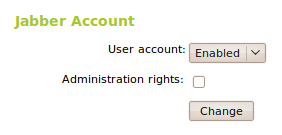

   Setting up a Jabber account

As you can see, a section called **Jabber Account** will appear, where you can
select whether the account is enabled or disabled. Moreover, you can specify
whether the user will have administrator privileges. Administrator privileges
allow to see which users are connected to the server, send them messages, set
the message displayed when connecting (MOTD, Message Of The Day) and send a
notice to all users connected (broadcast).

Setting up a Jabber client
--------------------------

To illustrate the configuration of a Jabber client, we will use **Pidgin**
and **Psi**, but if you use another client, the next steps should be very similar.

Pidgin
^^^^^^

**Pidgin** [#]_ is a multi-protocol client that allows to manage multiple
accounts at the same time. In addition to Jabber/XMPP, Pidgin supports many
other protocols such as IRC, ICQ, AIM, MSN and Yahoo!.

.. [#] **Pidgin**, *the universal chat client* <http://www.pidgin.im/>.

Pidgin was included by default in the Ubuntu desktop edition until *Karmic*,
but still is the most popular IM client. You can find
it in the menu :menuselection:`Internet --> Pidgin Internet Messenger`.
When starting Pidgin, if you do not have any account configured yet,
the window to manage accounts will appear as shown in the picture.

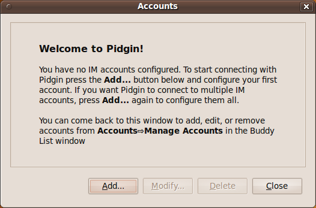

From this window, you can add new accounts, modify and delete existing
accounts.

Clicking on :guilabel:`Add`, two tabs with the basic and advanced configuration
will appear.

For the :guilabel:`Basic` configuration of your Jabber account, start by selecting
the protocol :guilabel:`XMPP`. The :guilabel:`Username` and :guilabel:`Password`
should be the same that the Jabber enabled user account has on eBox. The 
:guilabel:`Domain` must be the same that is set up in the Jabber/XMPP eBox
module configuration. Optionally, in the field :guilabel:`Local alias`, write the name
you want to show to your contacts.

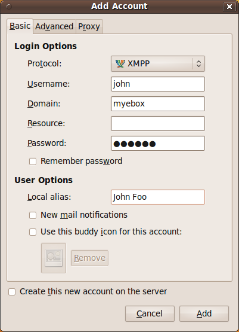

On the :guilabel:`Advanced` tab we can configure the SSL/TLS settings. By
default :guilabel:`Require SSL/TLS` is checked, so if we disabled on eBox the
:guilabel:`SSL Support` we must uncheck this and check :guilabel:`Allow plaintext
auth over unencrypted streams`.

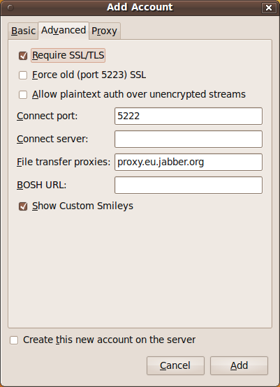

If we didn't change the default SSL certificate a warning will be raised asking
whether we want to accept it.

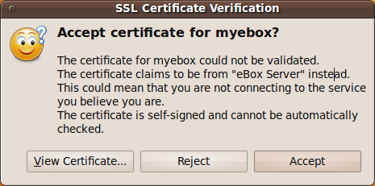

Psi
^^^

**Psi** [#]_ is a Jabber/XMPP client that allows to manage multiple
accounts at the same time. Fast and lightweight, Psi is fully open-source
and compatible with Windows, Linux, and Mac OS X.

.. [#] **Psi**, *The Cross-Platform Jabber/XMPP Client For Power Users* <http://psi-im.org/>.

When starting Psi, if you do not have any account configured yet, a window will
appear asking to use an existing account or registering a new one as shown
in the picture. We will select :guilabel:`Use existing account`.

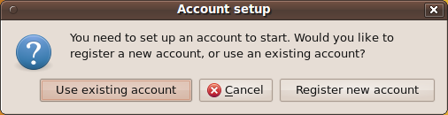

On the :guilabel:`Account` tab we will setup the basic configuration like the
:guilabel:`Jabber ID` or JID which is *user@domain* and the :guilabel:`Password`.
The user and password should be same that the Jabber enabled user account has on eBox.
The domain must be the same that is set up in the Jabber/XMPP eBox module configuration.

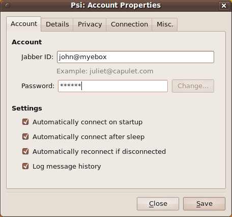

On the :guilabel:`Connection` tab we can find the SSL/TLS settings between other
advanced configuration. By default :guilabel:`Encrypt connection: When available`
is selected. If we disabled on eBox the :guilabel:`SSL Support` we must change
:guilabel:`Allow plaintext authentication` to :guilabel:`Always`.

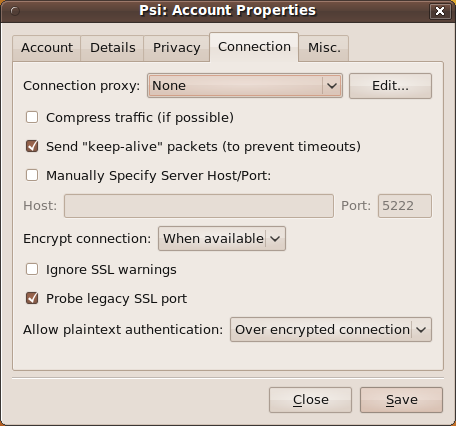

If we didn't change the default SSL certificate a warning will be raised asking
whether we want to accept it. To avoid this message check :guilabel:`Ignore SSL
warnings` on the :guilabel:`Connection` tab from last step.

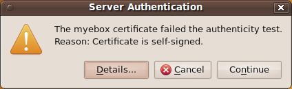

The first time we connect the client will raise a harmless error because we
haven't published our personal information on the server yet.

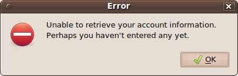

Optionally we can publish some information about ourselves here.

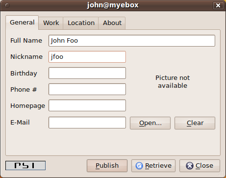

Once published, this error won't appear again.

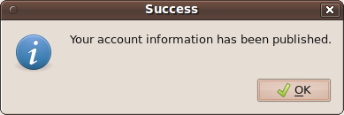

.. _jabber-exercise-ref:

Setting up a Jabber MUC (Multi User Chat) room
----------------------------------------------

Jabber MUC or Multi User Chat is a service that allows multiple users exchange
messages in the context of a room. Features like room topics, invitations, 
ability to kick and ban users, require password to join a room and many more
are available in Jabber MUC rooms. For a full specification of MUC check,
XEP-0045: Multi-User Chat [#]_ draft.

.. [#] The Jabber/XMPP chat rooms specification is available in <http://xmpp.org/extensions/xep-0045.html>.

Once we have enabled :guilabel:`Enable Multi User Chat (MUC)` on the
:menuselection:`Jabber` eBox menu entry, all further room configuration is
done from the Jabber clients.

Everybody can create a room on the Jabber/XMPP eBox server and the user who
creates a room is the administrator for that room. This administrator can
set up all the settings, add other users as moderators or administrators
and destroy the room.

One of the settings that we should highlight is :guilabel:`Make Room Persistent`.
By default all the rooms are destroyed shortly after the last participant leaves.
These are called dynamic rooms and are the preferred method for multi-user chats.
On the other hand, persistent rooms must be destroyed by one of its administrators and are
usually setup for work-groups or topics.

On Pidgin to join a chat room go to :guilabel:`Buddies --> Join a Chat...`.
A :guilabel:`Join a Chat` window will pop up asking for some information like the
:guilabel:`Room` name, the :guilabel:`Server` which should be *conference.domain*,
the user :guilabel:`Handle` or nickname and the room :guilabel:`Password` if needed.

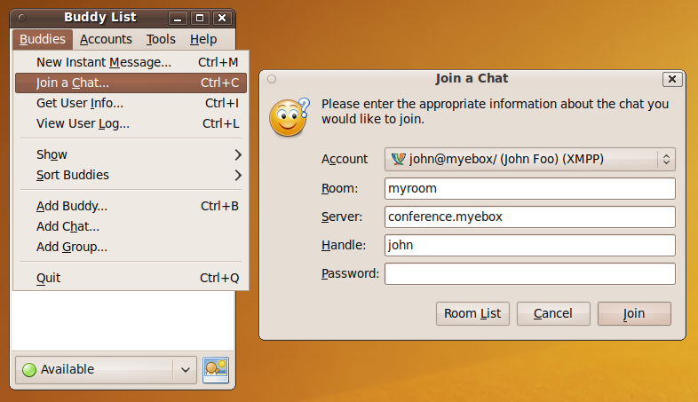

First user in joining a non existent room will lock it and will be asked whether
:guilabel:`Configure Room` or :guilabel:`Accept Defaults`.

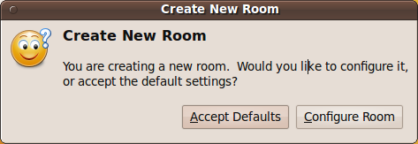

On :guilabel:`Room Configuration` will be able to set up all the possible settings for the room.
This configuration window can be opened later typing */config* in the room chat window.

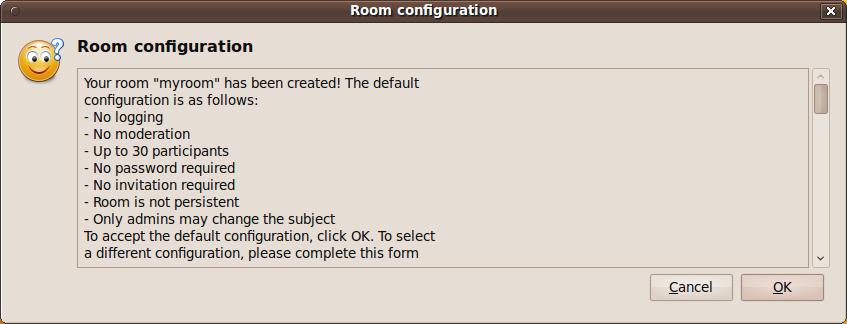

Once configured, other users will be able to join the room under the settings applied, leaving
the room unlocked ready to use.

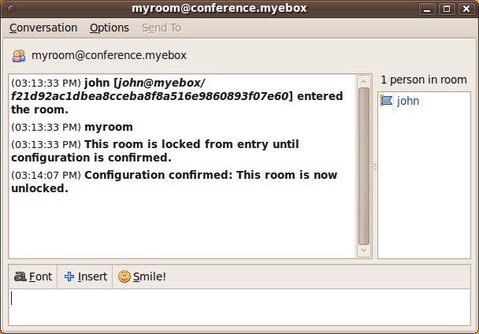

On Psi to join a chat room we should go to :guilabel:`General --> Join Groupchat`.
A :guilabel:`Join Groupchat` window will pop up asking for some information like the
:guilabel:`Host` which should be *conference.domain*, the :guilabel:`Room` name,
the user :guilabel:`Nickname` and the room :guilabel:`Password` if needed.

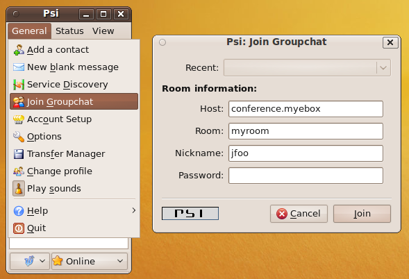

First user joining a non existent room will lock it and will be asked to configure it. On the
top right corner, a button will show a context menu with the :guilabel:`Configure Room` option.

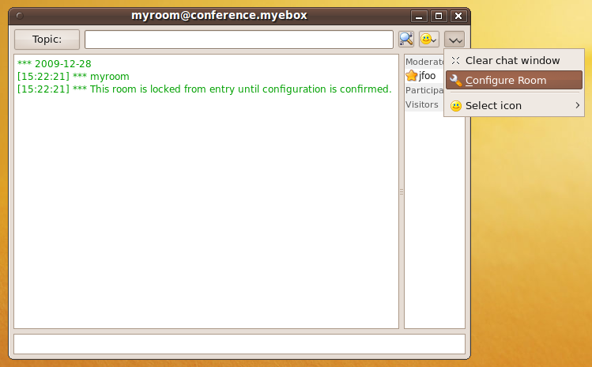

On :guilabel:`Room Configuration` will be able to set up all the possible settings for the room.

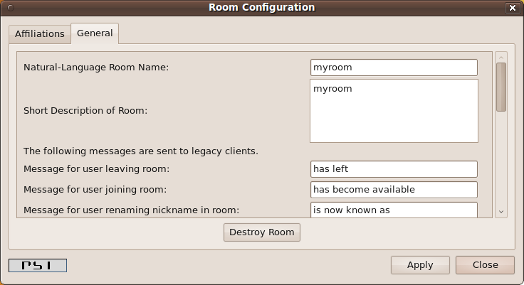

Once configured, other users will be able to join the room under the settings applied, leaving
the room unlocked ready to use.

Practical example
-----------------

Enable the Jabber/XMPP service and assign to it a domain name that eBox and the
clients are able to resolve.

#. **Action:**
   Go to :menuselection:`Module Status` and enable the module :guilabel:`Jabber`.
   When the info about the actions required in the system is displayed,
   allow them by clicking :guilabel:`Accept`.

   Effect:
     Enabled the button :guilabel:`Save Changes`.

#. **Action:**
   Add a domain with the desired name and whose IP address is the
   eBox server one, in the same way done in :ref:`dns-exercise-ref`.

   Effect:
     You will be able to use the added domain as the domain for your Jabber/XMPP
     service.

#. **Action:**
   Access the menu :menuselection:`Jabber`. In the field
   :guilabel:`Domain Name`, write the domain name just added. Click
   :guilabel:`Apply Changes`.

   Effect:
     :guilabel:`Save Changes` has been enabled.

#. **Action:**
   Save the changes.

   Effect:
     eBox shows the progress while applying the changes. When it finish, a
     message will be displayed.

     Now the Jabber/XMPP Service is ready to be used.

.. include:: jabber-exercises.rst
