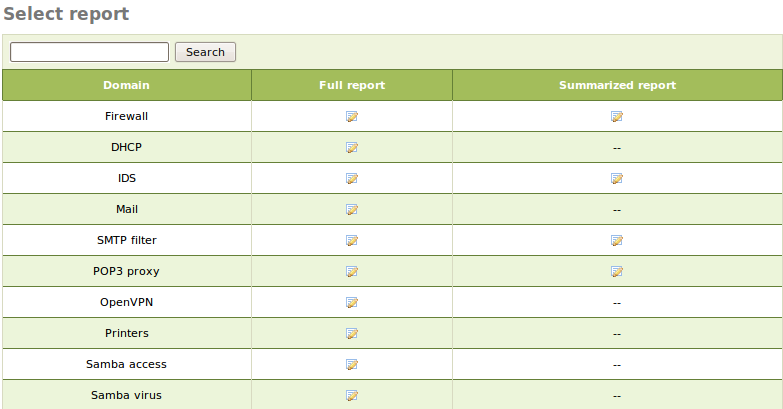
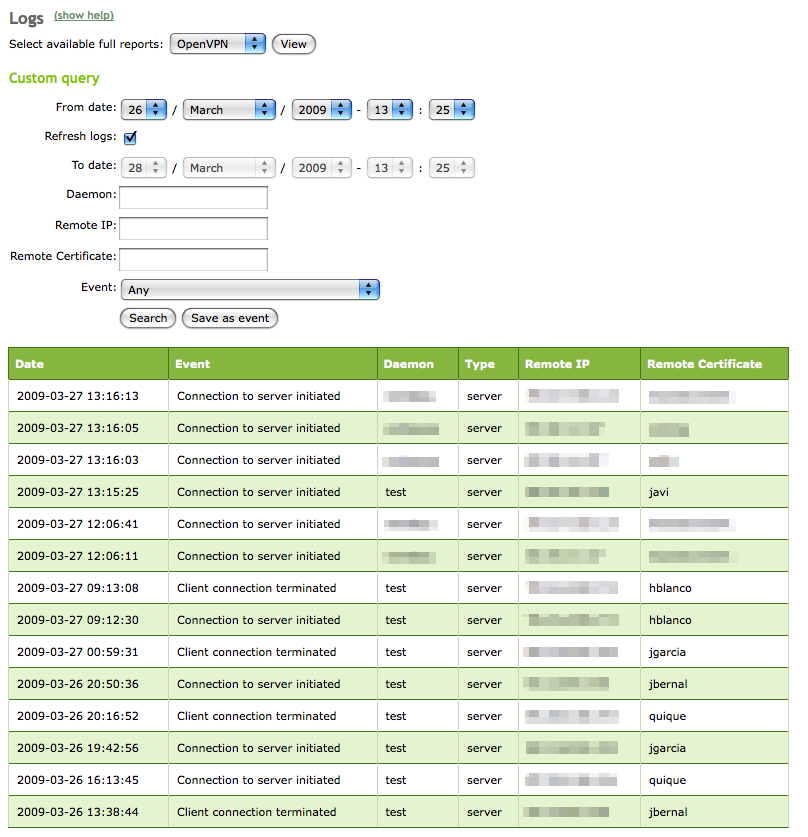
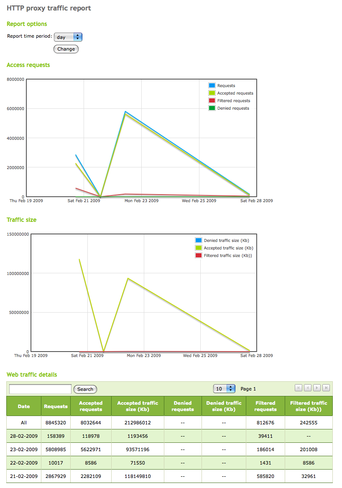
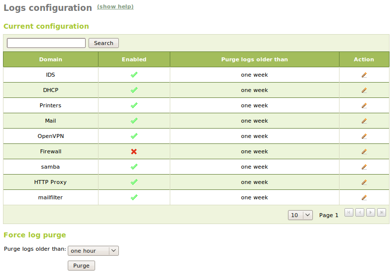

.. _logs-ref:

Logs
****

.. sectionauthor:: José A. Calvo <jacalvo@ebox-technologies.com>,
                   Enrique J. Hernandez <ejhernandez@ebox-technologies.com>

eBox provides an infrastructure for their modules that allows them to
log different kind of events that may be useful for the
administrator. These **logs** are available through the
eBox interface. They are also stored in a database for making queries, reports
and updates in an easier and more efficient way. The database management system
used is **PostgreSQL** [#]_.

.. [#] **PostgreSQL** *The world's most advanced open source database*
    http://www.postgresql.org/.

We can also configure different dispatchers for the events. That way
the administrator can be notified by different means
(email, RSS or Jabber [#]_).

.. [#] **RSS** *Really Simple Syndication* is an XML format used
    mainly to publish frequently updated works
    http://www.rssboard.org/rss-specification/.

You can have logs for the following services:

- OpenVPN (:ref:`vpn-ref`)
- SMTP Filter (:ref:`smtp-filter-ref`)
- POP3 proxy (:ref:`pop3-proxy-ref`)
- Printers (:ref:`printers-ref`)
- Firewall (:ref:`firewall-ref`)
- DHCP (:ref:`dhcp-ref`)
- Mail (:ref:`mail-service-ref`)
- Proxy (HTTP :ref:`proxy-http-ref`)
- File Sharing (:ref:`filesharing-chapter-ref`)
- IDS (:ref:`ids-ref`)

Likewise, you can receive notifications of the following events:

- Specific values inside the logs.
- eBox health status.
- Service status
- Events from the software RAID subsystem.
- Free disk space.
- Problems with Internet routers.
- Completion of a full data backup.

First, before you can work with the **logs**, like other eBox modules,
you have to make sure it is enabled.

To enable it, go to :menuselection:`Module Status` and
select :guilabel:`Logs`. In order to obtain reports
from the existing logs, you can access the
:menuselection:`Logs -> Query Logs` menu.

You can get a :guilabel:`Full report` of all log domains.
Moreover, some of them give us an interesting
:guilabel:`Summarized Report` that provides an overview of the
service for a period of time.

   Query logs

In :guilabel:`Full report`, we have a list of all registered actions for the
selected domain. Information provided is dependent on each domain.  For example,
for the *OpenVPN* domain you can see the connections to a VPN server
of a client with a specific certificate, or for example, in the *HTTP Proxy*
domain you can know which pages have been denied to a particular client.
You can also make custom queries that allow filtering by time period
or different values, depending on the domain.
These queries can be stored like an event that generates an
alert when a match occurs. Furthermore, if you do a query without an
upper bound in time, the results will be automatically refreshed with new data.

   Full report example

The :guilabel:`Summarized Report` allows you to select the period
of the report, which may be one hour, one day, a week or a month. The
information you get is one or more graphs, accompanied by a
summary table with total values for different data. In the picture
you can see, for example, daily statistics about the requests and traffic of
the *HTTP proxy*.

   Summarized report example

Logs configuration
==================

Once you know how to check the logs, is also important to know how to
configure them, through the :menuselection:`Logs -> Configure logs` menu
on the eBox interface.

   Configure logs

The values you can configure for each installed domain are:

Enabled:
  If this option is not activated no logs are written for this domain.
Purge logs older than:
  Sets the maximum time that the logs will be saved. Every
  value whose age exceeds the specified period, will be discarded.

You can also force the instant removal of all
logs that are older than a certain period. You can do this
using the :guilabel:`Purge` button inside of the :guilabel:`Force log purge`
section, which allows you to select different intervals
between one hour and 90 days.

Practical example
^^^^^^^^^^^^^^^^^
Enable the **logs** module. Using the
:ref:`mail-conf-exercise-ref` as a reference for generating email traffic
containing viruses, spam, banned senders and forbidden files.
Observe the results in :menuselection `Logs -> Query Logs -> Full Report`.

#. **Action:**
    Access eBox interface. Go to :menuselection:`Module Status` and
    activate the :guilabel:`logs` module. For this, check the box in the
    :guilabel:`State` column. You will be informed that a database
    to save the logs is going to be created. Allow the operation by pressing
    :guilabel:`Accept`.

    Effect:
      :guilabel:`Save Changes` button is now activated.

#. **Action:**
    Access :menuselection:`Logs -> Configure Logs` and check
    that the :guilabel:`Mail` domain is already enabled.

    Effect:
      You have enabled the **Logs** module and you have checked that the logs
      for **mail** are enabled.

#. **Action:**
    Save the changes.

    Effect:
      eBox shows the progress while applying the changes. Once the process
      is finished you are notified of that.

      From now on, all sent emails will be logged.

#. **Action:**
    Send a few problematic emails (with spam or virus)
    as it was done in the relevant chapter.

    Effect:
      As now the logs module is enabled, emails have been
      logged, unlike what happened when we sent them for the
      first time.

#. **Action:**
    Access :menuselection:`Records -> Query Logs` and
    :menuselection:`Full report` for the :guilabel:`Mail` domain.

    Effect:
      A table with entries for the emails that you have
      sent appears showing some information for each sent email.

.. include:: logs-exercises.rst
