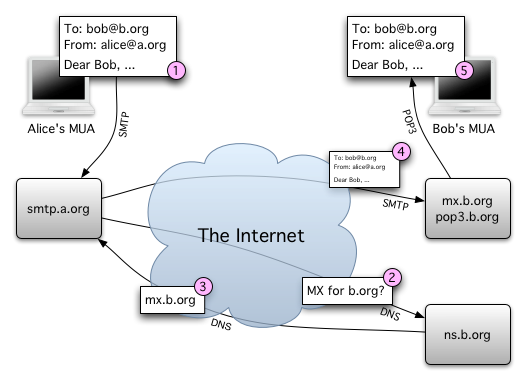
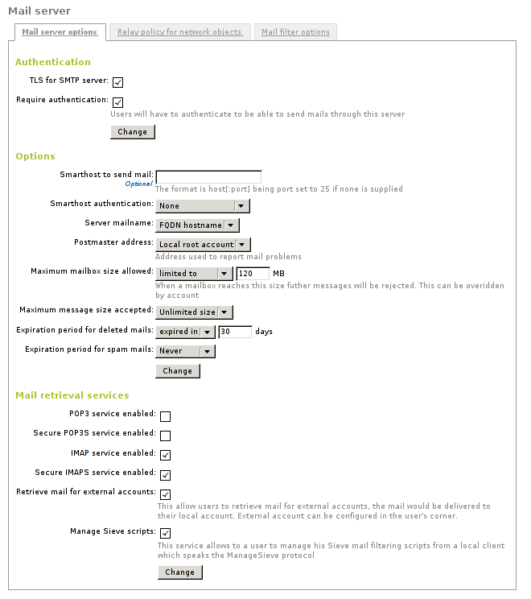
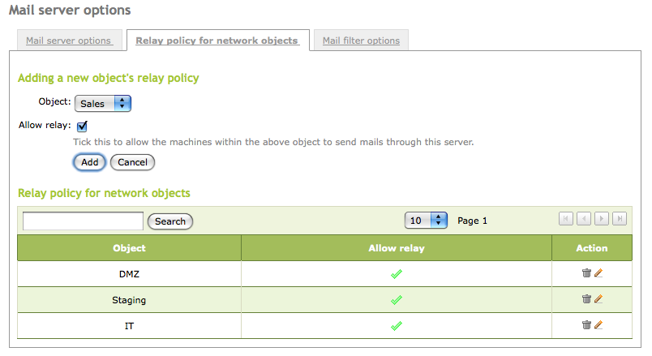
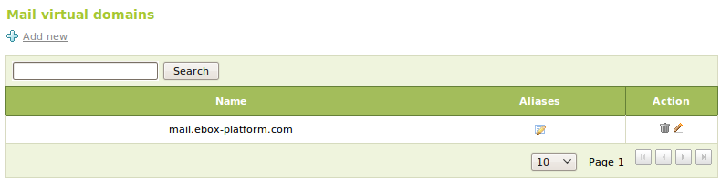
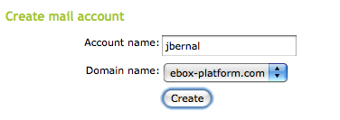
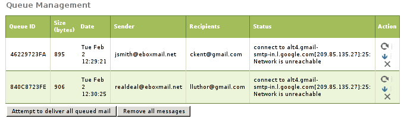
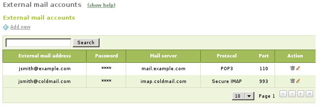

.. _mail-service-ref:

Electronic Mail Service (SMTP/POP3-IMAP4)
*****************************************

.. sectionauthor:: Javier Amor García <jamor@ebox-platform.com>
                   Jose A. Calvo <jacalvo@ebox-platform.com>
                   Enrique J. Hernández <ejhernandez@ebox-platform.com>
                   Víctor Jímenez <vjimenez@warp.es>

The **electronic mail** service is a store and forward method [#]_
to compose, send, store and receive messages over electronic
communication systems.

.. [#] **Store and forward**: Telecommunication technique in which 
       information is sent to an intermediate station where it is kept
       and sent at a later time to the final destination or to another
       intermediate station.

How electronic mail works through the Internet
==============================================

   Diagram where Alice sends an email to Bob

The diagram depicts a typical event sequence that takes place when
Alice writes a message to Bob using her *Mail User Agent* (MUA).

1. Her MUA formats the message in email format and uses the
   *Simple Mail Transfer Protocol* (SMTP) to send the message to the
   local *Mail Transfer Agent* (MTA).
2. The MTA looks at the destination address provided in the SMTP (not
   from the message header), in this case bob@b.org, and resolves a
   domain name to determine the fully qualified domain name of the
   destination mail exchanger server (**MX** record that was explained
   in the DNS section).
3. **smtp.a.org** sends the message to **mx.b.org** using SMTP, which
   delivers it to the mailbox of the user **bob**.
4. Bob receives the message through his MUA, which picks up the
   message using *Pop Office Protocol* (POP3).

There are many alternative possibilities and complications to the
previous email system sequence. For instance, Bob may pick up his
email in many ways, for example using the *Internet Message Access
Protocol* (IMAP), by logging into mx.b.org and reading it directly, or
by using a **Webmail** service.

The sending and reception of emails between mail servers is done through SMTP
but the users pick up their email using POP3, IMAP or their secure versions
(POP3S and IMAPS). Using these protocols
provides interoperability among different servers and email clients. There
are also proprietary protocols such as the ones used by *Microsoft Exchange* 
and *IBM Lotus Notes*.

POP3 vs. IMAP
-------------

The POP3 design to retrieve email messages is useful for slow connections,
allowing users to pick up all their email all at once to see and
manage it without being connected. These messages are usually removed
from the user mailbox in the server, although most MUAs allow to keep them
on the server.

The more modern IMAP, allows you to work on-line or offline as well as
to explicitly manage server stored messages. Additionally, it supports
simultaneous access by multiple clients to the same mailbox or partial retrievals
from MIME messages among other advantages. However, it is a quite complicated
protocol with more server work load than POP3, which puts most of the load on
the client side. The main advantages over POP3 are:

- Connected and disconnected modes of operation.
- Multiple clients simultaneously connected to the same mailbox.
- Access to MIME message parts and partial fetching.
- Message state information using *flags* (read, removed, replied, ...).
- Multiple mailboxes on the server (usually presented to the user as
  folders) allowing to make some of them public.
- Server-side searches
- Built-in extension mechanism

Both POP3 and IMAP have secure versions, called respectively POP3S and
IMAPS. The difference with its plain version is that they use TLS encryption so
the content of the messages cannot be eavesdropped.

SMTP/POP3-IMAP4 server configuration with eBox
==============================================

Setting up an email system service requires to configure an MTA to send
and receive emails as well as IMAP and/or POP3 servers to allow users
to retrieve their mails.

To send and receive emails Postfix [#f1]_ acts as SMTP server. The email
retrieval service (POP3, IMAP4) is provided by Dovecot [#f2]_. Both
servers support secure communication using SSL.

.. rubric:: Footnotes

.. [#f1] **Postfix** The Postfix Home Page http://www.postfix.org .

.. [#f2] **Dovecot** Secure IMAP and POP3 Server http://www.dovecot.org .

Receiving and relaying mail
============================

In order to understand the mail system configuration, a distinction
must be made between receiving mail and relaying mail.

**Reception** is when the server accepts a mail message whose
recipients contains an account that belongs to any of his virtual mail
domains. Mail can be received from any client which is able to
connect to the server.

On the other hand, **relay** is done when the mail server receives a
message whose recipients do not belong to any of his managed virtual
mail domains, thus requiring forwarding the message to other server.
Mail relay is restricted, otherwise *spammers* could use the server to
send spam over the Internet.

eBox allows mail relay in two cases:

 1. an authenticated user
 2. a source address that belongs to a network object which has a
    **allowed relay** policy

General configuration
---------------------

Through :menuselection:`Mail --> General --> Mail server options -->
Authentication`, you can manage the authentication options. The
following options are available:

:guilabel:`TLS for SMTP server`: 
   Force the clients to connect to the mail server using TLS encryption,
   thus avoiding eavesdropping.
:guilabel:`Require authentication`: 
   This setting enables the authentication usage. A user must use his
   email address and his password to identify himself, authenticated
   users can relay mail through the server. An account alias cannot be
   used to authenticate.

In the :menuselection:`Mail --> General --> Mail server options -->
Options` section you may configure the general settings for the mail
service:

:guilabel:`Smarthost to send mail`:
  Domain name or IP address of the smarthost. You could also specify a
  port appending the text `:[port_number ]` after the address. The
  default port is the standard SMTP port, 25.

  If this option is set eBox will not send its messages directly, but
  each received email will be forwarded to the *smarthost* without
  keeping a copy. In this case, eBox would be an intermediary between
  the user who sends the email and the server which is the real
  message sender.

:guilabel:`Smarthost authentication`:
  Whether the smarthost requires authentication using a user and
  password pair or not.

:guilabel:`Server mailname`: 
  This sets the visible mail name of the system, it will be used by the mail
  server as the local address of the system. 

:guilabel:`Postmaster address`: 
  The postmaster address by default is aliased to the root system user
  but it could be set to any account, belonging to any of managed
  virtual mail domains or not.

  This account is intended to be a standard way to reach the
  administrator of the mail server. Automatically-generated
  notification mails will typically use **postmaster** as reply
  address.

:guilabel:`Maximum mailbox size allowed`: 
  Using this option you could indicate a maximum size in MB for any
  user mailboxes. All mail which surpasses the limit will be rejected
  and the sender will be emailed a notification. This setting could be
  overridden for any user in the :menuselection:`Users and Groups -->
  Users` page.

:guilabel:`Maximum message size accepted`:
  Indicates, if necessary, the maximum message size accepted by the
  smarthost in MB. This is enforced regardless of any mailbox size limit.

:guilabel:`Expiration period for deleted mails`: 
  If you enable this option those mail messages which are in the
  users' trash folder will be deleted when their dates passes the day
  limit.

:guilabel:`Expiration period for spam mails`: 
   This option applies the same way as above option but regarding to
   the users' spam folder.

In order to configure the mail retrieval services go to the
:guilabel:`Mail retrieval services` section. There eBox may be
configured as POP3 and/or IMAP server, their secure versions POP3S and
IMAPS are available too.  Also the retrieve email for external
accounts and ManageSieve services could be enabled in this section, we
will discuss those services in :ref:`fetchmail-sec-ref` section.

In addition to this, eBox may be configured to relay mail without
authentication from some network addresses. To do so, you can add
relay policies for network objects through :menuselection:`Mail -->
General --> Relay policy for network objects`.  The policies are based
on the source mail client IP address. If the relay is allowed from an
object, then each object member may relay emails through eBox.

.. warning::
   Be careful when using an *Open Relay* policy, i.e., forwarding
   email from everywhere, since your mail server will probably
   become a *spam* source.

Finally, the mail server may be configured to use a content filter for
their messages [#]_. To do so, the filter server must receive the
message from a fixed port and send the result back to another established port
where the mail server is bound to listen the response. Through
:menuselection:`Mail --> General --> Mail filter options`, you may
choose a custom server or eBox as mail filter.

.. [#] In  :ref:`mailfilter-sec-ref` section this topic is deeply explained.

.. image:: images/mail/mailfilter-options.png
   :align: center

Email account creation through virtual domains
-----------------------------------------------

In order to set up an email account with a mailbox, a virtual domain and
a user are required. From :menuselection:`Mail --> Virtual Mail Domains`,
you may create as many virtual domains as you want. They provide the
*domain name* for email accounts for eBox users. Moreover, it is
possible to set *aliases* for a virtual domain. It does not make any difference
to send an email to one virtual domain or any of its aliases.

In order to set up email accounts, you have to follow the same rules
applied configuring any other user-based service . From
:menuselection:`Users and Groups --> Users --> Edit Users --> Create
mail account`.  You select the main virtual domain for the user
there. If you want to establish to the user more than a single email
address, you can create aliases.  Behind the scenes, the email
messages are kept just once in a mailbox.  However, it is not possible
to use the alias to authenticate, you always have to use the real
account.

Note that you can decide whether an email account should be created by
default when a new user is added or not. You can change this behaviour in
:menuselection:`Users and Groups --> Default User Template --> Mail Account`.

Likewise, you may set up *aliases* for user groups. Messages received
by these aliases are sent to every user of the group which has an email
account.  Group aliases are created through :menuselection:`Users and
Groups --> Groups --> Create alias mail account to group`. The group aliases
are only available when, at least, one user of the group has an email
account.

You may define alias to external accounts as well. The mail sent to
that alias will be forwarded to the external account. This kind of
aliases are set on a virtual domain basis and does not require any
email account and could be set in :menuselection:`Mail --> Virtual
Domains --> External accounts aliases`.

Queue Management
----------------

From :menuselection:`Mail --> Queue Management`, you may see those
email messages that haven't already been delivered. All the
information about the messages is displayed. The allowed actions to
perform are: deletion, content viewing or retrying sending (*re-queuing*
the message again). There are also two buttons to delete or requeue
all messages in queue.

.. _fetchmail-sec-ref:

Mail retrieval from external accounts
-------------------------------------

You could configure eBox to retrieve email messages from external
accounts, which are stored in external servers, and deliver them to
the user's mailboxes. In order to configure this you have to enable
this service in :menuselection:`Mail --> General --> Mail server
options --> Retrieval services` section. Once it is enabled, the users
will have their mail fetched from their external accounts and
delivered to their internal account's mailbox. Each user can configure
its external accounts through the user corner [#]_. The user must have a
email account to be able to do this. The external servers are pooled
periodically so email retrieval is not instantaneous.

To configure its external accounts, a user have to login in the user
corner and click on :menuselection:`Mail retrieval from external mail
accounts` in the left menu. In this page a list of user's external
accounts is shown, the user can add, edit and delete accounts. Each
account has the following fields:

:guilabel:`External mail address`: 
   The external mail address, it must be the address used
   to login in the retrieval services.
:guilabel:`Password`: 
   Password to authenticate the external account.
:guilabel:`Mail server`: 
   Address of the mail server which hosts the external account.
:guilabel:`Protocol`: 
   Mail retrieval protocol used by the external account, it may be one of
   the following: POP3, POP3S, IMAP or IMAPS.
:guilabel:`Port`: 
   Port used to connect to the external mail server.

For retrieving external emails, eBox uses the Fetchmail [#f3]_ software.

.. rubric:: Footnotes

.. [#] The user corner configuration is explained in
       :ref:`usercorner-ref` section
.. [#f3] **Fetchmail** The Fetchmail Home Page http://fetchmail.berlios.de/ .

.. _sieve-sec-ref:

Sieve scripts and ManageSieve protocol
---------------------------------------

The **Sieve language** [#f4]_ allows the user to control how his mail
messages are delivered, so it is possible to classify it in IMAP
folders, forward it or use a vacation message among other things.

The **ManageSieve** is a network protocol that allows the users to
easily manage their Sieve scripts. To be able to use ManageSieve, it
is required an email client that understands this protocol. [#f5]_

To enable ManageSieve in eBox you have to turn on the service in
:menuselection:`Mail --> General --> Mail server options -> Retrieval
services` and it could be used by all the users with email account. In
addition to this, if ManageSieve is enabled and the **webmail** [#f6]_ module in
use, a management interface for Sieve scripts will be available in the
webmail interface.

The ManageSieve authentication is done with the email account of the user and
its password.

Sieve scripts of an account are executed regardless of the ManageSieve
protocol option value.

.. rubric:: Footnotes

.. [#f4] For more info check out this page http://sieve.info/ .
.. [#f5] See a list of clients in this page http://sieve.info/clients
.. [#f6] The **webmail** module is explained in :ref:`webmail-ref` chapter.

Email client configuration
--------------------------

Unless users may use email only through the **webmail** or the
**egroupware** webmail application, users would like to configure their
email clients to use eBox's mail server. The values of the required
parameters would depend on the exact configuration of the module.

Please note that different email clients could use other names for
these parameters, so due to the great number of clients available this
section is merely guidance.

SMTP parameters
===============

SMTP server:
   Enter the address of your eBox server. It could be
   either an IP address or a domain name.

SMTP port:
   25, if you are using TLS you could instead use the port 465.

Secure connection:
   Select `TLS` if you have enabled :guilabel:`TLS for SMTP
   server:`, otherwise select `none`. If you are using TLS please read
   the warning below about SSL/TLS.

SMTP username:
   Use this if you have enabled :guilabel:`Require
   authentication`. Use as username the full email address of the
   user, don't use the username nor any of his mail aliases.

SMTP password:
   It is the user password.

POP3 parameters
===============

You can only use POP3 settings when POP3 or POP3S services are enabled in eBox.

POP3 server:
  Enter your eBox address likewise in the SMTP parameters section
  above.
 
POP3 port:
  110 or 995 if you are using POP3S.

Secure connection:
  Select `SSL` if you are using POP3S, otherwise `none`. If you are
  using POP3S please read the warning below about SSL/TLS.

POP3 username:
  Full email address, as above avoid the user name  or any of his
  email aliases.

POP3 password:
  User's password.

IMAP parameters
===============

IMAP configuration could be only used if either IMAP or IMAPS services are
enabled. As you will see the parameters are almost identical to POP3 parameters.

IMAP server:
  Enter your eBox address likewise in the SMTP parameters section
  above.

IMAP port:
  443 or 993 if you are using IMAPS.

Secure connection:
  Select `SSL` if you are using IMAPS, otherwise `none`. If you are
  using IMAPS please read the warning below about SSL/TLS.

IMAP username:
  Full email address, as above avoid the user name or any of his email
  aliases.

IMAP password:
  User's password.

.. warning::
  
  In client implementations there are some confusion about the use of
  SSL and TLS protocols. Some clients use `SSL` to mean that they will
  try to connect with `TLS`, others use `TLS` as a way to say that
  they will try to connect to the secure service through a port used
  normally by the plain version of the protocol.. In fact in some
  clients you will need to try both `SSL` and `TLS` modes to find
  which one works.  You have more information about this issue in this
  page http://wiki.dovecot.org/SSL , from the dovecot's wiki.

ManageSieve client parameters
=============================

To connect to ManageSieve, you will need the following parameters:

Sieve server:
  The same that your IMAP or POP server.

Port:
  4190, be warned that some applications use, mistakenly, the port
  number 2000 as default for ManageSieve.

Secure connection:
  Set to true

Username:
  Full mail address, as above avoid the user name or any of his email
  aliases.

Password: 
  User's password. Some clients allows you to select the same
  authentication than your IMAP or POP3 account if this is allowed,
  select it.

Catch-all account
-----------------

A **catch-all account** is those which receives a copy of all the mail sent and
received by a mail domain. eBox allows you to define a catch-all account for every
virtual domain; to define it you must go to :menuselection:`Mail --> Virtual
Mail Domains` and then click in the :guilabel:`Settings` cell. 

All the messages sent and received by the domain will be emailed as
*Blind Carbon Copy* (BCC) to the defined address. If the mail to the
catch-all address bounces, it will be returned to the sender.

.. _mail-conf-exercise-ref:

Practice example
^^^^^^^^^^^^^^^^

Set up a virtual domain for the mail service. Create a user account
and a mail account within the domain for that user. Configure the
*relay* policy to send email messages. Send a test email message
with the new account to an external mail account.

#. **Action:**
   Log into eBox, access :menuselection:`Module status` and enable
   **Mail** by checking its checkbox in the :guilabel:`Status` column.
   Enable **Network** and **Users and Groups** first if they
   are not already enabled.

   Effect:
     eBox requests permission to overwrite certain files.

#. **Action:**
   Read the changes of each of the files to be modified and
   grant eBox permission to overwrite them.

   Effect:
     The :guilabel:`Save changes` button has been enabled.

#. **Action:**
   Go to :menuselection:`Mail --> Virtual Mail Domains` and click
   :guilabel:`Add new` to create a new domain. Enter the name in
   the appropriate field.

   Effect:
     eBox notifies you that you must save changes to use this virtual
     domain.

#. **Action:**
   Save the changes.

   Effect:
     eBox displays the progress while the changes are being applied. Once this is
     completed, you will be notified.

     Now you may use the newly created virtual mail domain.

#. **Action:**
   Enter :menuselection:`Users and Groups --> Users --> Add User`,
   fill up the user data and click the :guilabel:`Create and Edit` button.

   Effect:
     The user is added immediately without saving changes. The edition
     screen is displayed for the newly created user.

#. **Action:**
   (This action is only required if you have disable the automatic
   creation of email accounts in `Users and Groups --> Default User
   Template --> Mail Account`). Enter a name for the user mail account
   in :guilabel:`Create mail account` and create it.

   Effect:
     The account has been added immediately and options to delete it
     or add *aliases* for it are shown.

#. **Action:**
   Enter the :menuselection:`Object --> Add new` menu. Fill in a name for
   the object and press :guilabel:`Add`. Click on :guilabel:`Members`
   in the created object. Fill in again a name for the member and write
   the host IP address where the mail will be sent from.

   Effect:
     The object has been added temporarily and you may use it in other
     eBox sections, but it is not persistent until you save changes.

#. **Action:**
   Enter :menuselection:`Mail --> General --> Relay policy for network
   objects`. Select the previously created object making sure
   :guilabel:`Allow relay` is checked and add it.

   Effect:
     The :guilabel:`Save changes` button has been enabled.

#. **Action:**
   Save the changes

   Effect:
     A relay policy for that object has been added, which makes
     possible from that object to send e-mails to the outside.

#. **Action:**
   Configure a selected MUA in order to use eBox as SMTP server and
   send a test email message from this new account to an external
   one.

   Effect:
     After a brief period you should receive the message in your
     external account mailbox.

#. **Action:**
   Verify using the mail server log file `/var/log/mail.log`
   that the email message was delivered correctly.

.. include:: mail-exercises.rst
