.. _mailfilter-sec-ref:

Mail Filter
***********

.. sectionauthor:: Javier Amor García <jamor@ebox-platform.com>
                   Jose A. Calvo <jacalvo@ebox-platform.com>
                   Enrique J. Hernandez <ejhernandez@ebox-platform.com>
                   Víctor Jímenez <vjimenez@warp.es>
                   Javi Vázquez <javivazquez@ebox-technologies.com>

The main threats in electronic mail system are **spam** and **virus**.

**Spam**, or not desired email, makes the user waste time looking for the
legitimate emails in the inbox. Moreover, spam generates a lot of
network traffic that could affect the network and email services.

Although the **virus** do not harm the system where eBox is installed, an infected
email could affect other computers in the network.

Mail filter schema in eBox
==========================

To defend ourselves from these threats, eBox has a mail filter
quite powerful and flexible.

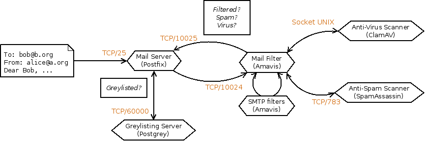

   *GRAPHIC: eBox's mail filter schema*

In the figure, we can observe the different steps that a message follows before
tagging it. First, the email server sends it to the greylisting policies
manager. If the email passes through the filter, spam and viruses are checked
next using a statistical filter. Finally, if everything is OK, the email is
considered valid and is sent to its recipient or stored in the server's mailbox.

In the following section, details on those filters and its configuration will
be explained in detail.

Greylist
--------
A greylist [#]_ is a method of defense against spam which does not discard
emails, but makes life harder for the spammers.

.. [#] eBox uses **postgrey** http://postgrey.schweikert.ch/ as the
       policy manager in postfix.

In the case of eBox, the strategy is to pretend to be out of service. When a
server wants to send a new mail, eBox says "*I'm out of service at this time,
try in 300 seconds*" [#]_. If the server meets the specification, it will send
the message again a bit later and eBox will consider it as a valid server.

In eBox, the greylist exempts the mail sent from internal networks, from objects
with an allowed mail relay policy and from addresses that are in the antispam whitelist.

.. [#] Actually the mail server sends as response "Greylisted", say, put on the
       greylist.

However, the servers that send spam do not usually follow the standard. They
will not try to send the email again and we would have avoided the
spam messages.

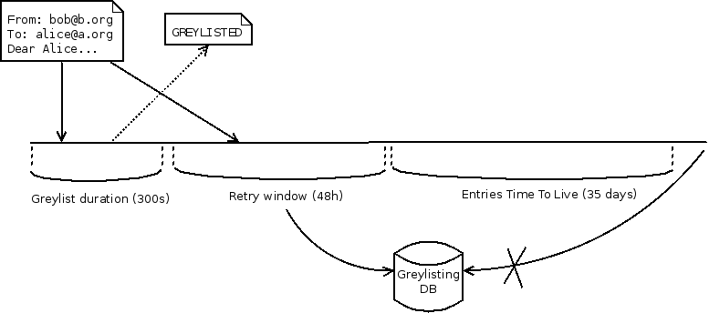

   *GRAPHIC: Schematic operation of a greylist*

Greylisting is configured from :menuselection:`Mail --> Greylist`
with the following options:

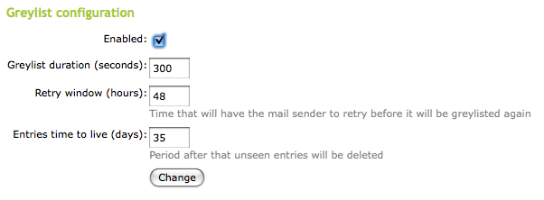

Enabled:
  Set to enable greylisting.

*Greylist* duration (seconds):
  Seconds the sending server must wait before sending the mail again.

Retry window (hours):
  Time (in hours) when the sender server can send email.
  If the server has sent any mail during that time,
  that server will go down in the grey list. In a grey list, the
  mail server can send all the emails you want without temporary restrictions.

Entry time-to-live (days):
  Days that data will be stored in the servers evaluated in the greylist.
  After the configured days, the mail server will have to pass again through the
  greylisting process described above.

Content filtering system
------------------------

Mail content filtering is provided by the antivirus and spam detectors.
To perform this task, eBox uses an interface between the MTA (**postfix**)
and those programs. **amavisd-new** [#]_ talks with the MTA via
(E)SMTP or LMTP (*Local Mail Transfer Protocol* :RFC:`2033`) to check that
the emails are not spam neither contain viruses. Additionally, this interface
performs the following checks:

 - White and black lists of files and extensions.
 - Malformed headers.

.. [#] **Amavisd-new**: http://www.ijs.si/software/amavisd/

Antivirus
---------

The antivirus used by eBox is **ClamAV** [#]_, which is an
antivirus toolkit designed for UNIX to scan attachments in emails in an MTA.
**ClamAV** updates its virus database through **freshclam**. This database is
updated daily with new virus that have been found. Furthermore, the antivirus is
able to scan a variety of file formats such as Zip, BinHex, PDF, etc..

.. [#] Clam Antivirus: http://www.clamav.net/

In :menuselection:`Antivirus`, you can check if the antivirus is installed
and up to date.

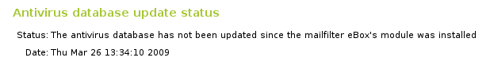

You can update it from :menuselection:`Software Management`, as we will see
in :ref:`software-ref`.

If the antivirus is installed and up to date, eBox will use it in the following
modules: *SMTP proxy*, *POP proxy*, *HTTP proxy* and even *file sharing*.

Antispam
--------

The spam filter works giving to each mail a spam score, if the mail
reaches the spam threshold is considered as junk mail if not is
considered as legitimate mail. The latter kind of mail is often called
*ham*.

The spam scanner uses the following techniques to assign scores:

 - DNS published blacklists (*DNSBL*).
 - URI blacklists that track spam websites.
 - Filters based on the checksum of messages.
 - Sender Policy Framework (SPF): RFC: `4408`.
 - DomainKeys Identified Mail (DKIM)
 - Bayesian filter
 - Static rules 
 - Other tests [#]_

Among this techniques the *Bayesian filter* should be further
explained. This kind of filter does a statistical analysis content of
the text of the message, giving a score which reflects the probability
of being spam for the message. However, the analysis is not done
against a set of static rules but against a dynamic one, which is
created supplying ham and spam messages to the filter. So it could
learn from them what are the statistical features from each type.

The advantage of this technique is that the filter could adapt to the
ever-changing flow of spam messages, the downsides are that the filter
needs to be trained and its accuracy depends on the quality of the
received training.

eBox uses **Spamassassin** [#]_ as spam detector.

.. [#] A long list of *antispam* techniques can be found in
       http://en.wikipedia.org/wiki/Anti-spam_techniques_(e-mail)

.. [#] *The Powerful #1 Open-Source Spam Filter*
       http://spamassassin.apache.org .

The general configuration of the filter is done from
:menuselection:`Mail filter --> Antispam`:

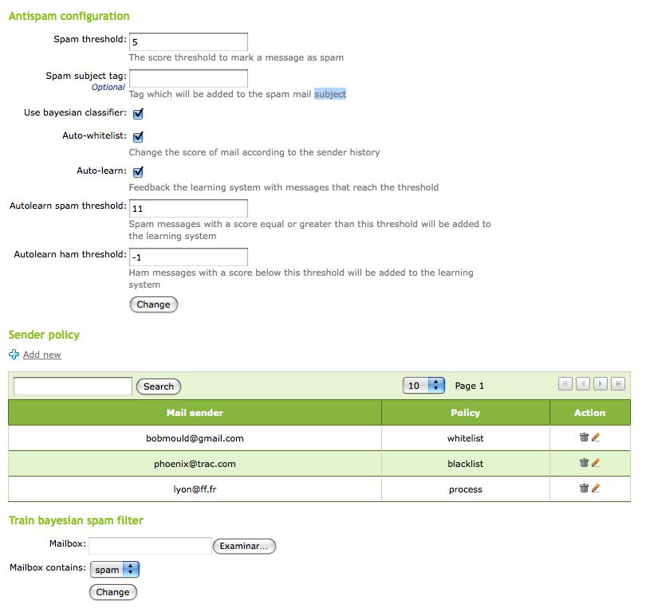

Spam threshold:
  Mail will be considered spam if the score is above this number.
Spam subject tag:
  Tag to be added to the mail subject when it is classified as spam.
Use Bayesian classifier:
  If it is marked, the Bayesian filter will be used. Otherwise, it will be
  ignored.
Auto-whitelist:
   It takes into account the history of the sender when rating the message.
   That is, if the sender has sent some ham emails, it is highly probable
   that the next email sent by that sender is also ham.
Auto-learn:
  If it is enabled, the filter will learn from messages which hit the self
  learning thresholds.
Autolearn spam threshold:
   The automatic learning system will learn from spam emails that have a score
   above this value. It is not appropriate to set a low value, since it can
   subsequently lead to false positives. Its value must be greater
   than the spam threshold.
Autolearn ham threshold:
   The automatic learning system will learn from ham emails that have a score
   below this value. It is not appropriate to put a high value, since it can
   cause false negatives. Its value should be less than 0.

From :guilabel:`Sender Policy` we can configure some senders
so their mail is always accepted (*whitelist*),
always marked as spam (*blacklist*) or always processed
by the spam filter (*process*).

From :guilabel:`Train Bayesian spam filter` we can train the
Bayesian filter sending it a mailbox in *mbox* format [#] _
containing only spam or ham. There are many sample files in the
Internet to train a Bayesian filter but normally is more accurate to use mail
received by the sites which will be filtered. The more trained the filter is,
the better the spam detection.

.. [#] *Mbox* and *maildir* are email storage formats, most email clients and
   servers use one of these. In the first one, all the emails in a directory
   are stored in a single file, while the second organizes the emails in
   different files within a directory.

File-based ACLs
---------------

It is possible to filter files attached to mails using
:menuselection:`Mail filter --> Files ACL` (Access Control Lists).

There, we can allow or deny mail according to the extensions of the files
attached or their Multipurpose Internet Mail Extensions (MIME) types.

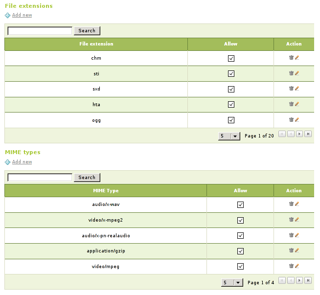

.. _smtp-filter-ref:

Simple Mail Transfer Protocol (SMTP) mail filter
------------------------------------------------

From :menuselection:`Mail filter --> SMTP mail filter` it is possible
to configure the behavior of the filters when eBox receives mail by SMTP.
On the other hand, from :menuselection:`General configuration` we can set
the general behavior for every incoming email:

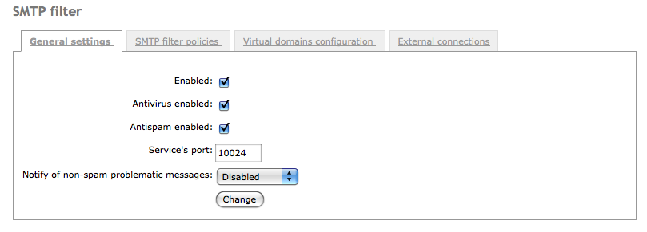

Enabled:
  Check to enable the SMTP filter.
Antivirus enabled:
  Check to make the filter look for viruses.
Antispam enabled:
  Check to make the filter look for spam.
Service's port:
  Port to be used by the SMTP filter.
Notify of non-spam problematic messages:
  We can send notifications to a mailbox when problematic (but not spam) emails
  are received, e.g., emails infected by virus.

From :menuselection:`Mail filter --> Filter Policies`, it is possible
to configure what the filter must do with any kind of email.

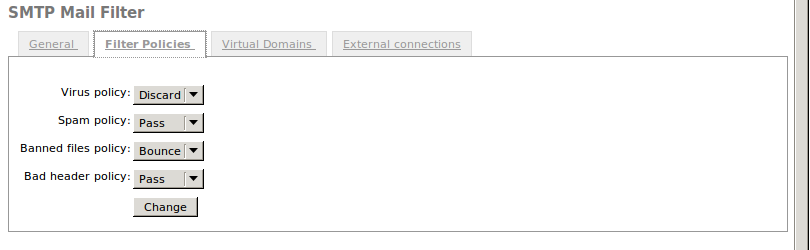

For each kind of email problem, you can perform the following actions:

Pass:
   Do nothing, let the mail reach its recipient.
Reject:
   Discard the message before it reaches the recipient, notifying the
   sender that the message has been discarded.
Bounce:
   Like reject, but enclosing a copy of the message in the notification.
Discard:
   Discards the message before it reaches the destination, without notice
   to the sender.

From :menuselection:`Mail Filter --> Virtual Domains`, the behavior of the filter
for virtual email domains can be configured. These settings override
the general settings defined previously.

To customize the configuration of a virtual domain email, click
on :guilabel:`Add new`.

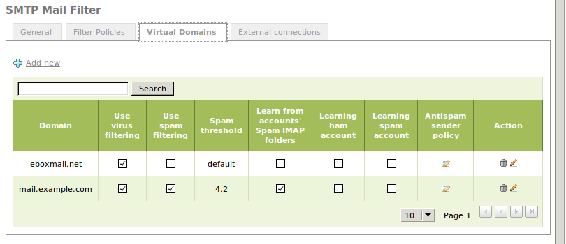

The parameters that can be overridden are the following:

Domain:
   Virtual domain that we want to customize, from those configured in
   at :menuselection:`Mail --> Virtual Domain`.
Use virus filtering / spam:
   If this is enabled, mail received for this domain will be filtered looking
   for viruses or spam.
Spam threshold:
   You can use the default threshold score for spam or a custom value.
Learn from accounts' Spam IMAP folders:
   If enabled, when a email is put in the `Spam` IMAP folder the email is
   automatically learned as spam. Likewise if a email is moved from the `Spam`
   folder to a normal folder is learned as ham.
Learning account for ham / spam:
   If enabled, `ham@domain` and `spam@domain` accounts will be created.
   Users can send emails to these accounts to train the filter. All mail sent to
   `ham@domain` will be learned as ham mail, while mail sent to `spam@domain`
   will be learned as spam.

Once the domain is added, from :menuselection:`Antispam policy for senders`,
it is possible to add addresses to its whilelist and its blacklist or even
force every mail for the domain to be processed.

External connection control lists
=================================

From :menuselection:`Mail Filter --> SMTP Mail Filter --> External connections`,
you can configure connections from external MTAs,
through its IP address or domain name, to the mail filter configured in eBox.
In the same way, these external MTAs can be allowed to filter mail
for those external virtual domains allowed in the configuration.
This way, you can distribute your load between two
machines, one acting as a mail server and another as a server
to filter mail.

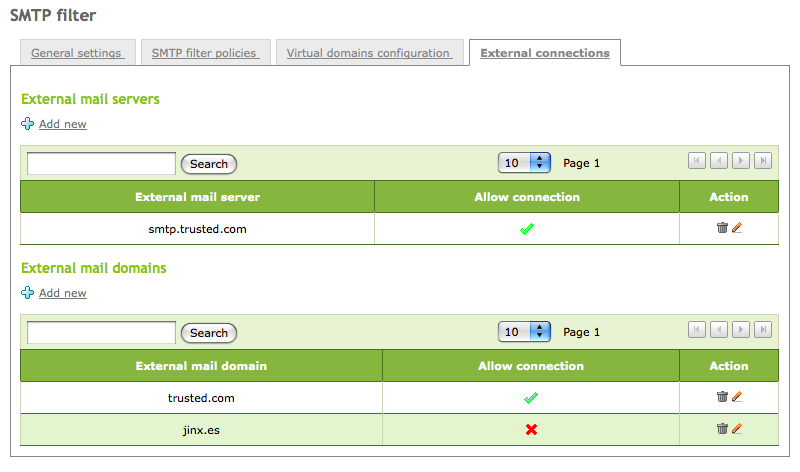

.. _pop3-proxy-ref:

Transparent proxy for POP3 mailboxes
====================================

If eBox is configured as a **transparent proxy**, you can filter POP email.
The eBox machine will be placed between the real POP server and the
user to filter the content downloaded from the MTAs. To do this,
eBox uses **p3scan** [#]_.

.. [#] Transparent POP proxy http://p3scan.sourceforge.net/

From :menuselection:`Mail Filter --> POP Transparent Proxy` you can configure
the behavior of the filtering:

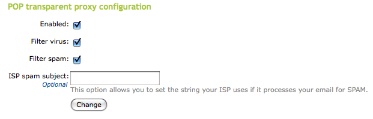

Enabled:
  If checked, POP email will be filtered.
Filter virus:
  If checked, POP email will be filtered to detect viruses.
Filter spam:
  If checked, POP email will be filtered to detect spam.
ISP spam subject:
  If the server marks spam mail with a tag, it can be specified here
  and the filter will consider these emails as spam.

Practical example
-----------------

Activate the mail filter and the antivirus. Send an email with a virus.
Check that the filter is working properly.

#. **Action:**
   Access eBox, go to :menuselection:`Module Status` and enable the module
   :guilabel:`mail filter`. To do this, check the box in the column
   :guilabel:`Status`. You will have to enable **network** and **firewall**
   first in case they were not already.

   Effect:
     eBox asks for permission to override some files.

#. **Action:**
   Read the changes that are going to be made and grant eBox permission to
   perform them.

   Effect:
     :guilabel:`Save Changes` has been enabled.

#. **Action:**
   Go to :menuselection:`Mail Filter --> SMTP Mail Filter`, check boxes for
   :guilabel:`Enabled` and :guilabel:`Antivirus enabled` and click on :guilabel:`Change`.

   Effect:
     eBox informs you about the success of the modifications with a **Done**
     message.

#. **Action:**
   Go to :menuselection:`Mail --> General --> Mail filter options` and select
   :guilabel:`eBox internal mail filter`.

   Effect:
     eBox will use its own filter system.

#. **Action:**
   Save changes.

   Effect:
     eBox shows the progress while applying the changes. Once it is done, it
     notifies about it.

     The mail filter with antivirus is enabled.

#. **Action:**
   Download the file http://www.eicar.org/download/eicar_com.zip, which contains
   a test virus and send it from your mail client to an eBox mailbox.

   Effect:
     The email will never reach its destination because the antivirus will discard it.

#. **Action:**
   Go to the console in the eBox machine and check the last lines of
   `/var/log/mail.log` using the **tail** command.

   Effect:
     There is a message in the log registering that the message with the virus
     was blocked, specifying the name of the virus:

         Blocked INFECTED (Eicar-Test-Signature)

.. include:: mailfilter-exercises.rst
