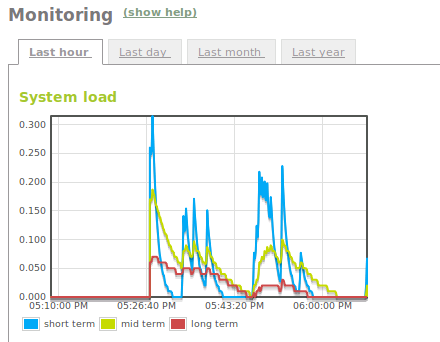
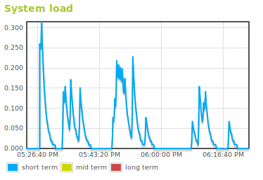
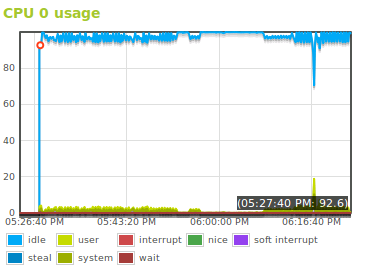
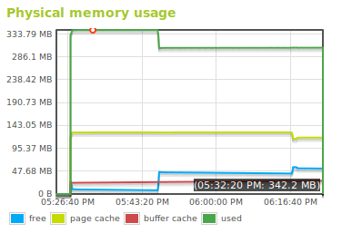
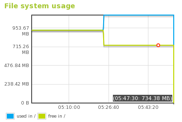
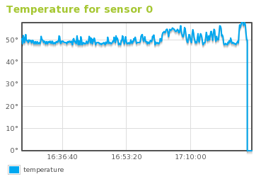
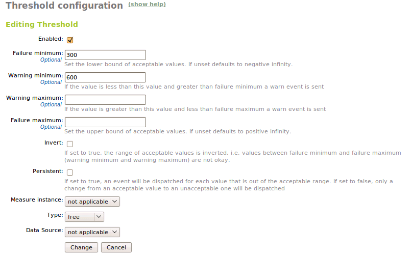

Monitoring
**********

.. sectionauthor:: Enrique J. Hernández <ejhernandez@ebox-platform.com>,
                   Javier Amor García <javier.amor.garcia@ebox-platform.com>,
                   Javier Uruen Val <juruen@ebox-platform.com>,

The **monitor** module allows the eBox administrator to know the state
of the resources of the eBox machine. This information is essential to
both troubleshoot and plan in advance the necessary resources.

Monitoring implies knowing how to interpret some system values in order
to decide if these values fall into an expected range, or otherwise, they
are too high or too low. The main issue of monitoring is the selection
of these ranges. As every machine can have different values depending on
the kind of use. For example, in a file sharing server, the free storage space
is a very important value that can change very quickly. However, in a
router with an enabled content filter, free memory and CPU load are more
interesting values. You should avoid fetching values that are useless for
your scenario.

This is the reason why eBox monitors only a few system metrics in its
current version. These are: system load, CPU usage, memory usage, and file
system usage.

The monitor module displays the fetched data using graphs. This allows the user
to easily visualize the evolution of the resources during time. To access these
graphs you have to click on the menu entry labeled as
:menuselection:`Monitor`. You can place the mouse pointer over any graph
point to know the exact value at that point.

You can see different time scales of the registered data: hourly, daily, monthly
or yearly. You just need to click on the relevant tab.

Metrics
=======

System load
-----------

The **system load** tries to measure the rate of pending work over the
completed work.
This value is computed using the number of active process in the CPU.

This metric is the capacity of the used CPU over a given time. This means that a
load of 1 represents a CPU working at full capacity. A load of 0.5 means that
the CPU could take twice as much. Conversely, a load of 2 means that it would
need another CPU to fullfill the requirements of the current work load.

You have to take into account that those processes that are waiting for
read/write operations in disk also contribute to this value.

CPU usage
---------

This graph shows detailed information of the **CPU usage**. In the case of
having a multi-core or multi-cpu machine you will see one graph for each
one of the cores.

This graph represents the amount of time that the CPU spends in each of its
states: running user code, system code, inactive, input/output wait, and so on.
This measure is not a percentage, but scheduling units known as *jiffies*. In
most *Linux* systems this value is 100 per second, but it can be different.

Memory usage
------------

This graphs shows the **memory usage**. The following variables are monitored:

Free memory:
  Amount of memory not used
Page cache:
  Amount of memory that is cached in disk swap
Buffer cache:
  Amount of memory that is cached for input/output operations
Memory used:
  Amount of memory that is not included in any of the above

File system usage
-----------------

This graph displays the used and free space of every mounting point.

Temperature
-----------

This graph allows you to know the system temperature in degrees Celsius by
using the ACPI system [#]_. You need to have data available in these
directories: `/sys/class/thermal` or `/proc/acpi/thermal_zone`.

.. [#]  *Advanced Configuration and Power Interface*
      (ACPI) is an open standard to configure devices focused
      on operating systems and power management. http://www.acpi.info/

Alerts
======

These graphs are not very helpful if in case of unexpected behaviour the
administrator is not properly notified. By using alerts, you can know when the
machine has reached an unusual system load or is approaching its full capacity.

You can configure **monitor alerts** in
:menuselection:`Events --> Configure Events`. The relevant alert is called
**monitor**.

.. image:: images/monitor/monitor-watchers.png
   :scale: 70
   :align: center

You can access the configuration page by clicking on the configuration cell.
In this page you can pick any monitored metric and set the threshold that will
trigger an event.

There are two different thresholds, *warning* and *failure*, this allows the
user to filter based on the event severity. You can use the option
:guilabel:`reverse:` to swap the values that are considered right and wrong.
Other important option is :guilabel:`persistent:`. Depending on the metric we
can also set other parameters.

Once you have configured and enabled the event you will need to configure, at
least, one observer. The observer configuration is the same as the
configuration of any other event. Check the :ref:`events-ref` chapter for further
information.

.. include:: monitor-exercises.rst
