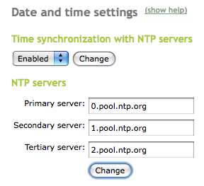

Time synchronization service (NTP)
**********************************

.. sectionauthor:: José A. Calvo <jacalvo@ebox-platform.com>
                   Enrique J. Hernández <ejhernandez@ebox-platform.com>
                   Víctor Jiménez <vjimenez@warp.es>

The **NTP** (*Network Time Protocol*) protocol was designed to synchronize
the clocks in PCs in an unreliable network with jitter.
This service listens on port 123 of the UDP protocol. It is designed to
withstand the effects of *jitter*.

It is one of the oldest protocols of the Internet still in use (since before
1985). NTP version 4 can reach a precision of up to 200 µs or greater if the
clock is in the local network. There are up to 16 levels defining the distance
of the reference clock and its associated precision.
Level 0 is for atomic clocks that are not connected to the network but to
another level 1 computer with RS-232 serial connection. Level 2
are the computers connected via NTP to those of a higher level
and are normally offered by default in the most common
operating systems, such as GNU/Linux, Windows or MacOS.

NTP server configuration with eBox
==================================

To configure eBox to use the NTP architecture [#]_, eBox
must first be synchronized with an external server of a higher
level (normally 2) offered via
:menuselection:`System --> Date/Time`. A list of these can be found
in the NTP *pool* (*pool.ntp.org*), which is a dynamic
collection of NTP servers that voluntarily give their clients a
relatively precise time over the Internet.

.. [#] NTP public service project
   http://support.ntp.org/bin/view/Main/WebHome.

Once eBox has been synchronized as an NTP client [#]_, eBox can also
act as an NTP server with a globally synchronized time.

.. [#] eBox uses **ntpdate** as its NTP client.
   http://www.ece.udel.edu/~mills/ntp/html/ntpdate.html.

Practical example
^^^^^^^^^^^^^^^^^
Enable the NTP service and synchronize the time of your host
using the command '**ntpdate**'. Check that both eBox and the client
host are set to the same time.

#. **Action:**
   Access eBox, enter :menuselection:`Module status` and
   enable the :guilabel:`ntp` module by marking the checkbox in the
   :guilabel:`Status` column. This will show the changes to be made
   to the system. Allow the operations by clicking on the
   :guilabel:`Accept` button.

   Effect:
     The :guilabel:`Save changes` button has been enabled.

#. **Action:**
   Access the :menuselection:`System --> Date/Time` menu.
   In the :guilabel:`Synchronization with NTP servers` section, select
   :guilabel:`Enabled` and click on :guilabel:`Change`.

   Effect:
     The option to manually change the date and time is replaced by
     fields to enter the NTP servers with which to synchronize.

#. **Action:**
   Save the changes.

   Effect:
     eBox displays the progress while the changes are being applied. Once this
     is completed, it notifies the user.

     Your eBox host will act as an NTP server.

#. **Action:**
   Install the **ntpdate** package in your client host. Run the
   command `ntpdate <eBox_ip>`.

   Effect:
     The time on the host will have been synchronized with that of the
     eBox host.

     You can check this by running the **date** command on both hosts.

