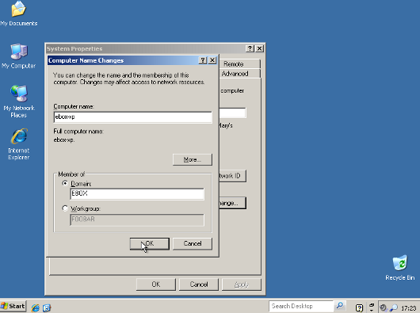

Using eBox as Windows Primary Domain Controller
-----------------------------------------------

.. sectionauthor:: Javier Amor García   <jamor@ebox-platform.com>
                   Enrique J. Hernández <ejhernandez@ebox-platform.com>

`eBox Platform <http://www.ebox-platform.com>`_ is an open source
small business server that allows you to manage all your services
like firewall, DHCP, DNS, VPN, proxy, IDS, mail, file and printer
sharing, VoIP, IM and much more. These features are tightly
integrated, automating most tasks, avoiding mistakes and saving
time for system administrators.

This tutorial shows you step by step how to use eBox as Windows
Primary Domain Controller. At the end, you will be using eBox
Platform |version| for users and shared resources management on your
Windows domain.

1. Installing the eBox server
=============================

The system installation can be done in two different ways:

-  Using the eBox Platform Installer (recommended).
-  Using an existing Ubuntu LTS Server Edition installation..

In the second case, you need to add eBox Platform `PPA repositories
<http://launchpad.net/~ebox/+archive/1.4>`_ to your
`/etc/apt/sources.list` and install the packages you are interested
in. [#]_

.. [#] The full installation guide is available at
       http://trac.ebox-platform.com/wiki/Document/Documentation/InstallationGuide

Nevertheless, in the first case eBox Platform installation and
deployment is easier as all the dependencies are in a single CD and
in addition to this, some pre-configuration is made during the
installation process. That is why we will take this approach on
this tutorial.

.. figure:: images/pdc-howto/eBox-installer.png
   :scale: 80
   :alt: eBox Platform installer

   eBox Platform installer

.. FIXME: Use 1.4 installer

The eBox Platform installer is based on the Ubuntu installer and
therefore those who are already familiar with it will find the
installation process very similar. We will not cover here the
Ubuntu system installation, but you can check out the
`official installation documentation
<https://help.ubuntu.com/8.04/serverguide/C/installation.html>`_ for
details.

When the base system installation ends, the system will reboot and
the eBox installation process will begin. Then it will first ask you
which software components are going to be installed. There are two
methods for selecting the features you want to deploy on
your system, we will choose the **simple** method.

.. figure:: images/pdc-howto/package-selection-method.png
   :scale: 80
   :alt: Installation method selection

   Installation method selection

After choosing the **simple** method, you will get a list of software
profiles. In this case, we will choose only the **Office** profile
which contains all the software components needed for the PDC. This
selection is not inmutable and if you require more features in the
future you can install and remove packages upon request.

.. figure:: images/pdc-howto/profiles.png
   :scale: 60
   :alt: Profiles selection

   Profiles selection

Once you have selected the components to install, a progress bar
will show you the installation process status.
   
.. figure:: images/pdc-howto/installing-eBox.png
   :scale: 80
   :alt: Installing eBox Platform 

   Installing eBox Platform

When the installation finishes, entering a password to access the eBox
Platform web interface is requested.

.. figure:: images/pdc-howto/password.png
   :scale: 80   
   :alt: Enter password to access the web interface 

   Enter password to access the web interface 

You need to confirm the password in the next dialog.

.. figure:: images/pdc-howto/repassword.png
   :scale: 80      
   :alt: Confirm password to access the web interface 

   Confirm password to access the web interface 

The installer will try to pre-configure some basic configuration
parameters. 

First, it will ask you if any of your network
interfaces are external (not connected the local network), i.e. used
to connect to the Internet. Strict policies for all incoming
traffic through external network interfaces will be applied.
Depending on the role the server plays, i.e. placed inside your
local network, there might be no external interfaces at all.
   
.. figure:: images/pdc-howto/select-external-iface.png
   :scale: 80   
   :alt: External interface selection

   External interface selection

Then, it will ask you for your default mail virtual domain name. As
we will not be using the email server on this tutorial, you may
enter here any name you like.
   
.. figure:: images/pdc-howto/vmaildomain.png
   :scale: 80   
   :alt: Set default mail virtual domain name

   Set default mail virtual domain name 

Once you have answered these questions, each module you installed
will be pre-configured.
   
.. figure:: images/pdc-howto/preconfiguring-ebox.png
   :scale: 80   
   :alt: Pre-configuring eBox packages 

   Pre-configuring eBox packages 

After completing this process, a message will inform you about how
to connect to the eBox Platform web interface.
     
.. figure:: images/pdc-howto/ebox-ready-to-use.png
   :scale: 80   
   :alt: eBox ready to use message 

   eBox ready to use message 

2. Login to the web interface
=============================

Now you are ready to login for first time to the eBox web
interface. With your browser, go to `https://address/` where the
address is the one given to you by the installer in the previous
step.

Because the eBox server has a new self-signed certificate your browser
will likely ask you whether it should trust it or not. Make your
browser trust it to be able to continue.

Then, you will be shown the login screen, to login enter here the
eBox administration password that you set in the installation
process.
   
.. figure:: images/pdc-howto/01-login.png
   :scale: 80   
   :alt: Login screen

   Login screen 

After the login the summary page is depicted.
   
.. figure:: images/pdc-howto/02-homepage.png
   :scale: 80   
   :alt: Summary page

   Summary page

3. Enabling and disabling modules
=================================

The next step is disabling the modules that are not needed for the PDC
server. To do so, in the left menu select :menuselection:`Module
Status`. In this page, you will be shown the list of installed eBox
modules and a checkbox to enable or disable them.
   
.. figure:: images/pdc-howto/module-status.png
   :scale: 80   
   :alt: Module status page 

   Module status page

All installed modules are enabled by default, but in order to
outperform your resource usage, you might want to disable modules not
related with the PDC server.  The following modules needed for the PDC
feature are:

-  Network
-  Logs
-  Users and Groups
-  File Sharing
-  Anti-virus

You may disable any other module to save resources on your system.

5. Creating groups
==================

You may need user groups in your domain. To create a group, in the
left menu select :menuselection:`Users and Groups --> Groups`. You
will be asked for a group :guilabel:`name` and an optional
:guilabel:`description`.
      
.. figure:: images/pdc-howto/add-group.png
   :scale: 80   
   :alt: Add group form 

   Add group form

You can create the group either clicking in :guilabel:`Add group` or
:guilabel:`Add and edit group`. We will create the group **IT** for this
tutorial. You can also create any other necessary groups for your
domain.

6. Creating users
=================

To create your domain users, in the left menu select
:menuselection:`Users and Groups --> Users`. A form
for adding the new user is shown. This form has the following fields:

:guilabel:`User name`:
  User common name uniquely identifying the user within the system

:guilabel:`First name`:
  User first name

:guilabel:`Last name`:
  User last name

:guilabel:`Comment`:
  Optional explanatory description

:guilabel:`Password` and :guilabel:`Retype password`:
   First user password, he can change his password when he connects to
   the domain. We will see later how to establish password policies
   for the domain users.

:guilabel:`Group`: 
   User primary group. After its creation the user can
   be added to more additional groups.
    
.. figure:: images/pdc-howto/add-user.png
   :scale: 80   
   :alt: Add user form 

   Add user form 

We will create a user with **pdcadmin** as user name for this
tutorial. Other fields will be filled in with the appropriate values.
We will click in the button :guilabel:`Add and edit`, so we will be
forwarded to the :guilabel:`Edit user` page.

Remind that you can come back to this page clicking in the user list
the :guilabel:`Edit` control.

There are some PDC user settings on this page, under the
:guilabel:`PDC/File sharing account` heading.

You can enable or disable the user account, a disabled account
cannot login or be used in the domain. We will leave our new user
account enabled. You may set a setting to enable by default the PDC
account under :menuselection:`Users and Groups --> Default User Template`.

You can give also administration rights to the user. A user with
administration rights can add computers to the domain so you will need
,at least, one user with administration rights. For this reason, we will
enable this option for the **pdcadmin** user.

There is another field to change the disk quota for the user. We do
not need to touch this setting now.
   
.. figure:: images/pdc-howto/pdc-user-settings.png
   :scale: 80   
   :alt: PDC-related user settings 

   PDC-related user settings

Now you can create some other user accounts for your regular users.
They only need to have an enabled account without administration
rights. If you feel that their disk quota is too big or too small
you can edit it as well.

7. Configuring general PDC settings
===================================

To configure the general PDC and file sharing settings, in the left
menu select :menuselection:`File sharing`.

In the :guilabel:`General settings` tab will enable the PDC with the
:guilabel:`Enable PDC` checkbox. Also you may change the domain name
from its default value to a name which makes sense for your domain or
organization. We will use **ebox** as :guilabel:`domain name`.

You may change the :guilabel:`NetBIOS name` as well. This will be the
name used to identify the server when using the NetBIOS protocol. This
name must not be the same that the domain, regardless of their case,
or we will have troubles connecting. We will use **ebox-server** as
NetBIOS name.

In the :guilabel:`Description` field, you can enter some text to
identify the domain.

The :guilabel:`Quota limit` field is to assign the default disk quota
to new users.

The :guilabel:`Enable roaming profile` checkbox controls whether the user
desktop profile is saved to the PDC server and used in every
desktop the user logs in. The downside of this feature is that in
some cases the user profile could take a lot of space in the disk.
We want to use this feature on this tutorial so we will enable it.

The :guilabel:`Drive letter` field assigns which letter will be used for the
virtual drive containing the user home.
   
The last field is :guilabel:`Samba group`, with this setting we
could restrict the users that could login and share files in the
domain to a single group. In the tutorial, we don't want to restrict
any use so we left the default :guilabel:`All users` value.
   
.. figure:: images/pdc-howto/general-settings.png
   :scale: 80   
   :alt: PDC general settings 

   PDC general settings 

8. Configuring PDC password policy settings
===========================================

Domain administrators usually enforce some kind of password policy
because users usually choose weak passwords and hardly ever change
them.

In the :guilabel:`PDC` tab, there are three passwords settings to
configure.  The first one is :guilabel:`Minimum Password Length`, We
want that all users choose a password with at least 8 character long,
so we increase this value to 8 characters.

The second one is :guilabel:`Maximum Password Age`, we set it to 180
days to make sure that the users change their password, at least,
twice a year.

Last one is :guilabel:`Enforce password history`, this setting is
useful when you do not want the users to reuse their old passwords, we
set it to *Keep history for 5 passwords*, so the users cannot reuse
their last five passwords.
   
.. figure:: images/pdc-howto/pdc-password-settings.png
   :scale: 80   
   :alt: PDC password settings 

   PDC password settings

.. _saving-changes-sec:

9. Saving changes
=================

We have the basic PDC configuration nailed down, we need
to save the changes to commit them to the system. For this, we have
a button :guilabel:`Save changes` in the right upper corner. If we have pending
changes to commit, his color will be red, it will be
green otherwise. Since we have made changes, a
red color will bright, so we can click on it.
      
.. figure:: images/pdc-howto/06-savechanges.png
   :scale: 80   
   :alt: Save changes button 

   Save changes button 

After clicking, you will see a screen which will show you two
options, saving the pending configuration changes or discard them.
If you discard them the configuration will revert either to the
default state or, if you have already saved any changes, to the
last time you saved changes. We want to commit our changes so we
will click on the button :guilabel:`Save changes`.

In some cases after clicking a screen will be popped up asking for
authorization to overwrite some configuration files. If you want
eBox to manage those files, accept the request. If you deny it,
eBox will not be able to commit your configuration.

After that, a screen displays the progress while the new configuration
is committing. When it finishes, a *Changes saved* message will be
shown.

.. warning:: 
   Changes in user and groups are committed immediately, so
   you don't need to save them and cannot discard them.

10. Adding computers to the PDC
===============================

Now we have our PDC server running, it is time to add some computers to
the domain.

For this, we will need to know the name of our domain
and the user name and password of a user with administration
rights. In our example, the user **pdcadmin** fits the bills.

The computer to be added must be in the same local network and need to
have a CIFS-capable Windows (i.e. Windows XP Professional or Windows 7). The
eBox network interface that connects to this network must **not**
be marked as an external interface. In the following instructions we
will assume that you have a Windows XP Professional.

Log into the Windows system and click on :menuselection:`My PC -->
Properties`, then click on the button :guilabel:`Change`, in the
section :guilabel:`To rename this computer` or :guilabel:`Join a
domain`.
   
.. figure:: images/pdc-howto/change-domain-button.png
   :scale: 80   
   :alt: Clicking on Windows change domain button 

   Clicking on Windows change domain button

Next window in the wizard, set the :guilabel:`domain name` and then
click :guilabel:`OK`.
   

   Setting domain name 

A login window will pop up, you have to login as the user with
administration privileges.
   
.. figure:: images/pdc-howto/windows-change-domain-login.png
   :scale: 80   
   :alt: Login as user with administration privileges 

   Login as user with administration privileges

If all the steps has been done correctly, a welcome message to the
domain should appear. After joining the domain, a restart action is
requested. You next login could be done with a domain user.
   
.. figure:: images/pdc-howto/pdc-login.png
   :scale: 80   
   :alt: Login with a domain user 

If you need more assistance to add the computer to your domain you can
check the `Microsoft documentation
<http://support.microsoft.com/kb/295017>`_ about this process.

11. Configuring shares
======================

We have already our domain active with its users, groups and
computers. Now we want to add the file sharing service to ease the
sharing of data between users.

We have three types of shares available in eBox:

#. Users home directory shares
#. Groups shares
#. General shares

The users home directories shares are automatically created for
each user. It will be automatically available to the user as a
mapped drive with the letter configured in the :guilabel:`General Settings`
tab. Only the user can connect to its home directory share, so it is
useful to have access to the same files regardless of which domain
the user has logged on.

On the other hand, groups shares are not created automatically, you
need to go to the :menuselection:`Users and Groups --> Edit Group`
window and give a name for the share.  All group members are
granted access to it with the only restriction that they cannot modify
or delete files that are owned by other group members.
   
.. figure:: images/pdc-howto/group-sharing-directory.png
   :scale: 80   
   :alt: Form for setting of group sharing directory 

   Form for setting of group sharing directory

As for the third shares category, eBox allows us to define
multiple file shares each with its own *Access Control List* (ACL)
which will determine what users and groups can read and write the
files in that share.

To illustrate this feature we will create a share for the IT
technical documentation, all members of the group **IT** should be
able to read the files and the user **pdcadmin** should have
permissions to update them.

To create a share select the :menuselection:`File Sharing --> Shares`
tab. We will see the list of shares but since we do not have created
any, the list is empty. To create the first share, click on
:guilabel:`Add new`, this will show you a form to setup the share.

The first parameter in the share is for enabling or disabling the
share, we leave the share enabled. However, if we would want to disable
it temporally, this setting would be useful.

:guilabel:`Share name` is the name to identify this share, in our example we
will call the share *IT documentation*.

The :guilabel:`comment` field could explain the purpose of this
share. Back to our example, we can write *Documentation and knowledge
base for the IT department* there.

Finally, we must choose the path of the share in the server, two
options are available: :guilabel:`Directory under eBox` or
:guilabel:`File path`. The second one is intended for directories that
are already available, so in our example we will choose
:guilabel:`Directory under eBox` and give as directory name **itdoc**.
   
.. figure:: images/pdc-howto/add-share.png
   :scale: 80   
   :alt: Adding a new share 

   Adding a new share

Once we have our share defined, we will need to choose a correct set
of ACLs for it. To do so, we must go to the shares list, look for the
line of the share and click on the :guilabel:`Access Control`
field. Here we can add the ACLs for the share, each ACL give
permissions to a user or a group. The permissions can be *read*, *read
and write* and *administrator*. The *administrator* permission allows
to write and remove files owned by other users, so it must be sparingly
granted.

In our example, we will add a read permission to the *IT* group and
a read and write permission to the user **pdcadmin**. This way the
*IT* members can read the files but only **pdcadmin** can add or
remove them.
   
.. figure:: images/pdc-howto/add-share-acl.png
   :scale: 80   
   :alt: Adding a new ACL to a share

   Adding a new ACL to a share

.. note::
   Some special shares are created automatically by eBox and access is
   only granted to users with administration rights. They are
   `ebox-internal-backups` which contains the eBox backup files and
   `ebox-quarantine` which contains infected files.

12. File sharing anti-virus
===========================

Scanning for viruses in the shares are available in eBox. The scan is
done when a file is written or accessed, so you can be sure that all
files in the share have been checked by the anti-virus. If an infected
file is found, it is moved to the *ebox-quarantine* share which is only
accessible by users with *administration rights*. These users can
browse this share and choose whether delete these files or to do
another action with them.

In order to use this feature, the **antivirus** module has to be
enabled. So if you have disabled it, you should enable it again. The
anti-virus updates its virus database automatically each hour, so you
don't need to worry about updates.

To configure anti-virus scan go to the :menuselection:`File Sharing -->
Antivirus`. The :guilabel:`Scan` setting determines whether the files
should be scanned or not.

We want the antivirus to scan the shares, so we enable this for our
example. In the :guilabel:`Samba shares antivirus exceptions` list, we can add
exceptions to the antivirus scan. The listed shares will not
be scanned regardless of the value of the :guilabel:`Scan` setting.
   
.. figure:: images/pdc-howto/antivirus.png
   :scale: 80   
   :alt: Antivirus settings 

   Antivirus settings 

13. Accessing shares
====================

We have our shares defined, so we could want to access them now. But
before we have to make sure that we have saved the last changes in the
configuration like we have explained in the :ref:`saving-changes-sec`
section.

When you login into a domain computer with a domain user, you may be
able to access the shares via the :guilabel:`Entire network` window, to open
this window go to :menuselection:`My PC --> Network Places` and then click in the link
in the :guilabel:`Other places` left panel.
   
.. figure:: images/pdc-howto/domain-computers.png
   :scale: 80   
   :alt: Domain network view 

   Domain network view

Then, you can click in the eBox server and all the shares accessible by
the user appears. You can try to access a share clicking on it,
if the user has read access, a browser page with the share contents
will be shown.
   
.. figure:: images/pdc-howto/domain-server-shares.png
   :scale: 80   
   :alt: Shares in PDC server 

   Shares in PDC server

Additionally. the user home directory will be mapped to a virtual
drive with the letter set in the PDC configuration.

.. note::
    
    In a GNU/Linux system you can use the program **smbclient** to
    access the shares. You can find a guide to use it `here
    <http://tldp.org/HOWTO/SMB-HOWTO-8.html>`_. Another option is
    using a file browser with SMB capabilities like the default ones
    in KDE or Gnome.

If you have the antivirus enabled, you can test it trying to upload
an infected file. For testing purposes we recommend the
`EICAR test file <http://www.eicar.org/anti_virus_test_file.htm>`_
because is harmless.

14. Logon script
================

eBox gives support to  Windows **logon scripts**. These scripts will be
downloaded and executed every time a user logs into a domain
computer.

When you write this script, you have take in account it is
executed into the computer where the user logs in, so you should do
only things that could be done in every computer of your domain.

Furthermore, it will be a Windows computer, so you have to take care
that the file is written with DOS return/linefeed characters. In order
to ensure it, you can write the script using a Windows computer or
using the Unix tool **flip** to convert between the two formats.

Once you have written your logon script you have to save it as
**logon.bat** under the `/home/samba/netlogon` directory in your eBox
server.

To carry on our example we will show a logon script that maps a
share called **timetable**, which contains the organization timetables
to the drive **Y:**. Remember to create this share and grant access
to it before trying this logon script.
::

    # contents of logon.bat 
    # map timetable share
    echo "Mapping timetable share to drive Y: ..."
    net use y: \\ebox-server\timetable

15. The end
===========

That's all folks. We hope the information and examples on this
tutorial have helped you to use eBox as a Windows Primary Domain
Controller and file server.

I'd like to thank Falko Timme who wrote a file-sharing how-to for a
previous version of eBox which has been a source of inspiration for
this document.
