Using eBox as Windows Primary Domain Controller
-----------------------------------------------

`eBox Platform <http://www.ebox-platform.com>`_ is an open source
small business server that allows you to manage all your services
like firewall, DHCP, DNS, VPN, proxy, IDS, mail, file and printer
sharing, VoIP, IM and much more. These functionalities are tightly
integrated, automating most tasks, avoiding mistakes and saving
time for system administrators.

This tutorial shows you step by step how to use eBox as Windows
Primary Domain Controller. At the end of it you will be using eBox
Platform 1.4 for users and shared resources management on your
Windows domain.

1. Installing the eBox server
=======================================

The system installation can be done in two different ways:

-  Using the eBox Platform Installer (recommended).
-  Using an existing Ubuntu LTS Server Edition installation..

In the second case, you need to add eBox Platform
`PPA repositories <http://launchpad.net/~ebox/+archive/1.4>`_ to
your sources.list and install the packages you are interested in.

Nevertheless, in the first case eBox Platform installation and
deployment is easier as all the dependencies are in a single CD and
in addition, some pre- configuration is made during the
installation process. For this reason we will take this approach on
this tutorial.

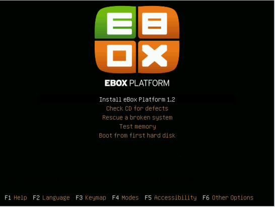

The eBox Platform installer is based on the Ubuntu installer and
therefore those who are already familiar with it will find the
installation process very similar. We will not cover here the
Ubuntu system installation, but you can check the
`official installation documentation
<https://help.ubuntu.com/8.04/serverguide/C/installation.html>`_

When the base system installation ends, the system will reboot and
the eBox installation process will begin. Then will first ask you
which software components are going to be installed. There are two
methods for selecting the functionalities you want to deploy on
your system, we will choose the 'simple' method.

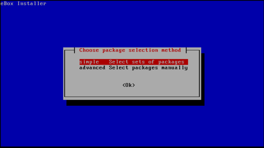

After choosing the 'simple' method, you will get a list of software
profiles. In this case we will choose only the 'Office' profile
which contains all the software components needed for the PDC. This
selection is not final and if you need more functionalities on the
future you can install and remove packages according to your needs.

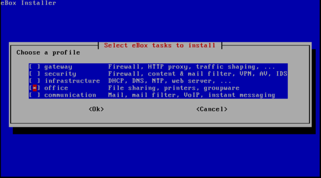

Once you have selected the components to install, a progress bar
will show you the installation process status.
   
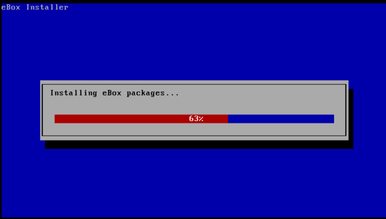

When the installation finish, you will be requested to enter a
password to access the eBox Platform web interface.

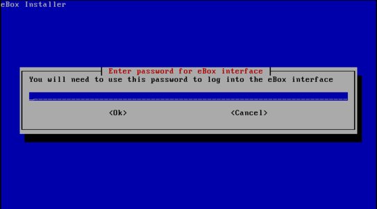

You need to confirm the password.

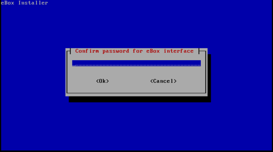

The installer will try to pre-configure some basic configuration
parameters. 

First, it will ask you if any of your network
interfaces are external (not connected the local network), i.e. used
to connect to the Internet. Strict policies for all incoming
traffic through external network interfaces will be applied.
Depending on the role the server plays, i.e. placed inside your
local network, there might be no external interfaces at all.
   
   
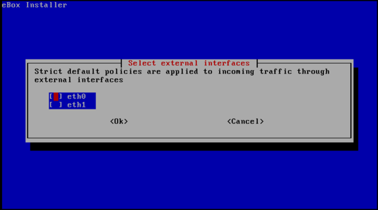

Then it will ask you for your default mail virtual domain name. As
we will not be using the email server on this tutorial you can
enter here any name you like.
   
   
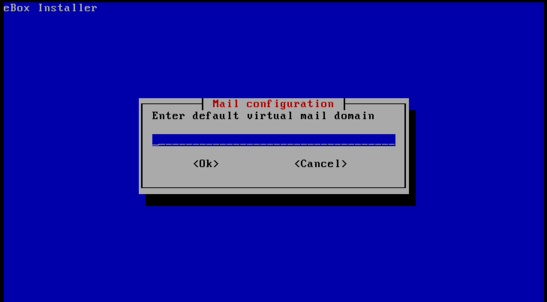

Once you have answered these questions, each module you installed
will be pre- configured.
   
   
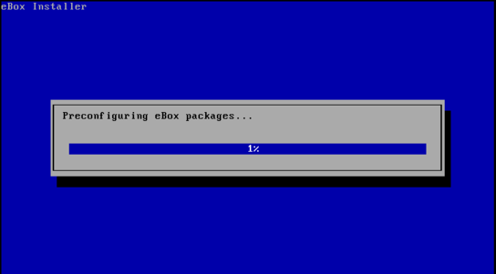

After this process is completed, a message will inform you on how
to connect to the web interface of eBox Platform.
   
   
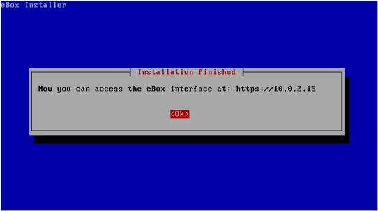

2. Login to the web interface
=======================================

Now you are ready to login for first time to the eBox web
interface. With your browser, go to `https://address/` where the
address is the one given to you by the installer in the previous
step.

Because the eBox server has a new self-signed certificate your
browser likely will ask you whether it should trust it. Make your
browser trust it to be able to continue.

Then you will be show the login screen, to login enter here the
eBox administration password that you set in the installation
process.
   
   
.. image:: images/pdc-howto/01-login.png
   :scale: 80   
   :alt:    login screen 

After the login you will be show the summary page.
   
   
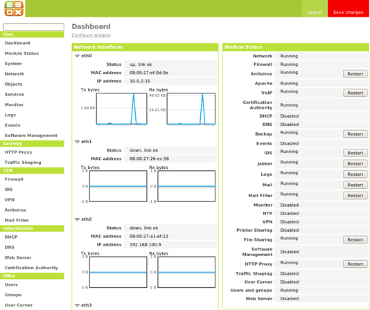

3. Enabling and disabling modules
=======================================

Next step is to disable the modules that are not needed for the PDC
server. To do so in the left menu select Module Status. In this
page you will be shown the list of installed eBox modules and a
checkbox to enable or disable them.
   
   
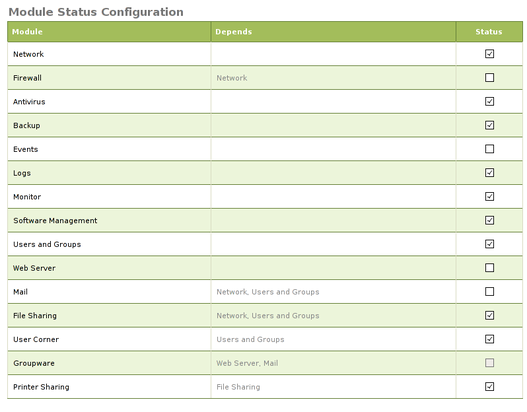

By default all installed modules are enabled but to make better use
of your resources you might want to disable modules not related
with the PDC server.
The modules needed for the PDC server are:

-  Network
-  Logs
-  Users and Groups
-  File Sharing
-  Antivirus

You can disable any other module to save resources on your system.

5. Creating groups
=======================================

You may need user groups in your domain. To create a group, in the
left menu select `Users and Groups -> Groups`. You will be asked for a group
name and an optional commentary.
   
   
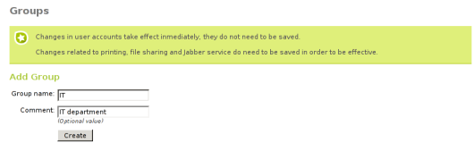

You can create the group either clicking in `Add group` or `Add and edit group`.
After a group creation you will be forwarded to the Edit group
page. We are not interested in any setting here right now, so we click in `Add
group` however you can enter in the `Edit user` page through the `Edit` field in
the group list.

We will create the group *IT* for this tutorial. You can also
create any other necessary groups for your domain.

6. Creating users
=======================================

To create your domain users, in the left menu select `Users and Groups ->
Users`. You will be show a form for adding the new user. This form
has the following fields:

-  User name: user name for the user.
-  First name: first name of the user.
-  Last name: last name of the user.
-  Comment: optional commentary.
-  Password and Retype password: first user password, he can change
   his password when he connects to the domain. We will see later how
   to establish password policies for the domain users.
-  Group: user primary group. After its creation the user can be
   added to more aditional groups.

   
   
.. image:: images/pdc-howto/add-user.png
   :scale: 80   
   :alt:    Add user form 

For this tutorial we will create a user with *pdcadmin* as user
name. Other fields will be filled in with the appropriate values.
We will click in the button `Add and edit` so we will be forwarded to the Edit
user page.

Remember that you can come back to this page clicking in the user list the
`Edit` control .

There are some PDC user settings on this page, under the PDC/File
sharing account heading.

You can enable or disable the user account, a disabled account
cannot login or be used in the domain. We will leave our new user
account enabled. 

You can give also administration rights to the
user. An user with administration rights can add computers to the
domain so you will need at least one user with administration
rights. For this reason, we will enable this option for the
*pdcadmin* user.

There is another field to change the disk quota for the user. We do
not need to touch this setting now.
   
   
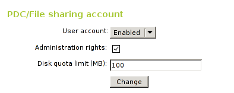

Now you can create some other user accounts for your regular users.
They only need to have an enabled account without administration
rights. If you feel that their disk quota is too big or too small
you can edit it as well.

7. Configuring general PDC settings
=======================================

To configure the general PDC and file sharing settings, in the left
menu select File sharing.

In the General settings tab will enable the PDC with the `Enable PDC`
checkbox. Also you may change the domain name from is default value
to a name which makes sense for your domain or organization. We
will use *ebox* as domain name. 

You may change the netbios name as
well. This will be the name used to identify the server when using
the netbios protocol. This name should not be the same than the
domain, regardless of their case, or we will have troubles
connecting. We will use *ebox-server* as netbios name.

In the `Description` field you can enter some text to identify the
domain.

The `Quota limit` field is to assign the default disk quota to new
users.

The `Enable roaming profile` checkbox controls whether the user
desktop profile is saved to the PDC server and used in every
desktop the user logs in. The downside of this feature is that in
some cases the user profile could take a lot of space in the disk.
We want to use this feature on this tutorial so we will enable it.

The `Drive letter` field assigns which letter will be used for the
virtual drive containing the user home.
   
The last field left is `Samba group`, with this setting we could restrict the
users that could login and share files in the domain to one single group. In the
tutorial we don't want to restrict any use so we left it set to `All users`.
   
.. image:: images/pdc-howto/general-settings.png
   :scale: 80   
   :alt:    PDC general settings 

8. Configuring PDC password policy settings
=============================================

Domain administrators usually enforce some kind of password policy
because left to users themselves they will choose weak passwords
and rarely will change them.

In the PDC tab we will see three passwords settings to configure:
The first one is `Minimum Password Length`, We want that all users choose a
password with 8 character at least, so we raise this value to 8
characters.

The second one is `Maximum Password Age`, we set it to 180 days to
make sure that the users change their password at least two times
for year.

Last one is `Enforce password history`, this setting is to make sure
that the users do not reuse old passwords, we set it to
*Keep history for 5 passwords* so the users cannot reuse their last
five passwords.
   
   
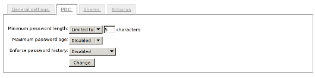

9. Saving changes
=======================================

Now that we have the basic PDC configuration nailed down, we need
to save the changes to commit them to the system. For this we have
a button Save changes in the right upper corner, if we have pending
changes to commit it will have a red colour otherwise it will be in
green. Since we have made changes it will be painted with a bright
red, so we can click on it.
   
   

After clicking you will see a screen which will show you two
options, saving the pending configuration changes or discard them.
If you discard them the configuration will revert either to the
default state or, if you have already saved any changes, to the
last time you saved changes. We want to commit our changes so we
will click on the button Save changes.

In some cases after clicking a screen will be pop up asking for
authorization to overwrite some configuration files. If you want
that eBox to manage those files accept the request, if you deny it
eBox would not be able to commit your configuration.

Then you will show a screen which displays the progress in
committing the new configuration. When it finish a
*Changes saved* message will be show.

.. warning:: 
   Changes in user and groups are committed immediately, so
   you don't need to save them and couldn't discard them.

10. Adding computers to the PDC
=======================================

Now we have our PDC server running is time to add some computers to
the domain.

For this we will need to know the name of our domain
and the user name and password of a user with administration
rights. In our example the user *pdcadmin* fits the bills.

The computer to be added must be in the same local network and need to
have a CIFS- capable Windows (i.e. Windows XP Professional). The
eBox network interface that connects to this network must **not**
be marked as external interface. In the following instructions we
will assume that you have a Windows XP Professional.

Log into the Windows system and click on My PC -> Properties, then
click on the button Change, in the section To rename this computer
or join a domain.
   
   
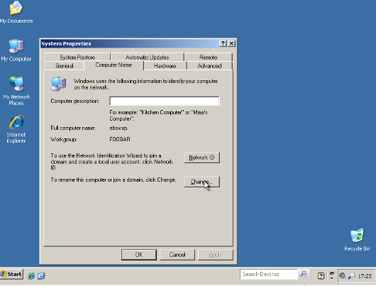

In the next window, set the domain name and then click *OK*.
   
   
.. image:: images/pdc-howto/ windows-change-domain.png
   :scale: 80   
   :alt:    setting domain name 

A login window will pop up, you have to login as the user with
administration privileges.
   
   
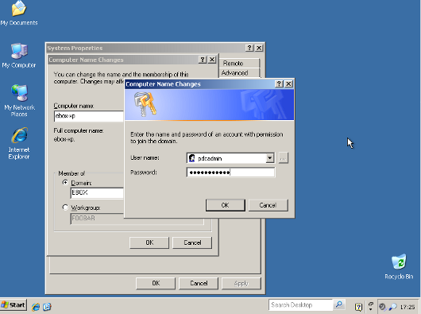

If all the steps were correctly done a welcome message to the
domain should appear. After joining the domain you will need to
restart the computer. You next login could be done with a domain
user.
   
   
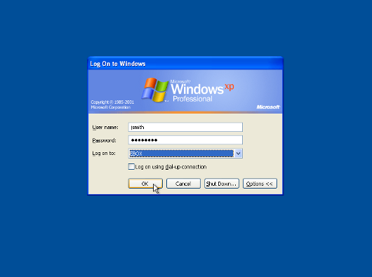

If you need more assistance to add the computer to your domain you
can check the
`Microsoft documentation <http://support.microsoft.com/kb/295017>`_
about this procedure.

11. Configuring shares
=======================================

We have already our domain active with its users, groups and
computers. Now we want to add the file sharing service to ease the
sharing of data between users.

We have three types of shares available in eBox:

#. Users home directory shares
#. Groups shares
#. General shares

The users home directories shares are automatically created for
each user. It will be automatically available to the user as a
mapped drive with the letter configured in the `General Settings`
tab. Only the user can connect to its home directory share so it is
useful to have access to the same files regardless on which domain
the user has logged on.

On the other hand, groups shares are not created automatically, you
need to go to the `Edit Group` window and give a name for the share.
All members of the group are granted access to it with the only
restriction that they cannot modify or delete files that are owned
by other members of the group.
   
   
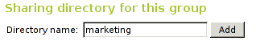

As for the third category of shares, eBox allows us to define
multiple file shares each with its own access controls lists (ACL)
which will determine what users and groups can read and write the
files in that share.

To illustrate this feature we will create a share for the IT
technical documentation, all members of the group *IT* should be
able to read the files and the user *pdcadmin* should have
permissions to update them.

To create a share select the Shares tab that can be found in File
sharing in the left menu. We will see the list of shares but since
we will have none created the list will be empty. To create the
first share click on Add new, this will show you a form to setup
the share.

The first parameter in the share is for enabling or disabling the
share, we left the share enabled. However if we wanted to disable
it temporally this setting would be useful.

Share name is the name to identify this share, in our example we
will call the share IT documentation.

The comment field could explain the purpose of this share. Back to
our example, we can write
*Documentation and knowledge base for the IT department* there.

Finally we must choose the path of the share in the server, two
options are available: Directory under eBox or File path. The
second one is intended for already existent directories so in our
example we will choose Directory under eBox and give as directory
name *itdoc*.
   
   
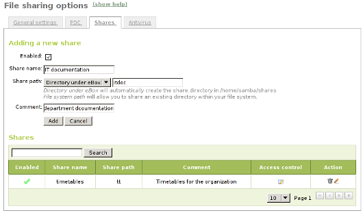

Once we have our share defined we will need to choose a correct set
of ACLs for it. To do so we must go to the shares list, look for
the line of the share and click on the Access Control field. Here
we can add the ACLs for the share, each ACL give permissions to a
user or a group. The permissions can be *read*, *read and write*
and *administrator*. The *administrator* permission allows to write
and remove files owned by other users so it must be sparingly
granted.

In our example, we will add a read permission to the *IT* group and
a read and write permission to the user *pdcadmin*. This way the
*IT* members can read the files but only *pdcadmin* can add or
remove them.
   
   
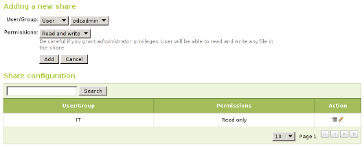

.. note::
   Some special shares are created automatically by eBox and access is
   only granted to users with administration rights. They are
   `ebox-internal-backups` which contains the eBox backup files and
   `ebox-quarantine` which contains infected files.

12. File share antivirus
=======================================

eBox can scan the shares files for viruses. The scan is done when a
file is written or accessed so you can be sure that all files in
the share have been checked by the antivirus. If an infected file
is found it is moved to the *ebox-quarantine* share which is only
accessible by users with *administration rights*. These users can
browse this share and choose whether delete these files or to do
another action with them.

To use this feature the antivirus module has to be enabled, so if
you disabled it you should enable it again. The antivirus updates
its virus database automatically each hour so you don't need to
worry about updates.

To configure antivirus scan go to the File Sharing page and there
under the Antivirus tab. The Scan setting determines if the files
should be scanned or not.

We want the antivirus to scan the shares so we enable this for our
example. In the Samba shares antivirus exceptions list we can add
exceptions to the antivirus scan, the shares listed here will not
be scanned regardless of the value of the Scan setting.
   
   
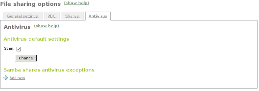

13. Accessing shares
=======================================

We have our shares defined so we could want to access them now. But
before we have to make sure that we have saved the last changes in
the configuration like we have explained in the
`9. Saving changes`_ section.

When login into a domain computer with a domain user you will be
able to access the shares via the Entire network window, to open
this window go to My PC -> Network Place and then click in the link
in the Other places left panel.
   
   
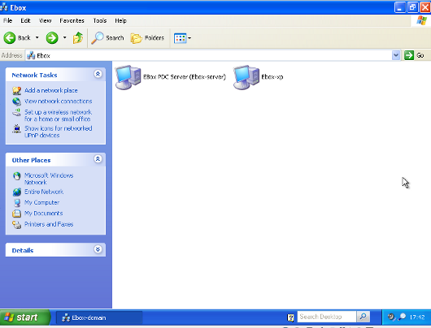

Then you can click in the eBox server and all the shares known to
the user will appear. You can try to access a share clicking on it,
if the user has read access a browser page with the share contents
will be shown.
   
   
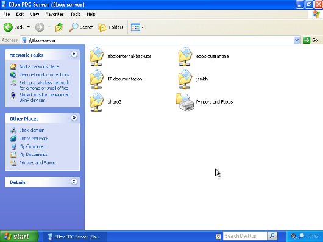

Additionally the user home directory will be mapped to a virtual
drive with the letter set in the PDC configuration.

.. note:: In a GNU/Linux system you can use the program
        *smbclient* to access the shares. You can find a guide to use it
        `here <http://tldp.org/HOWTO/SMB-HOWTO-8.html>`_. Another option is
         using a file browser with SMB capabilities like the default ones in
         KDE or Gnome.

If you have the antivirus enabled you can test it trying to upload
an infected file. For testing purposes we recommend the
`EICAR test file <http://www.eicar.org/anti_virus_test_file.htm>`_
because is harmless.

14. Logon script
=======================================

eBox supports the use of Windows logon script. This script will be
downloaded and executed every time a user logs into a domain
computer.

When writing this script you have take in account that it is
executed into the computer where the user logs in, so you should do
only things that could be done in every computer of your domain.

Furthermore, it will be a Windows computer so you have take care
that the file is written with DOS return/linefeed characters. To be
sure of this you can write it in a Windows computer or use the Unix
tool *flip* to convert between the two formats.

Once you have written your logon script you have to save it as
*logon.bat* under the /home/samba/netlogon directory in your eBox
server.

To continue our example we will show a logon script that maps a
share called *timetable* which contains the organization timetables
to the drive *Y:*. Remember to create this share and grant access
to it before trying this logon script!.
::

    # contents of logon.bat 
    # map timetable share
    echo "Mapping timetable share to drive Y: ..."
    net use y: \\ebox-server\timetable

15. The end
=======================================

That's all folks. We hope the information and examples on this
tutorial have helped you to use eBox as a Windows Primary Domain
Controller and file server.

I'd like to thank Falko Timme who wrote a file-sharing howto for a
previous version of eBox which has been a source of inspiration for
this document.

