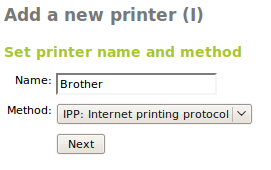
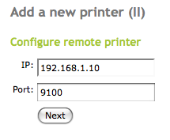
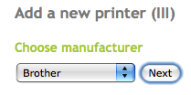
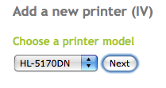
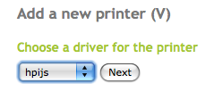
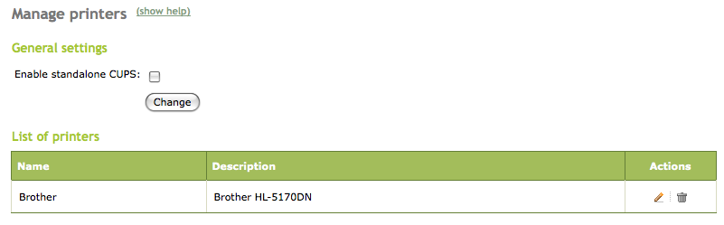
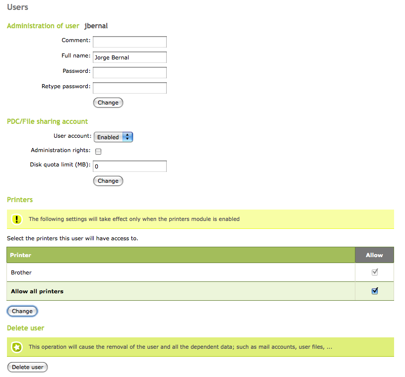

.. _printers-ref:

Printers sharing service
************************

.. sectionauthor:: José A. Calvo <jacalvo@ebox-platform.com>,
                   Enrique J. Hernández <ejhernandez@ebox-platform.com>,
                   Javier Uruen <juruen@ebox-platform.com>

.. FIXME: Not so well supported

In order to share a printer in our network, allowing or denying users
and groups the access to it, we need to have access to that printer
from a host running eBox. This can be done through: direct
connection, i.e., with a USB [#]_ or parallel port, or through the local
network. Besides that, if we want to obtain good results on its
operation, we will need to know certain information regarding the
manufacturer, the model and the driver of the printer. Printers can be
added going to :menuselection:`Printers --> Add printer`. Once there,
you will be asked to enter all the necessary details in a wizard.

.. [#] *Universal Serial Bus* (USB) is a serial bus standard to
       connect devices to a host computer.

First of all, we need to name the printer and to establish a
connection method for it. The following methods are currently supported by
eBox:

Parallel port:
  A physical printer connected to the eBox server using parallel port.
USB:
  A physical printer connected to the eBox server using USB
*AppSocket*:
  A remote printer that uses the *AppSocket* protocol, also known as
  *JetDirect*.
IPP:
  A remote printer that uses the *Internet Printing Protocol* (IPP) [#]_.
LPD:
  A remote printer that uses the *Line Printer Daemon protocol* (LPD) [#]_.
Samba:
   A remote printer shared through Samba or *Windows* printer sharing.

.. [#] *Internet Printing Protocol* (IPP) is a standard network
       protocol for remote printing as well as for managing print
       jobs, media size, resolution, and so forth. More information
       available on :rfc:`2910`.

.. [#] *Line Printer Daemon protocol* (LPD) is a set of programs that
       provide printer spooling and network printer server
       functionality for *Unix-like* systems. More information
       available on :rfc:`1179`.

We will need to configure the connection parameters according to the
selected method. For example, if we have a network printer, we
will have to set up an IP address and a listening port as the
following figure shows:

In the next four steps we will configure the printer driver that eBox needs to
use in order to send the jobs to be printed out, defining:
the manufacturer, the model, the printer driver as well as other
settings.

.. image:: images/printers/12-printer5.png
   :scale: 60

After these steps, the printer will be configured.  Now you will be able to
see not only the queued printing jobs but also the ones in progress. In
addition to that, you can also modify any of the parameters already introduced
in the wizard going to :menuselection:`Printers --> Manage printers`.

The printers managed by eBox are accessible using the Samba protocol.
You can also enable the printing daemon **CUPS** in order to share
the printers using IPP too.

.. [#] *Common Unix Printing System* (CUPS) is a modular printing system
       for Unix systems that allows a machine to act as a printing server,
       thus being able to accept printing jobs, process them and forward
       them to the appropriate printer.

.. _cups-img-ref:

Once the service is enabled and you have saved changes, you can give
access to the resources editing either the group or the user
(:menuselection:`Groups --> Edit Group --> Printers` or
:menuselection:`Users --> Edit User --> Printers`).

.. include:: printers-exercises.rst
