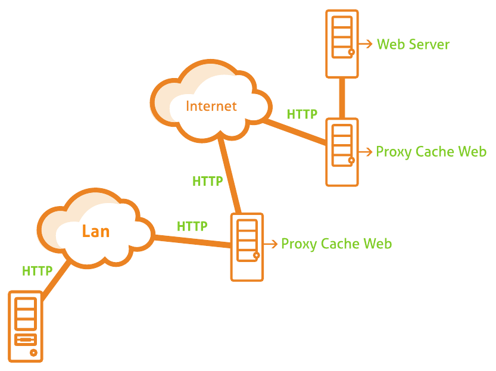
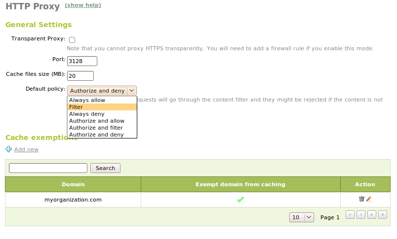
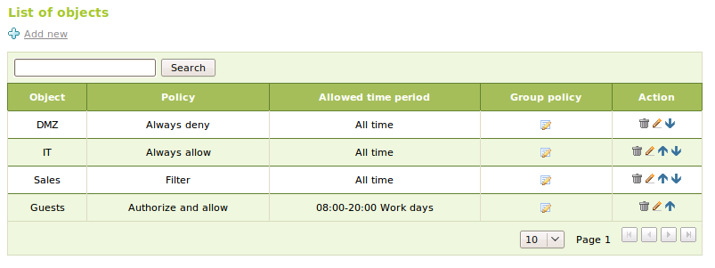
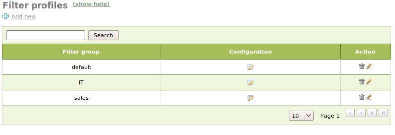
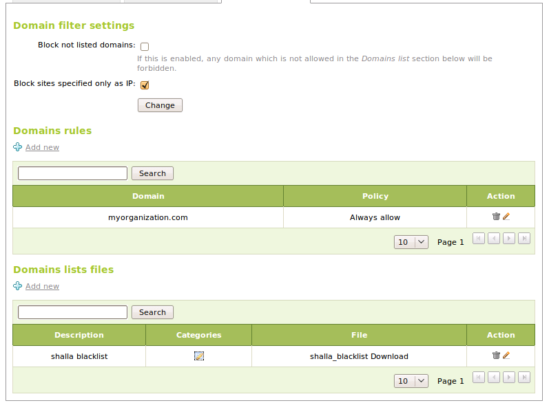
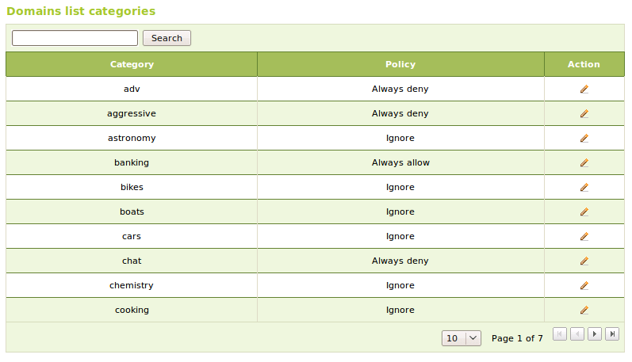

.. _proxy-http-ref:

HTTP Proxy Service
******************

.. sectionauthor:: José A. Calvo <jacalvo@ebox-technologies.com>,
                   Isaac Clerencia <iclerencia@ebox-technologies.com>,
                   Enrique J. Hernández <ejhernandez@ebox-technologies.com>,
                   Víctor Jímenez <vjimenez@warp.es>,
                   Javier Uruen <juruen@ebox-technologies.com>,
                   Javier Amor García <javier.amor.garcia@ebox-technologies.com>

A *Web Proxy Cache* server is used to reduce the bandwidth used in HTTP (Web)
[#]_ connections, control access and improve the browsing security and
browsing speed.

.. [#] For more information about  HTTP service, see the section
      :ref:`web-section-ref`.

A *proxy* is a program that acts as intermediary in a connection, in this case a
connection using the HTTP protocol. In this intermediation it can change the
behaviour of the protocol, for example adding a *cache* or mangling the received
data.

The HTTP proxy service available in eBox has the following features:

    * Web content cache. It speeds up the browsing and reduces the bandwidth
      consumption.
    * Access restriction. It can be restricted by source address, user or using
      a time table criteria.
    * Antivirus. It blocks infected files.
    * Content access restriction for given domains or file types.
    * Content filter.

eBox uses Squid [#]_ as *proxy*, and draws on Dansguardian [#]_ for content control.

.. [#] Squid: http://www.squid-cache.org *Squid Web Proxy Cache*
.. [#] Dansguardian: http://www.dansguardian.org *Web content filtering*

Access policy configuration
===========================

The most important task when configuring the *HTTP Proxy*, is to set the access
policy to the web content trough it. The policy determines whether the access to
the web is allowed and whether the content filter is applied.

The first step to do is to define a default police. We set it in the page
:menuselection:`HTTP Proxy --> General`, choosing one of the six available policies:

Allow all:
  This policy allows to browse without restriction. However it does not mean
  that the *cache* is not used.

Deny all:
  This policy denies the web access. At first, it could seem not useful because
  you could too deny access with a firewall rule. However, as we will see later,
  we can define particular policies for each *network object*, so we could use
  this policy to deny as default and then override it in some objects.

Filter:
  This policy allows the access and also enables the content filtering, so the
  access could be denied depending on the requested content.

Authorize and allow, Authorize and deny, Authorize and filter:
  These policies are derived from the previous policies but with authorization
  added. The authorization will be explained in the section
  :ref:`advanced-proxy-ref`.

After setting the default policy, we can refine our policy setting particular
policies for each network object. To set them we must enter in the section
:menuselection:`HTTP Proxy --> Objects policy`.

We can choose any of the six policies for each object; when accessing the
*proxy* from an object this policy will override the default policy.
A network address can be contained in various objects so we can establish the
priority rearranging the objects in the list. In this case, the policy with
greater priority will be applied. It is also possible to define a timetable for
each object, access outside the specified time will be denied.

.. warning::

   The timetable option is not compatible with policies that use the content
   filter.

   Network objects' web access policies

Client connection to the proxy and transparent mode
===================================================

In order to connect to the *HTTP proxy* the users must configure their
browser. The exact configuration method depends on the used browser but the
information required is the eBox server's address and the port used by the proxy.

The eBox proxy only accepts connections received on its internal
interfaces so an internal address must be used in the browser's configuration.

The default port is 3128 but it can be changed through the
:menuselection:`HTTP Proxy --> General` page. Other popular ports for HTTP proxy
services are 8000 and 8080.

To avoid that users could bypass the proxy and access directly to the web, you
should deny the HTTP traffic in the firewall.

One way to avoid the need to configure each browser is to use the
*transparent mode*. In this mode, eBox should be the network gateway and the
HTTP connections toward external servers (for example, Internet) will be
redirected to the *proxy*. To activate this mode we should go to the
:menuselection:`HTTP Proxy --> General` and enable the
:guilabel:`Transparent Proxy` checkbox. As we will see in
:ref:`advanced-proxy-ref`, the transparent mode is incompatible with
policies with authorization.

Finally, it must be kept in mind that the secure web traffic (HTTPS) cannot be
used in *transparent mode*. If you want to allow it, you must set a firewall
rule that allows it. This traffic will not be managed by the proxy.

*Cache* parameters
==================

In the section :menuselection:`HTTP Proxy --> General`, is possible to define
the disk *cache* size and which addresses are exempted from it.

The *cache* size controls the maximum disk space used to store the cached web
elements. This maximum size is set in the field :guilabel:`Cache file size` that
we find under the heading :guilabel:`General Settings`.

With a bigger size, the probability of recovering a web element from the cache
increases, and as result the browsing speed could be increased and the bandwidth
use could be reduced. In the other hand, the increase of size not only comes
with a greater disk usage but also with a increase in the use of RAM memory
because the *cache* must maintain in memory an index of the stored elements.

It is the job of each system administrator to choose a size according to the
server characteristics and the traffic profile.

It is possible to establish domains that are exempted from cache usage. For
example, you may have local web servers that a cache will not speed up and you
will waste cache space with them. When a domain exempted from cache is
requested, it will be contacted directly without any cache lookup and the
response will be returned without being stored.

The exempted domains are managed under the heading :guilabel:`Cache Exemptions`
that we find at the page :menuselection:`HTTP Proxy --> General`.

Web content filter
==================

eBox allows to filter web pages according to their contents. To enable the
filter, the default policy or the object policy of a given object should be
either :guilabel:`Filter` or :guilabel:`Authorize and Filter`.

With eBox, we can define multiple filter profiles but in this section we will
only talk about the default profile, leaving the discussion of multiple
profiles to the section :ref:`advanced-proxy-ref`. In order to configure the
filter settings you have to go to the page
:menuselection:`HTTP Proxy --> Filter Profiles` and select the configuration
of the *default* profile.

The content filtering is based in various test including virus filtering,
heuristic word filter and simpler things like banned domains. The end result is
the decision about whether to allow or deny the browsing of the page under
analysis.

The first filter is the virus filtering. To use it you should have the
*antivirus* module installed and enabled. Then you can configure in the filter
profile whether you want to use it or not. When enabled it will block HTTP
traffic with infected contents.

The text content filter analyzes the text contained in the web page, if
it is considered not appropriate according to the rules (for example is
considered a text of a pornographic page) the request will be blocked.

To control this process we can establish a threshold that will be compared to
the score assigned to the page by the filter, if the score is above the
threshold, the page will be blocked. The threshold is set in the
filter profile, at the section :guilabel:`Content filtering threshold`. This
filter can also be disabled by choosing the value :guilabel:`Disabled`. Itx
should be noted that the text analysis could result either in false positives
or false negatives, blocking innocent pages or letting pass inappropriate ones;
this problems can be mitigated using domain policies but it could happen again
with unknown pages.

There are more explicit filters:
* By domain. For example, denying the access to a sport newspaper domain
* By file extension. For example, forbidding the download of .EXE files.
* By file MIME type. For example, forbidding the download of video files.

These filters are presented in the filter profile configuration by means of
three tabs, :guilabel:`Files extension filter`, :guilabel:`MIME types filtering`
and :guilabel:`Domains filtering`.

.. image:: images/proxy/04-proxy-mime.png
   :scale: 80
   :align: center

In the :guilabel:`Files extension filter` table you can configure which file
extensions should be blocked.

Likewise, in the :guilabel:`MIME types filtering` table you can establish which
MIME types should be blocked.
The MIME types (*Multipurpose Internet Mail Extensions*) are a standard,
originally conceived to extend the contents of email, which define the
type of the content. They are used too by other protocols, HTTP among them, to
determine the content of transfered files. An example of MIME type is
*text/html*, which is the type for web pages. The first part of the type
informs about the type of content stored (text, video, images, executables, ...)
and the second about the format used (HTML, MPEG, gzip, .. ).

In the :guilabel:`Domains filtering` section, you will found the parameters
related to filtering websites according to its domain. They are two global
settings:

* :guilabel:`Block not listed domains`. This option will block  domains
   that are not present in :guilabel:`Domain rules` or in the
   categories in :guilabel:`Domain lists files`. In this last case, the
   domains in a category with the policy of *Ignore* are considered not listed.

* :guilabel:`Block sites specified only as IP`. This option blocks pages
  requested using their IP address instead of their domain name. The purpose
  of this option is to avoid attempts to bypass domain rules using IP
  addresses.

Next we have :guilabel:`Domain rules`, where you can introduce domains and
assign them one of the following policies:

Always allow:
 The access to the content of this domain is always allowed. All
 the content filters are ignored.

Always deny:
 The access to the contents of this domains will be always blocked.

Filter:
 The filters will be applied to this domain as usual. However it will not be
 automatically blocked if the :guilabel:`Block not listed domains` option is
 active.

In :guilabel:`Domain list files`, you can simplify the management of domains
using classified lists of domains. These lists are usually maintained by third
parties and they have the advantage that the domains are classified in
categories, allowing to define policies for a full domain category.
eBox supports the lists distributed by *urlblacklist* [#]_,
*shalla's blacklists* [#]_ and any other that uses the same format.

.. [#] URLBlacklist: http://www.urlblacklist.com
.. [#] Shalla's blacklist: http://www.shallalist.de

This lists are distributed as compressed archives. Once downloaded, you can add
the archive to your configuration and set policies for each category.

The policies that can be set for each category are the same polices that can be
applied to individual domains, and they will be enforced to all domains in the
category. There is an additional policy called :guilabel:`ignore`, its effect
is to ignore completely the presence of a category. This is the default policy
for all categories.

Practical example
^^^^^^^^^^^^^^^^^
Enable the transparent mode in the proxy. Check with the **iptables** command
the added *NAT* rules which should have been added to enable this feature.

#. **Action:**
   Log into eBox, enter :menuselection:`Module status` and enable the
   :guilabel:`HTTP Proxy` module, to do this check its box in the column :guilabel:`Status`.

   Effect:
     eBox will ask for permission to overwrite some files.

#. **Action:**
   Read the reason for the changes on each file and grant permission to eBox to
   overwrite them.

   Effect:
     The :guilabel:`Save changes` button is highlighted.

#. **Action:**
   Go to :menuselection:`HTTP Proxy --> General`, check
   the :guilabel:`Transparent proxy` checkbox. Make sure that eBox can act as
   router, for this at least one internal and one external interfaces are
   required.

   Effect:
     The transparent mode is configured.

#. **Action:**
    Click into :guilabel:`Save changes` to enforce the new configuration.

   Effect:
     The firewall and HTTP proxy services will be restarted.

#. **Action:**
   In the console of the eBox computer, execute the command
   `iptables -t nat -vL`.

   Effect:
     The command output must be similar to this:

       Chain PREROUTING (policy ACCEPT 7289 packets, 1222K bytes)
        pkts bytes target     prot opt in    out     source     destination
         799 88715 premodules  all  -- any   any   anywhere    anywhere

       Chain POSTROUTING (policy ACCEPT 193 packets, 14492 bytes)
        pkts bytes target     prot opt in    out     source    destination
          29  2321 postmodules all  -- any   any   anywhere    anywhere
           0     0 SNAT        all  -- any   eth2  !10.1.1.1   anywhere to:10.1.1.1

       Chain OUTPUT (policy ACCEPT 5702 packets, 291K bytes)
        pkts bytes target     prot opt in    out     source    destination

       Chain postmodules (1 references)
        pkts bytes target     prot opt in    out     source    destination

       Chain premodules (1 references)
        pkts bytes target     prot opt in    out    source     destination
           0     0 REDIRECT   tcp  --  eth3  any   anywhere !192.168.45.204    tcp dpt:www redir ports 3129

.. include:: proxy-exercises.rst
