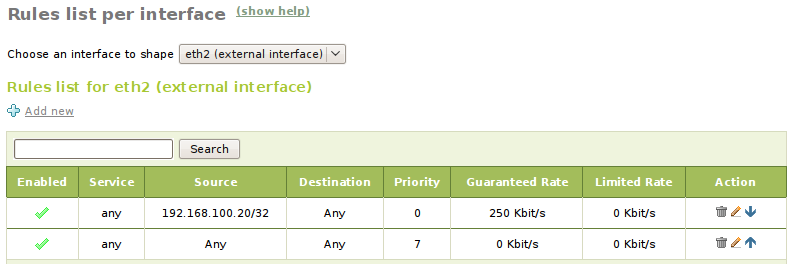

.. _qos-ref:

Traffic shaping
***************

.. sectionauthor:: Isaac Clerencia <iclerencia@ebox-platform.com>,
                   Enrique J. Hernández <ejhernandez@ebox-platform.com>

Quality of Service (QoS)
========================

**Quality of Service** (QoS) in computer networks refers to resource
reservation control mechanisms to provide different priorities to
different applications, users, or data flows, or to guarantee a
certain level of performance according to the constraints imposed by
the application. Constraints such as delay in delivery, the *bit*
rate, the probability of packet loss or the variation delay per packet
[#]_ may be determined for various multimedia data stream applications
such as voice or TV over IP. These mechanisms are only applied when
resources are limited (wireless cellular networks) or when there is
congestion in network, otherwise such QoS mechanisms are not required.

.. [#] *jitter* or *Packet Delay Variation* (PDV) is the difference in
       end-to-end delay between selected packets in a flow with any
       lost packets being ignored.

There are several techniques to give quality of service:

* Reserving network resources: using *Resource
  reSerVation Protocol* (RSVP) to request and reserve resources in the
  routers. However, this option has been neglected because it does not scale
  well with Internet growth
* Differentiated services (*DiffServ*): in this model, packets are
  marked according to the type of service they need. In response to
  these marks, routers and switches use various queuing strategies
  to tailor performance to requirements. This approach is currently
  widely accepted.

In addition to these systems, *bandwidth management* mechanisms may be
used to further improve performance such as  **traffic shaping**, **Scheduling
algorithms** o **congestion avoidance**.

Regarding traffic shaping, there are two predominant methods:

*Token bucket*:
  It dictates when traffic can be transmitted, based on the presence
  of *tokens* in the *bucket* (an abstract container that holds
  aggregate network traffic to be transmitted). Each *token* in the
  *bucket* can represent a unit of *bytes* of predetermined size, so
  each time that traffic is transmitted, the *tokens* are removed
  (*cashed in*). When there are no *tokens*, a flow cannot transmit
  its packets. Periodically, *tokens* are added to the *bucket*. Using
  such mechanism, it is allowed to send data in peak burst rate.

*Leaky bucket*:
  Conceptually based on considering a *bucket* with a hole in the
  bottom. If packets arrive, they are placed into the bucket until it
  becomes full, then packets are discarded. Packets are sent at a
  *constant rate*, which is equivalent to the size of the hole in the
  bucket.

eBox uses Linux kernel features [#]_ to shape traffic using *token bucket*
mechanisms that allow to assign a limited rate, a guaranteed rate and a
priority to certain types of data flows through the
:menuselection:`Traffic Shaping --> Rules` menu.

.. [#] Linux Advanced Routing & Traffic Control http://lartc.org

In order to perform traffic shaping, it is required to have, at least, an
internal network interface and an external one. A configured *gateway*
with a download and upload rates different from zero is required. The shaping
rules are specific for each interface and they may be selected for those
external network interfaces with assigned upload rate and all internal ones.

If the external network interface is shaped, then you are limiting
eBox output traffic to the Internet. The maximum output rate is the
sum of all the upload rates provided by the *gateways*. If, however, you
shape an internal network interface, then the eBox output to internal
networks is limited. The maximum rate will be the sum of all download
*gateway* rates. As it can be seen, shaping input traffic is not
possible directly, that is because input traffic is not predictable nor
controllable in almost any way. There are specific techniques from
various protocols to handle the incoming traffic, for instance TCP
by artificially adjusting the TCP window size as well as controlling
the rate of acknowledgements (ACK) being returned to the sender.

Each network interface has a rule table to give
:guilabel:`priority` (0: highest priority, 7: lowest priority),
:guilabel:`guaranteed rate` and/or :guilabel:`limited rate`. These
rules apply to traffic bound to a :guilabel:`service`,
a :guilabel:`source` and/or a :guilabel:`destination`.

   Traffic shaping rules

.. FIXME: traffic shaping image is in Spanish

Practice example
^^^^^^^^^^^^^^^^

Set up a rule to shape incoming HTTP traffic by limiting it to 20KB/s. Check if
it works properly.

#. **Action:**
   Add a gateway in :menuselection:`Network --> Gateways` to
   your external network interface.

   Effect:
     The :guilabel:`Save changes` button is enabled. The gateway list
     displays a single gateway.

#. **Action:**
   Save the changes.

   Effect:
     eBox displays the progress while the changes are being applied. Once this is
     complete, it informs the user.

#. **Action:**
   Enter :menuselection:`Services` and add a new external service called HTTP
   with TCP protocol and destination port 80.

   Effect:
     eBox shows a list with all the services where the new service is
     displayed too.

#. **Action:**
   Enter :menuselection:`Traffic Shaping --> Rules`. Select the internal
   interface from the interface list and, using :guilabel:`Add new`, set a new
   rule with the following details:

   :Enabled:         Yes
   :Service:         Port-based service / HTTP
   :Source:          any
   :Destination:     any
   :Priority:        7
   :Guaranteed rate: 0 Kb/s
   :Limited rate:    160 Kb/s

   Press the :guilabel:`Add` button.

   Effect:
     eBox displays a table with the new traffic shaping rule.

#. **Action:**
   Start downloading a huge file, which is reachable from the Internet
   (for example, a Ubuntu ISO image) from a host within your **LAN**
   (not eBox itself) using the **wget** command.

   Effect:
     The download rate is stable around 20 KB/s (160 Kbit/s).

.. include:: qos-exercises.rst
