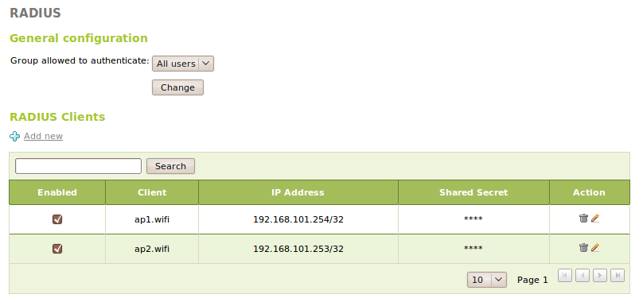
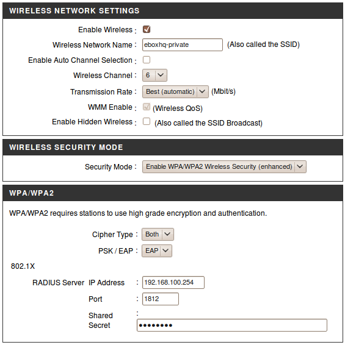

.. _radius-ref:

RADIUS
******

.. sectionauthor:: Enrique J. Hernández <ejhernandez@ebox-platform.com>
                   Jorge Salamero Sanz <jsalamero@ebox-platform.com>

*Remote Authentication Dial In User Service* (*RADIUS*) is a networking protocol
that provides centralized *Authentication*, *Authorization* and *Accounting*
(*AAA*) management for computers to connect and use a network service.

The authentication and authorization flow in RADIUS works as follows:
the user or machine sends a request to a *Network Access Server*
(*NAS*), like it could be a wireless Access Point, using the proper
link-layer protocol in order to gain access to a particular network
resource using access credentials.  In turn, the NAS sends an *Access
Request* message to the RADIUS server, requesting authorization to
grant access and including all the needed access credentials, not only
username and password but probably also realm, IP address, VLAN to be
assigned or maximum time to be connected.  This information is checked
using authentication schemes like *Password Authentication Protocol*
(PAP), *Challenge-Handshake Authentication Protocol* (CHAP) or
*Extensible Authentication Protocol* (EAP) [#]_ and then a response is
sent to the NAS:

#. *Access Reject*: when the user is denied access.
#. *Access Challenge*: when additional information is requested, like in TTLS
   where a tunneled dialog is established between the RADIUS server and the
   client for a second authentication phase.
#. *Access Accept*: when the user is granted access.

.. [#] These authentication protocols are defined in :rfc:`1334`.

RADIUS official assigned IANA ports are **1812/UDP** for Authentication and
**1813/UDP** for Accounting. This protocol does not transmit passwords in
plain text between the NAS and the server (not even with PAP protocol), a
shared secret is used to encrypt the communication between both parties.

**FreeRADIUS** [#]_ server is being used for eBox RADIUS service.

.. [#] **FreeRADIUS** - *The world's most popular RADIUS Server* <http://freeradius.org/>.

.. FIXME: WPA-WEP and so on??? It is required for FP

RADIUS server configuration with eBox
=====================================

If we want to give support to RADIUS server in eBox, first check in
:menuselection:`Module Status` if the :guilabel:`Users and Groups`
module is enabled, as RADIUS depends on it.  Then, mark the
:guilabel:`RADIUS` checkbox to enable the RADIUS eBox module.

   RADIUS General Configuration

In order to configure the service, go to :menuselection:`RADIUS` in the left menu. There
you will be able to setup the whether :guilabel:`All users` or only the users
who belong to one of your groups will be granted access.

All the NAS requesting authentication to eBox need to be defined on the
:guilabel:`RADIUS clients` section. For each NAS client we can specify:

:guilabel:`Enabled`: 
  whether this NAS is enabled or not.

:guilabel:`Client`:
  The name for this client, like it could be the hostname.

:guilabel:`IP Address`: 
  The IP address or IP range allowed to send authentication requests
  to the RADIUS server.

:guilabel:`Shared Secret`:
  A shared password between the RADIUS server and the NAS to
  authenticate and encrypt their communication.

Access Point (AP) configuration
===============================

On every NAS you will need to setup the address of eBox as the RADIUS server, the
port, which defaults to **UDP/1812** and the shared secret. WPA and WPA2, using TKIP or AES
(recommended) can both be used with eBox RADIUS. The mode should be EAP.

   Access Point Wireless Settings

.. FIXME client configuration
