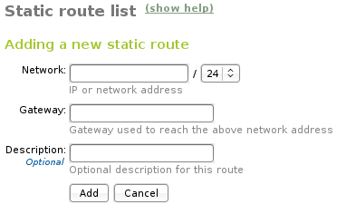
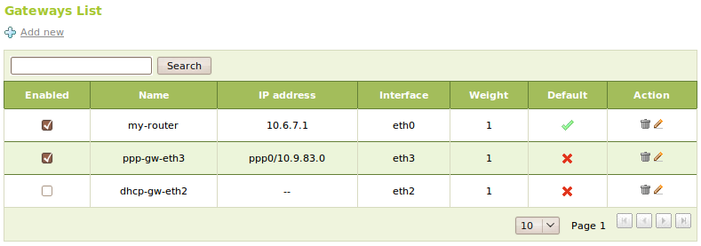
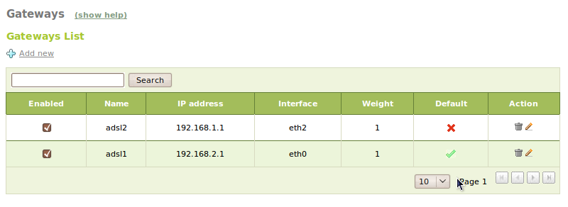
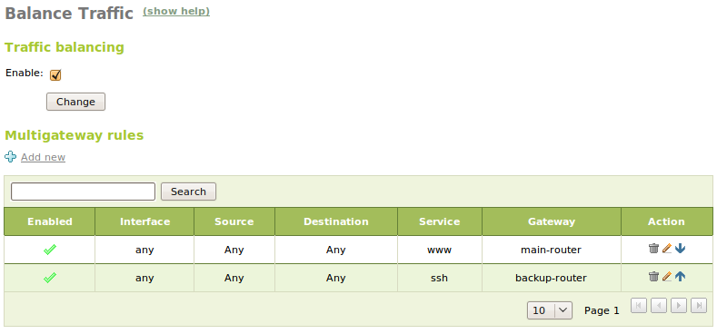
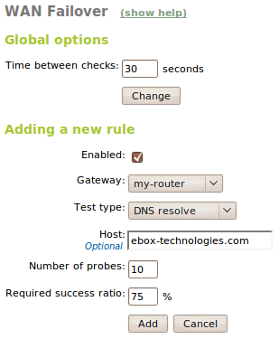

Routing
*******

.. sectionauthor:: Isaac Clerencia <iclerencia@ebox-platform.com>
                   Enrique J. Hernández <ejhernandez@ebox-platform.com>
                   Víctor Jiménez <vjimenez@warp.es>

Routing tables
==============

The term **routing** refers to the action of deciding through which interface
a certain packet must be sent from a host.  The operating system has a routing
table with a set of rules to make this decision.

Each of these rules has different fields, although the three most
important ones are: :guilabel:`destination address`,
:guilabel:`interface` and :guilabel:`router`. These must be read as
follows: to reach a certain :guilabel:`destination address`,
the packet must be directed through a :guilabel:`router`,
which is accessible through a certain :guilabel:`interface`.

When the message arrives, its destination address is compared to the entries in
the table and is sent through the interface indicated in the rule that matches.
The best match is considered the most specific rule. For example, if a rule is
specified indicating that to reach network A (10.15.0.0/16), *router* A must be
used and another rule indicates that to reach network B (10.15.23.0/24), which
is a subnet of A, *router* B must be used. If a packet arrives with destination
10.15.23.23/32, then the operating system will decide to send it to *router B*,
as there is a more specific rule.

All hosts have at least one routing rule for the *loopback* interface, or local
interface, and additional rules for other interfaces that connect it to other
internal networks or to Internet.

To manually configure a static route table, :menuselection:`Network --> Routes`
is used (basically it is an interface for the **route** or **ip route**
commands). These routes may be overwritten if the DHCP protocol is used.

   Route configuration

Gateway
-------

When sending a packet, if no route matches and there is a gateway
configured, it will be sent through the gateway.

The *gateway* is the route by default for packets sent to other networks.

To configure a gateway, use :menuselection:`Network --> Gateways`.

.. FIXME: Update this without upload/download
.. image:: images/routing/11-routing-gateways.png
   :scale: 80
   :alt: gateway configuration
   :align: center

Enabled:
  Indicates if the gateway is really going to be used at the moment.
Name:
  Name identifying the gateway.
IP address:
  IP address of the gateway. This address must be accessible from
  the host containing eBox.
Interface:
  Network interface connected to the gateway. Packages sent to the
  gateway will be sent through this interface.
Weight:
  The heavier the weight, the more traffic will be directed to this gateway
  when load balancing is enabled.
Default:
  Indicates if this gateway should be used as the default one.

If you have interfaces configured as DHCP or PPPoE you can't add gateways
for them as they are managed automatically. You still can enable and disable
them, edit their :guilabel:`Weight` or set the :guilabel:`Default` one,
but not the rest of attributes.

   Gateway list showing DHCP and PPPoE gateways

Subnets and subnet routing
--------------------------

As indicated above, initially there were classes of networks with associated
fixed network masks, which were 8-bit multiples. Due to the lack of scalability
of this approach, CIDR *(Classless Inter-Domain Routing)* was created to allow
for network masks of a variable size to be used, allowing, for example, for a
class C network to be divided into several subnets of a smaller size or to
aggregate several class C subnets into one of a larger size. This allows:

* A more effective use of the scarce IPv4 address space.
* Better use of the hierarchy in address assignment (adding of
  prefixes), decreasing routing overload throughout the
  Internet.

The number of bits interpreted as the subnet identifier is given by a *netmask*
that is of the same length as the IP address. To find the network of an IP
address with its mask, proceed as follows:

+-----------------+-------------------------+-------------------------------------+
|                 | Address with full stops | Binary                              |
+=================+=========================+=====================================+
| IP address      | 192.168.5.10            | 11000000.10101000.00000101.00001010 |
+-----------------+-------------------------+-------------------------------------+
| Netmask         | 255.255.255.0           | 11111111.11111111.11111111.00000000 |
+-----------------+-------------------------+-------------------------------------+
| Network portion | 192.168.5.0             | 11000000.10101000.00000101.00000000 |
+-----------------+-------------------------+-------------------------------------+

CIDR also introduced a new nomenclature that can be seen compared to
the above in the following table:

+------+---------+------------+-----------------+
| CIDR | Class   | N Hosts    | Mask            |
+======+=========+============+=================+
| /32  | 1/256 C | 1          | 255.255.255.255 |
+------+---------+------------+-----------------+
| /31  | 1/128 C | 2          | 255.255.255.254 |
+------+---------+------------+-----------------+
| /25  | 1/2 C   | 128        | 255.255.255.128 |
+------+---------+------------+-----------------+
| /24  | 1 C     | 256        | 255.255.255.0   |
+------+---------+------------+-----------------+
| /21  | 8 C     | 2048       | 255.255.248.0   |
+------+---------+------------+-----------------+

Practical example A
^^^^^^^^^^^^^^^^^^^

You will now configure the network interface statically. The class will be
divided into two subnets.

To do so:

#. **Action:**
   Access the eBox interface, enter :menuselection:`Network --> Interfaces` and,
   for the :guilabel:`network interface` *eth0*, select the :guilabel:*Static*
   `method`. As the :guilabel:`IP address`, enter that indicated by the
   instructor.  As the :guilabel:`Netmask`, use 255.255.255.0. Click on the
   :guilabel:`Change` button.

   The network address will be of the form 10.1.X.Y, where 10.1.X corresponds to
   the network and Y to the host. These values will be used from now on.

   Enter :menuselection:`Network --> DNS` and click on :guilabel:`Add`. As the
   :guilabel:`Name server` enter 10.1.X.1. Click on :guilabel:`Add`.

   Effect:
     The :guilabel:`Save changes` button has been enabled and the network
     interface keeps the data entered. A list is displayed containing the name
     servers, including the recently created server.

#. **Action:**
   Save the changes.

   Effect:
     eBox displays the progress while the changes are being applied.

#. **Action:**
   Access :menuselection:`Network --> Diagnosis`. Ping ebox-platform.com.

   Effect:
     The following is given as the result::

       connect: network is unreachable

#. **Action:**
   Access :menuselection:`Network --> Diagnosis`. Ping to an eBox of a classmate
   part of the same subnet.

   Effect:
     Three satisfactory connection attempts to the host are displayed as
     the result.

#. **Action:**
   Access :menuselection:`Network --> Diagnosis`. Ping to the
   eBox of a classmate in the other subnet.

   Effect:
     The following is given as the result::

       connect: network is unreachable

Practical example B
^^^^^^^^^^^^^^^^^^^

You will now configure a route to access hosts in other subnets.

To do so:

#. **Action:**
   Access the eBox interface, enter :menuselection:`Network --> Routes` and
   select :guilabel:`Add new`. Complete the form with the following values:

   :Network:     10.1.X.0 / 24
   :Gateway:     10.1.1.1
   :Description: route to the other subnet

   Click on the :guilabel:`Add` button.

   Effect:
     The :guilabel:`Save changes` button has been enabled. A list is displayed
     containing the routes, including the recently created one.

#. **Action:**
   Save the changes.

   Effect:
     eBox displays the progress while the changes are being applied.

#. **Action:**
   Access :menuselection:`Network --> Diagnosis`. Ping ebox-platform.com.

   Effect:
     The following is given as the result::

       connect: network is unreachable

#. **Action:**
   Access :menuselection:`Network --> Diagnosis`. Ping to the eBox of a
   classmate in the other subnet.

   Effect:
     Three satisfactory connection attempts to the host are displayed as
     the result.

Practical example C
^^^^^^^^^^^^^^^^^^^

You will now configure a gateway to connect to the remaining networks.

To do so:

#. **Action:**
   Access the eBox interface, enter :menuselection:`Network --> Routes` and
   delete the route created during the previous exercise.

   Enter :menuselection:`Network --> Routers` and select
   :guilabel:`Add new`. Complete with the following data:

   :Name:     Default Gateway
   :IP address: 10.1.X.1
   :Interface:  eth0
   :Weight:     1
   :Default:    yes

   Click on the :guilabel:`Add` button.

   Effect:
     The :guilabel:`Save changes` button has been enabled. The list of routes
     has disappeared. A list of gateways is displayed containing the recently
     created gateway.

#. **Action:**
   Save the changes.

   Effect:
     eBox displays the progress while the changes are being applied.

#. **Action:**
   Access :menuselection:`Network --> Diagnosis`. Ping ebox-platform.com.

   Effect:
     Three satisfactory connection attempts to the host are displayed as
     the result.

#. **Action:**
   Access :menuselection:`Network --> Diagnosis`. Ping to the eBox of a
   classmate in the other subnet.

   Effect:
     Three satisfactory connection attempts to the host are displayed as
     the result.

.. _multigw-section-ref:

Multirouter rules and load balancing
====================================

**Multirouter rules** are a tool that enables PCs in a network to use several
*Internet* connections transparently. This is useful if, for example, an office
has several ADSL connections and the entire bandwidth available is to be used
without having to worry about distributing the work of the hosts manually
between both *routers*, so that the load is shared automatically between them.

Basic **load balancing** evenly distributes the packets transferred from
eBox to the *Internet*. The simplest form of configuration involves establishing
different **weights** for each *router* so that, if the connections available
have different capacities, they can be used optimally.

*Multirouter* rules allow for certain traffic types to be sent permanently by
the same *router*, where required. Common examples include sending emails
through a certain *router* or ensuring that a certain subnet is always routed
from the Internet through the same *router*.

eBox uses the **iproute2** and **iptables** tools for the configuration required
for the *multirouter* function. **iproute2** informs the *kernel* of the
availability of several *routers*. For *multirouter* rules, **iptables** is used
to mark the packets of interest. These marks can be used from **iproute2** to
determine the *router* through which a packet must be sent.

There are several possible problems that must be considered. Firstly, the
connection concept does not exist in **iproute2**. Therefore, with no other
type of configuration, the packets belonging to the same connection could
end up being sent by different *routers*, making communications impossible.
To solve this, **iptables** is used to identify the different connections and
ensure that all the packets of a connection are sent via the same *router*.

The same applies to any incoming connections established. All response
packets for a connection must be sent using the same *router* through which
that connection was received.

To establish a *multirouter* configuration with load balancing in eBox, as many
*routers* as required must be defined in :menuselection:`Network --> Routers`.
Using the :guilabel:`weight` parameter when configuring a *router*, it is
possible to determine the proportion of packets that each one will send. Where
two *routers* are available and weights of 5 and 10, respectively, are
established, 5 of every 15 packets will be sent through the first router,
while the the remaining 10 will be sent via the second.

*Multirouter* rules and traffic balancing are established in the
:menuselection:`Network --> Traffic balancing` section. In this section,
it is possible to add rules to send certain packets to a specific
*router*, depending on the input :guilabel:`interface`, the
:guilabel:`source` (this could be an IP address, an object, eBox or
any), the :guilabel:`destination` (an IP address or a network
object), the :guilabel:`service` with which this rule is to be associated and
via which :guilabel:`routers` the traffic type specified is to be
directed.

Practical example D
-------------------

Configure a *multirouter* scenario with several *routers* with different weights
and check that it works using the **traceroute** tool.

To do so:

#. **Action:**
   In pairs, leave one eBox with the current configuration and add
   a new *gateway* in the other, accessing
   :menuselection:`Network --> Routers` via the interface and clicking on
   :guilabel:`Add new`, with the following data:

   :Name:         Gateway 2
   :IP address:   <classmate's eBox IP>
   :Interface:       eth0
   :Weight:           1
   :Default: yes

   Click on the :guilabel:`Add` button.

   Effect:
     The :guilabel:`Save changes` button has been enabled. A list of gateways
     is displayed containing the recently created gateway and the previous
     gateway.

#. **Action:**
   Save the changes.

   Effect:
     eBox displays the progress while the changes are being applied.

#. **Action:**
   Go to a console and run the following *script*::

      for i in $(seq 1 254); do sudo traceroute -I -n 155.210.33.$i -m 6; done

   Effect:
     The result of running **traceroute** shows the
     different *routers* through which a packet passes to reach its
     destination. On running it in a host with *multirouter*
     configuration, the result of the first leaps between *routers*
     should be different depending on the *router* chosen.

WAN Failover
============

If you are balancing traffic among two or more gateways, this feature is
really useful. In a standard scenario without failover, imagine you are
balancing the traffic between two routers and one of them goes down.
Assuming both gateways have the same weight, half of the traffic will keep
going through the downed gateway, causing connectivity problems to all the
clients in the network.

In the failover configuration, you can define a set of rules for each gateway
that needs to be checked. These rules can be a *ping* to the gateway, to
another external host, a DNS resolution or a HTTP request. You can also
define how many probes you need and the acceptation percentage. If any
of the tests fails to reach the acceptation percentage, the associated
gateway will be disabled. But the tests keep running, so if the gateway comes
back to life all the tests should run successfully and it will be enabled
again.

The gateway disabling without connection heads to all the traffic
coming out through the other gateway instead of being balanced. That way the
users in the network shouldn't notice any big issue with the connection.
Once eBox detects that the downed gateway is fully operative, the normal
behavior of the traffic balance is restored.

The failover is implemented as an eBox event. In order to use it, you first need to
make sure that the :guilabel:`Events` module is enabled and also enable
:guilabel:`WAN Failover` event. [#]_

.. [#] Check out :ref:`events-ref` chapter for details about how events work in eBox
       and how to configure them.

To configure the failover options and rules go to the
:menuselection:`Network --> WAN Failover` menu. You can specify the
event period modifying the value of the :guilabel:`Time between checks`
option. For adding a new rule, just click :guilabel:`Add new` and a form with
the following fields will appear:

:guilabel:`Enabled`:
  It indicates whether the rule is going to be applied or not
  when checking the connectivity of the gateways. You add different rules
  and enable or disable according to your needs instead of deleting and
  adding them again.

:guilabel:`Gateway`:
  It is already filled with the list of configured
  gateways, so you just need to select one of them.

:guilabel:`Test type`:
  It may have any of the following values:

  :guilabel:`Ping to gateway`:
    It sends a ICMP echo packet with the IP
    address of the gateway as destination.
  
  :guilabel:`Ping to host`:
    It sends a ICMP echo packet with the IP
    address of a external host specified below as destination.
  
  :guilabel:`DNS resolve`:
    It tries to get the IP address for the host name
    specified below.

  :guilabel:`HTTP request`:
    It downloads the website content specified below.

:guilabel:`Host`:
   The server to be used as target in the test, it is not
   applicable in case of the :guilabel:`Ping to gateway` type.

:guilabel:`Number of probes`:
   Number of times that the test is tried.

:guilabel:`Required success ratio`:
   Indicates how many successful attempts are needed to consider the test as passed.

It is recommended to configure a event dispatcher in order to be aware of the
connections and disconnections of the gateways. Otherwise, they will be
logged only to the `/var/log/ebox/ebox.log` file.

.. include:: routing-exercises.rst

