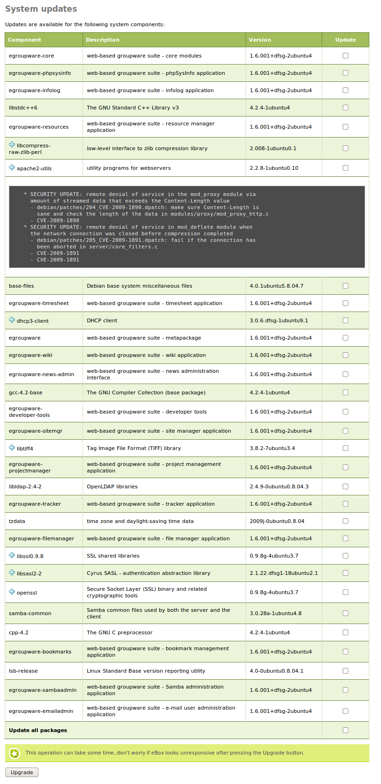

.. _software-ref:

Software Updates
++++++++++++++++

.. sectionauthor:: Javier Amor García <javier.amor.garcia@ebox-technologies.com>
                   Enrique J. Hernandez <ejhernandez@ebox-technologies.com>
                   Ignacio Correas <icorreas@ebox-technologies.com>

Like any other software system, eBox Platform requires periodic
updates, either to add new features or to fix defects or system failures.

eBox distributes its software as packages and it uses Ubuntu's standard tool,
**APT** [#]_. However, in order to ease this task, eBox provides a web interface
to simplify the process.[#]_

.. [#] Advanced Packaging Tool (APT) is a system for the management
       of software packages created by the Debian Project that
       greatly simplifies the installation and removal of
       programs on the GNU / Linux operating system
       http://wiki.debian.org/Apt

.. manual

.. [#] For a more extensive explanation on how to install
       software packages in Ubuntu, please read the section
       :ref:`package-tool-ref`.

.. endmanual

.. Web

.. [#] For a more extensive explanation on how to install
       software packages in Ubuntu, please read the chapter on
       package management in Ubuntu's official documentation
       https://help.ubuntu.com/8.04/serverguide/C/package-management.html

.. endweb

The web interface allows checking for new available versions of eBox components
and installing them in a simple way. It also allows you to update the software
supporting eBox, mainly to correct potential security flaws.

Management of eBox components
=============================

The **management of eBox components** allows you to install, update and
remove eBox modules.

The component manager is a module, and like any other eBox module
must be enabled before being used. To manage eBox components you must access
:menuselection:`Software Management -> eBox components`.

.. image:: images/software/software-ebox-components.png
   :scale: 80
   :align: center

A list of all eBox components is shown there, together with the
installed version and the latest available version. Components
that are not installed or up to date, can be installed or
updated by clicking on the respective icon in the *Actions* column. There is a
button called *Update all packages* to
update all those packages with a new version available.

It is also possible to uninstall components by clicking on the
respective icon for this action. Before proceeding to uninstall,
a dialogue will be displayed with the list of the software packages to be
removed. This step is necessary because it might be about to eliminate
a component that is used by others, which would be also removed.

Some components are basic and cannot be uninstalled, as
that would uninstall eBox Platform completely.

System Updates
==============

**System updates** performs the updates of programs used by
eBox. In order to carry out its function, eBox Platform
integrates different system programs within eBox components'
packages. These programs are referenced as **dependencies**
ensuring that when installing eBox, they are also installed. Similarly,
these programs may have dependencies as well.

Usually the update of a dependency is not important enough
to create a new eBox package with new dependencies, but
it may be interesting to install it in order to use its improvements
or its patches for security flaws.

   System Updates

To see updates of the system you must go to
:menuselection:`Software Management --> System Updates`.
You should see if your system is already updated or, otherwise, a list of
packages that can be upgraded. If you install packages on the machine
without using the web interface, this data may be outdated. Therefore, every
night a process is executed to search for available updates for the system.
Such a search can be forced by running::

    $ sudo ebox-software

For each update, you can determine whether it is a security update
using the information icon. If it is a security update the details about the
security flaw included in the package changelog will be displayed by clicking
on the icon.

If you want to perform an update you should select the packages
on which to perform the action and press the appropriate button.
As a shortcut, you can use the button :guilabel:`Update all packages`.
Status messages will be displayed during the update operation.

Automatic Updates
=================

**Automatic updates** allow eBox Platform to automatically
install any updates available. This operation is performed
daily at midnight.

This feature can be activated by accessing the page
:menuselection:`Software Management -> Automatic Updates`.

.. image:: images/ software/software-automatic-updates.png
   :scale: 80
   :align: center

It is not advisable to use this option if the administrator wants
to keep a higher level of security in the management of updates. When performing
the updates manually, administrators can avoid possible errors going unnoticed.

.. include:: software-exercises.rst
