Voice over IP service
*********************

.. sectionauthor:: Enrique J. Hernández <ejhernandez@ebox-technologies.com>
                   Jorge Salamero <jsalamero@ebox-technologies.com>
                   Jorge Bernal <jbernal@ebox-technologies.com>
                   Javi Vázquez <javivazquez@ebox-technologies.com>
                   Javier Uruen <juruen@ebox-technologies.com>

**Voice over IP** or **VoIP** involves transmitting voice over data networks
using different protocols to send the digital signal through packets instead
of using analog circuits.

Any IP network can be used for this purpose, including private or public
networks such as *Internet*. There are huge cost savings using the same
network for data and voice without losing quality or reliability. The main
issues of VoIP deployments over data networks are NAT [#]_ with its management
difficulties and QoS [#]_, because of the need to offer a quality real-time
service where latency (the time it takes for data to arrive at destination), *jitter* (variations on latency) and bandwidth have to be considered.

.. [#] Concept explained in section :ref:`firewall-ref`.

.. [#] Concept explained in section :ref:`qos-ref`.

Protocols
---------

There are several protocols involved in the voice transmission, from network
protocols like IP and transport protocols like TCP or UDP, to voice
protocols both for signaling and transport.

VoIP **signaling protocols** accomplish the task of establishing and controlling
the call. SIP, IAX2 and H.323 are signaling protocols.

The most widely used **voice transport protocol** is RTP
(*Realtime Transport Protocol*), which carries the encoded voice from origin to
destination. This protocol starts once the call has been established by the signaling
protocol.

SIP
^^^

**SIP** (*Session Initiation Protocol*) is a protocol created by the IETF [#]_
for the establishment, modification and termination of interactive multimedia
sessions. It incorporates many elements of HTTP and SMTP. SIP only handles
signaling and works over the UDP/5060 port. Multimedia transmission is handled
by RTP over the port range UDP/10000-20000.

.. [#] **Internet Engineering Task Force** develops and promotes communication
       standards used on *Internet*.

.. TODO: developt further SIP and SIP+NAT
.. TODO: H323 protocol

IAX2
^^^^

**IAX2** is the second version of the *Inter Asterisk eXchange* protocol,
created for connecting *Asterisk* [#]_ PBX systems. The main feature of this
protocol is that voice and signaling travel through the same data stream, this
is called trunking. This way it can traverse NAT easily and there is less overhead
when trying to keep multiple communication channels open among servers. Also with
this protocol the communication can be encrypted. IAX2 works on UDP/4569 port.

.. [#] **Asterisk** is a PBX *software* that eBox uses for its VoIP module
       <http://www.asterisk.org/>.

Codecs
------

A **codec** is an algorithm that adapts digital information (encoding at origin
and decoding at destination) to compress it, reducing bandwidth usage, detecting
and recovering from transmission errors. G.711, G.729, GSM and speex are
common codecs for VoIP.

**G.711**: It is one of the most used codecs. It comes in two flavors: an
American one (*ulaw*) and an European one (*alaw*). This codec offers good
quality, but it has significant bandwidth requirements (64kbps), which makes it
a common choice for communication over local networks.

**G.729**: It offers a better compression using only 8kbps, being ideal for
*Internet* communications. There are some usage restrictions on this codec.

**GSM**: It is the same codec that is used in mobile networks. Voice quality is
not very good and it uses around 13kbps.

**speex**: It is a patent-free codec specially designed for voice. It is very
versatile, though it uses more CPU than others. It can work at different
bitrates, such as 8KHz, 16KHz and 32KHz, usually referred as *narrowband*,
*wideband* and *ultra-wideband*, each consuming 15.2kbps, 28kbps and 36kbps
respectively.

Deployment
----------

Let's cover the elements involved in a VoIP deployment:

IP Phones
^^^^^^^^^

They are *phones* with a traditional look but with a RJ45
connector to plug them to an *Ethernet* data network instead of the RJ11 connector
for analog telephone networks. They add also new features like addressook or call
automation not present in regular analog phones. These phones talk usually SIP
directly with the server and any other clients.

Analog Adapters
^^^^^^^^^^^^^^^

Analog adapters, also known as **ATA** (*Analog Telephony Adapter*) can
connect a traditional analog phone to a data network and make it work like
an IP phone. They have a RJ45 data port and one or more RJ11 analog ports.

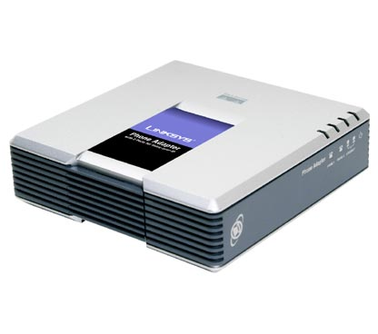

Softphones
^^^^^^^^^^

**Softphones** are computer programs to make and receive calls without
additional hardware (except the computer microphone and speakers). There are
multiple applications for all platforms and operating systems. X-Lite and
QuteCom (WengoPhone) are available for Windows, MacOS X and GNU/Linux. Ekiga
or Twinkle are native GNU/Linux applications.

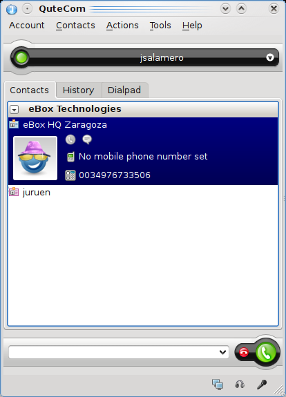

   QuteCom

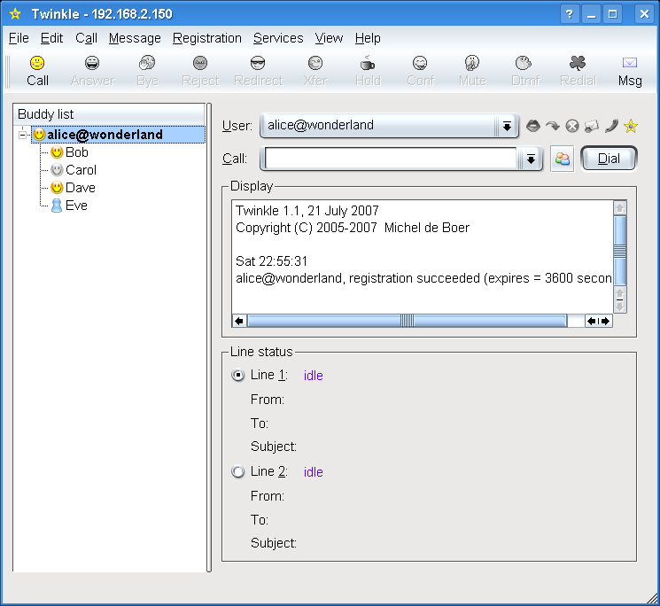

   Twinkle

IP PBXs
^^^^^^^

In contrast to traditional telephony which routed all calls through a central
PBX, VoIP clients (IP phones or *softphones*) register on the server, ask him for
the call recipient information and then establish the call directly. When establishing
the call, the caller and the recipient negotiate a common codec for the voice
transmission.

*Asterisk* is a software only application that works in commodity servers,
providing the features of a PBX (*Private Branch eXchange*): connect multiple
phones amongst them and with a VoIP provider or the analog telephone network. It
also offers services such as voicemail, conferences, interactive voice responses,
etc.

To connect the *Asterisk* server to the public network, it needs extra cards
called FXO (*Foreign eXchange Office*) which allow *Asterisk* to act like a
regular phone and route calls through the phone network. To connect an analog
phone to the server, it needs a FXS (*Foreign eXchange Station*) card. That way,
existing phones can be adapted to the new IP telephony network.

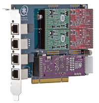

   Digium TDM422E FXO and FXS card

*Asterisk* server configuration with eBox
-----------------------------------------

eBox VoIP module allows you to manage an *Asterisk* server with the users that
already exist on the system LDAP server, and the most common features
configured.

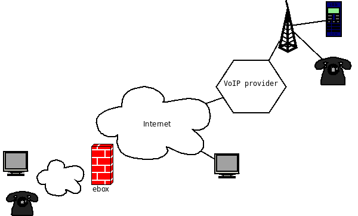

As usual, the module must be enabled first. Go to :menuselection:`Module Status`
and select the :guilabel:`VoIP` checkbox. If the :guilabel:`Users and Groups` is
not enabled, it should be enabled beforehand.

To change the general configuration, go to :menuselection:`VoIP --> General`.
Once there, the following general parameters should be configured:

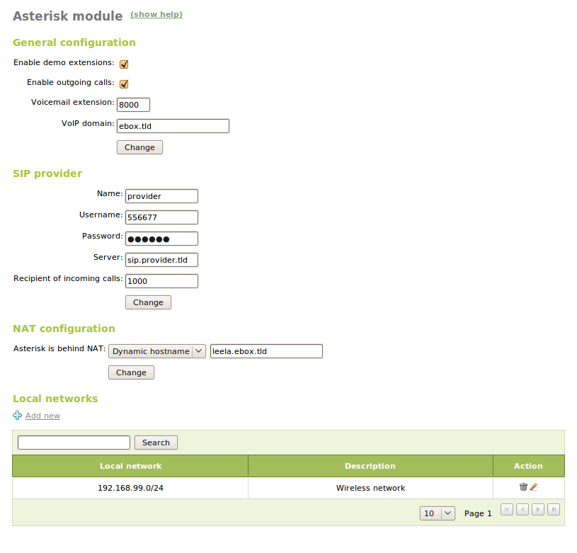

:guilabel:`Enable demo extensions`:
  Enables extensions 400, 500 and 600. A call to extension 400 starts music on hold
  if configured. Extension 500 starts an IAX call
  to guest@pbx.digium.com. Extension 600 provides an echo test to estimate your
  call latency. These extensions can help to check if a client is well
  configured.

:guilabel:`Enable outgoing calls`:
  Enables outgoing calls through a
  SIP provider to call regular phones. To call through the SIP provider, add an
  additional zero before the number to call. For instance, to call eBox
  Technologies offices (+34 976733507 or 0034976733506) dial 00034976733506.

:guilabel:`Voicemail extension`:
  It is the extension to call to check the voicemail. User and password are both
  the extension assigned by eBox when creating the user, or assigned for the first
  time.  It is strongly recommended to change that password immediately from the
  **User Corner** [#]_. The application listening on this extension allows you
  to change the welcome message, listen to recorded messages and delete them.
  For security reasons, it is only accessible by the users of the eBox server,
  so it does not accept incoming calls from other servers.

.. [#] Explained in the section :ref:`usercorner-ref`.

:guilabel:`VoIP domain`:
  It is the domain assigned to the user addresses. For example, an user **user** with an
  extension 1122 can be called at user@domain.tld or 1122@domain.tld.

In the :guilabel:`SIP provider` section, enter the credentials supplied by the
SIP provider, so eBox can route calls through it:

:guilabel:`Provider`:
  If you are using :guilabel:`eBox VoIP Credit`, select this option which will
  configure your provider name and server. Otherwise use :guilabel:`Custom`.
:guilabel:`Name`:
  It is the identifier of the provider in eBox.
:guilabel:`User name`:
  It is the user name to login in the provider.
:guilabel:`Password`:
  It is the password to login in the provider.
:guilabel:`Server`:
  It is the provider server.
:guilabel:`Recipient of incoming calls`:
  It is the internal extension that will receive the incoming calls to the
  provider account.

The :guilabel:`NAT configuration` section defines the network location of
your eBox host.  If it has a public IP address, the default option
:guilabel:`eBox is behind NAT` is not appropriate. If it has a private IP
address, *Asterisk* needs to know your *Internet* public IP address.  If you
have a fixed public address, select :guilabel:`Fixed IP address` and enter it;
if the IP is dynamic, configure the dynamic DNS service (DynDNS) available in
:menuselection:`Network --> DynDNS` (or configure it manually) and enter the
domain name in :guilabel:`Dynamic hostname`.

In the :guilabel:`Local networks` section, you can add the local networks to
which eBox has direct access without NAT, like VPN or not configured network
segments, like a wireless network. This is required to make SIP work with
NAT environments.

The conference configuration is accessed through
:menuselection:`VoIP --> Meetings`. There you can configure multiple conference
rooms. These rooms :guilabel:`extension` should fit in the 8001-8999 range and
optionally have a :guilabel:`password` and a :guilabel:`description`. These
extensions can be accessed from any server by dialing extension@domain.tld.

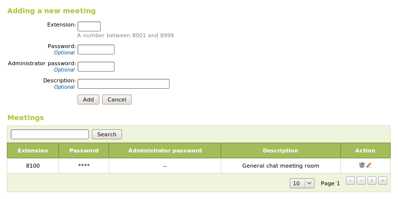

When editing a user, you will be able to enable and disable this user VoIP account and change his extension.
Take in account that an extension can only be assigned to one user and no more, if you need to call more
than one users from an extension you should use queues.

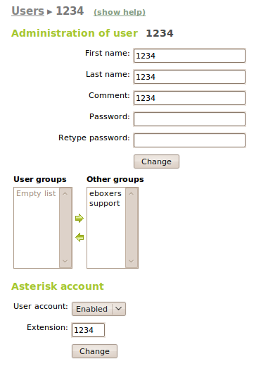

When editing a group, you will be able to enable and disable this group queue. A queue is an extension
where when you call, it rings all the users who belong to this group.

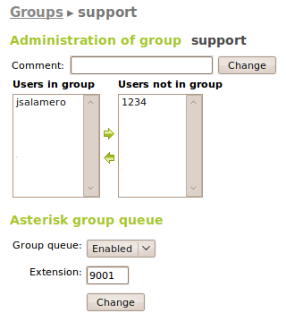

If you want to configure music on hold, drop your MP3 songs to `/var/lib/asterisk/mohmp3/`
and install the *mpg123* package.

Configuring a *softphone* to work with eBox
-------------------------------------------

Ekiga (Gnome)
^^^^^^^^^^^^^

**Ekiga** [#]_ is the *softphone* (or VoIP client) recommended by the Gnome
desktop environment. When first launched, Ekiga presents a wizard to configure
the user's personal data, audio and video devices, the connection to the
Internet and the *Ekiga.net*'s services. We can skip the configuration of both
*Ekiga.net* and *Ekiga Call Out*.

.. [#] <http://ekiga.org/>

From :guilabel:`Edit --> Accounts`, selecting :guilabel:`Accounts
--> Add a SIP Account` you can configure your VoIP account in eBox Platform.

:guilabel:`Name`:
  Identifier of the account inside *Ekiga*.
:guilabel:`Register server`:
  Domain name of the VoIP server.
:guilabel:`User` and :guilabel:`User for authentication`:
  Both are the user name.
:guilabel:`Password`:
  User password.

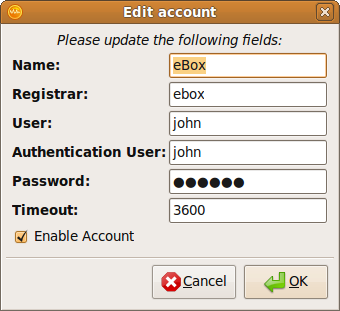

After setting the account, it will attempt to register on the server.

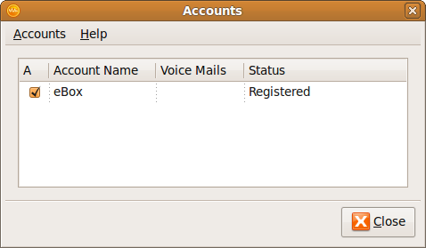

To make a call is as simple as typing the number or *SIP* address
on the top bar, and call using the green phone icon to the right of the bar.
To hang up, use the red phone icon.

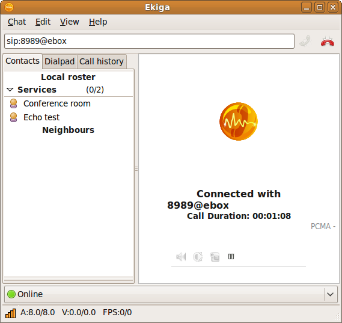

Qutecom (Multiplatform)
^^^^^^^^^^^^^^^^^^^^^^^

**Qutecom** [#]_ is a *softphone* that uses Qt4 libraries, what makes it
available for the three more popular operating systems: GNU/Linux, OSX and
Windows. When launched first time it shows a wizard to configure the VoIP
account, as Ekiga does.

.. [#] http://www.qutecom.org

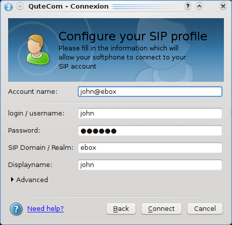

You have a keypad or a list of contacts to make calls. Use the green/red buttons
at the bottom to call and hang up.

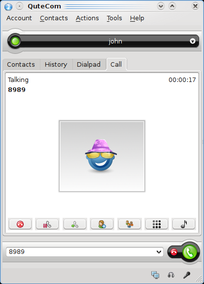

Using eBox VoIP features
------------------------

Call transfering
^^^^^^^^^^^^^^^^
The call transfering feature is quite simple. While you are on a conversation,
press # and then dial the extension where you want to transfer the current call.
You can hang up now as the call will be ringing on the called extension.

Call parking
^^^^^^^^^^^^
The extension 700 is the call parking. While you are on a conversation, press #
to initiate a transfer, then dial 700. The extension where the call has been
parked will the announced to the called, and the caller will listen the music
on hold if configured. You can hang up now. From a different phone or different
user dial that announced extension and you will wake up the parked user and you
will be able to speak with him.

On eBox the call parking can hold up to 20 current calls and the maximum time
a call can wait parked is 300 seconds.

Example
-------
Create a user with a VoIP account. Change the extension to 1500.

#. **Action:**
   Log into eBox, click on :menuselection:`Module status` and
   enable the :guilabel:`VoIP` module by clicking the checkbox in the
   :guilabel:`Status` column. If :guilabel:`Users and Groups` is not enabled
   you should enable it previously. Then you will be informed about the changes
   that are going to take place in the system. You should allow these actions
   by clicking the :guilabel:`Accept` button.

   Effect:
     The :guilabel:`Save Changes` button has been activated.

#. **Action:**
   Go to :menuselection:`VoIP`. Write the machine's domain name in
   :guilabel:`VoIP Domain`. The domain should be resolvable from the machines
   of the service clients. Click on :guilabel:`Change`.

#. **Action:**
   Save the changes done.

   Effect:
     eBox shows its progress while applying the changes. Once it is done, it
     shows it.

     VoIP service is ready to be used.

#. **Action:**
   Access the :menuselection:`Users and Groups --> Users --> Add User` menu. Fill in the form to
   create a new user.  Click on :guilabel:`Create and Edit`.

   Effect:
     eBox creates a new user and shows you its profile.

#. **Action:**
   In the section :guilabel:`VoIP Account`, eBox shows if the user has its
   account enabled or disabled, and also its extension.
   Make sure that the account is enabled, all the users created while
   the VoIP module is enabled should have their account also enabled. Finally,
   change the extension given by defect (say, the first free extension of the
   range of users), to the extension 1500.
   Click on :guilabel:`Apply changes` in the :guilabel:`VoIP Account` section.

   Effect:
     eBox apply the changes immediately. The user is able to receive calls in
     that extension.
