*********************************************
Secure interconnection between local networks
*********************************************

.. sectionauthor:: Javier Amor García <javier.amor.garcia@ebox-technologies.com>,
                   Enrique J. Hernández <ejhernandez@ebox-technologies.com>,
                   José A. Calvo <jacalvo@ebox-technologies.com>,
                   Jorge Salamero Sanz <jsalamero@ebox-technologies.com>

.. _vpn-ref:

Virtual Private Network (VPN)
=============================
The **Virtual Private Networks** were designed both to allow secure access
to remote users to the corporate network and secure interconnection of
geographically distant networks.

A frequent situation is where remote users need to access resources located in
the company local network, but those users are outside the facilities and cannot
connect directly.  The obvious solution is to allow the connection through the
Internet. This would create security and configuration problems, which can be
resolved through the use of **virtual private networks**.

The solution offered by a VPN (*Virtual Private Network*) to this problem is
the use of encryption to only allow access to authorized users (hence the
private adjective). And to ease the use and configuration, connections
seem to be as if there were a network between the users and the local network
(hence the virtual).

The VPN's usefulness is not limited to the access of remote users; a
organization may wish to interconnect networks that are located in different
places. For example, networks located in different cities. Some time ago, to
solve this problem dedicated data lines were hired, but this service was
expensive and slow to deploy. Later, the advance of the Internet provided a
ubiquitous and cheap, but insecure, medium. And again, the security and
virtualization features of the VPN were an appropriate response to this problem.

In this regard, eBox Platform provides two modes of operation. It can work as
a server for remote users and as a server and client for the connection between
two networks.

Public Key Infrastructure (PKI) with a Certification Authority (CA)
===================================================================

The VPN used by eBox to ensure data privacy and integrity uses SSL as
cypher technology. The SSL technology is used widely since a long time
so we could reasonably trust its security. However, all cypher schemes
have the problem of how to distribute the keys to their users without
interception by third parties. In the VPN context, this step is
required when a new participant joins the virtual network. The adopted
solution is the use of a public key infrastructure (PKI). This
technology allows the use of the key in a insecure medium, like the
Internet, without allowing the interception of keys by anyone who
snoops the communication.

**PKI** is based in that each participant generates two keys: a *public key*
and a *private key*. The *public* one can be distributed publicly and
the *private* one must remain secret. Any participant who wants to cypher a
message can do it with the *public key* of the recipient but the message can
only be deciphered with the *private key* of the recipient. As this key is kept
secret, it is ensured that only the recipient can read the message. However,
this solution creates a new problem. If anyone could present a *public key*,
how we can guarantee that a participant is really who he claims to be and is not
impersonating another identity? To solve this problem, **certificates**
were created. [#]_

.. [#] There is a lot of information about public key encryption. You can begin
       here: http://en.wikipedia.org/wiki/Public-key_encryption

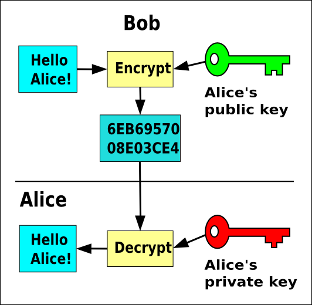

   *GRAPHIC: Public key encryption*

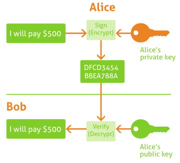

   *GRAPHIC: Public key signature*

The *certificates* use another **PKI** feature: the possibility of signing
files. The *private key* is used to sign a file. The signature can be checked
by anyone using the *public key*. A *certificate* is a file that contains a
*public key*, signed for someone that is trusted. This trusted participant is
used to verify identities and is called **Certification Authority** (CA).

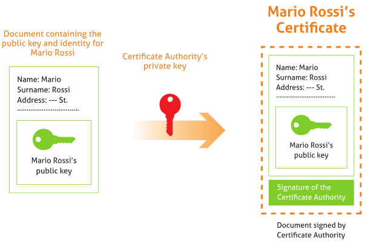

   *GRAPHIC: Diagram to issue a certificate*

Certification Authority configuration with eBox
===============================================

eBox Platform has integrated management of the Certification Authority and
the life cycle of the issued certificates for your organization.
It uses the **OpenSSL** [#]_ tools for this service.

.. [#] **OpenSSL** - *The open source toolkit for SSL/TLS* <http://www.openssl.org/>.

First of all, you need to generate the keys and issue the certificate of the
CA itself. This step is needed to sign new certificates, so the
remaining features of the module will not be available until the CA keys
are generated and its certificate, which is self signed, is issued. Note that
this module runs unmanaged and you don't need to enable it in
:guilabel:`Module Status`.

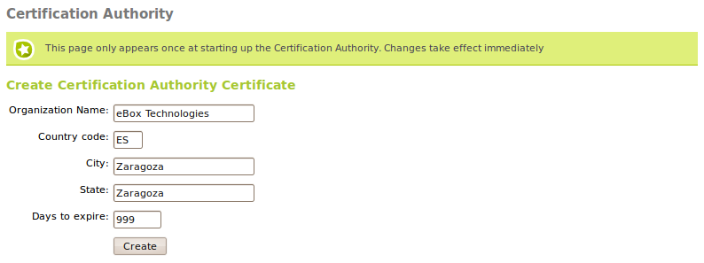

Go to :menuselection:`Certification Authority --> General` and you will find the
form to issue the CA certificate after generating automatically the key pair. It
is required to fill in the :guilabel:`Organization Name` and
:guilabel:`Days to expire` fields. When setting this duration you have to take
into account its expiration will revoke all certificates issued by this CA,
stopping all services depending on those certificates. It is possible to add
also these optional fields to the CA certificate:

:guilabel:`Country Code`
  An acronym consisted of two letters defined in ISO-3166.

:guilabel:`City`

:guilabel:`State`

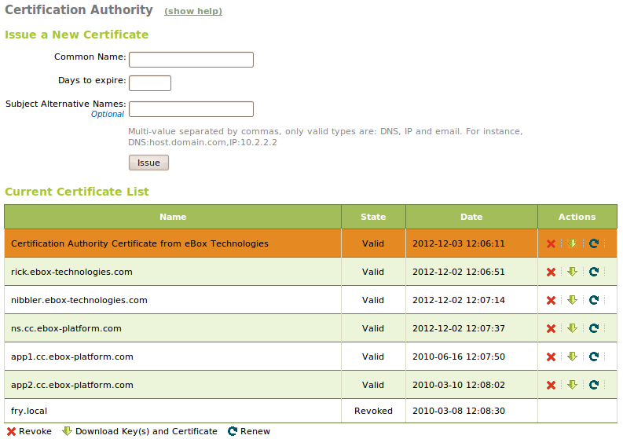

Once the CA has been created, you will be able to issue certificates
signed by the CA. To do this, use the form now available at
:menuselection:`Certification Authority --> General`. The required data are the
:guilabel:`Common Name` of the certificate and the :guilabel:`Days to
expire`. This last field sets the number of days that the certificate will
remain valid and the duration cannot surpass the duration of the CA.
In case we are using the certificate for a service server like it could be a
web server or mail server, the :guilabel:`Common Name` of the certificate should
match the hostname or domain name of that server.

When the certificate is issued, it will appear in the list of certificates and
it will be available to eBox services that use certificates and to external
applications. Furthermore, several actions can be applied to the certificates
through the certificate list:

- Download a tarball archive containing the public key, private key and the
  certificate.
- Renew the certificate.
- Revoke the certificate.

If you renew a certificate, the current certificate will be revoked and a new
one with the new expiration date will be issued along with the key pair.

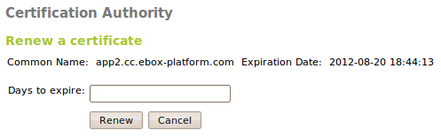

If you revoke a certificate you won't be able to use it anymore as this
action is permanent and you can't go backwards. Optionally you can select
the reason of the certificate revocation:

:guilabel:`unspecified`

:guilabel:`keyCompromise`
  The private key for this certificate has
  been compromised and now it is available for suspicious people.

:guilabel:`CACompromise`
  The private key for the CA certificate
  has been compromised and now it is available for suspicious people.

:guilabel:`affilliationChanged`
  The issued certificate has changed its affiliation to another
  certification authority from other organization.

:guilabel:`superseded`
  The certificate will be renewed and this is no
  longer valid and thus replaced.

:guilabel:`cessationOfOperation`
  The issued certificate has ceased its operation.

:guilabel:`certificateHold`

:guilabel:`removeFromCRL`
  Currently unimplemented delta CRLs support.

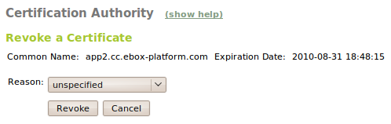

If you renew the CA certificate then all the certificates will be renewed with
the new the CA. The old expiration date will be kept, if this is
not possible it means that the old expiration date is a later date than the new
CA expiration date, in this case the expiration date of the certificate will be
set to the expiration date of the CA.

When a certificate expires all the modules are notified. The expiration date of
each certificate is automatically checked once a day and every time you access
the certificate list page.

Services Certificates
^^^^^^^^^^^^^^^^^^^^^

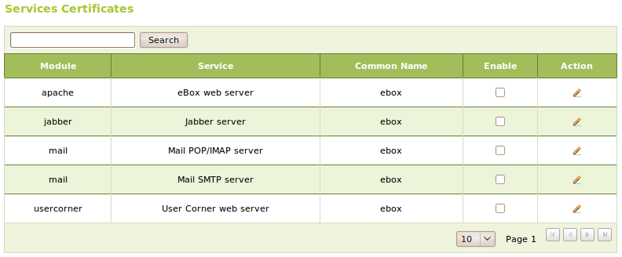

On :menuselection:`Certification Authority --> Services Certificates`
we can find the list of eBox modules using certificates for its secure
services. By default, these are generated by each module, but if we
are using the CA we can replace these self signed certificates with
ones issued by our organization CA. You can define for each service
the :guilabel:`Common Name` of the certificate and if there is a
certificate with that :guilabel:`Common Name` available, the CA will
issue one. In order to set these key pair and signed certificate to
the service you have to :guilabel:`Enable` the certificate.

Every time a certificate is renewed is pushed again to the eBox module but you
need to restart the service to force the new certificate usage.

Practical example A
^^^^^^^^^^^^^^^^^^^

Create a Certification Authority which will be valid for a year, then create a
certificate called *server* and two client certificates called *client1* and
*client2*.

#. **Action:**

    Go to :menuselection:`Certification Authority --> General`. In the form
    called :guilabel:`Create Certification Authority Certificate`, fill in
    the fields :guilabel:`Organization Name` and :guilabel:`Days to expire`
    with reasonable values. Press :guilabel:`Create` to generate the
    Certification Authority.

    Effect:
     The key pair of the Certification Authority is generated and its certificate
     will be issued. Our new CA will be displayed in the list of certificates. The
     form for creating the CA will be replaced by another one intended to issue
     normal certificates.

#. **Action:**
     Using the form :guilabel:`Issue a New Certificate` to issue certificates,
     enter *server* as :guilabel:`Common Name` and then, in
     :guilabel:`Days to expire`, a number of days less than or equal to the one
     you entered for the CA certificate. Repeat these steps with the names
     *client1* and *client2*.

    Effect:
     The new certificates will appear in the list of certificates, ready to be
     used.

Configuring a VPN with eBox
===========================

The software selected by eBox to create VPNs is **OpenVPN** [#]_. OpenVPN has
the following advantages:

  - Authentication using public key infrastructure.
  - Encryption based on SSL technology.
  - Clients available for Windows, MacOS X and Linux.
  - Code that runs in user space, without the need to modify the network stack
    (as opposed to **IPSec**).
  - Possibility to use network applications in a transparent way.

.. [#] **OpenVPN**: *An open source SSL VPN Solution by James
        Yonan* http://openvpn.net.

Remote VPN Client
^^^^^^^^^^^^^^^^^

eBox can be configured to support remote clients (familiarly known as road
warriors). That is, an eBox machine can work as a gateway and OpenVPN server,
allowing clients on the Internet (the road warriors) to connect to the network
via the VPN service and access the local area network.

The following figure can give a more accurate view of the scenario:

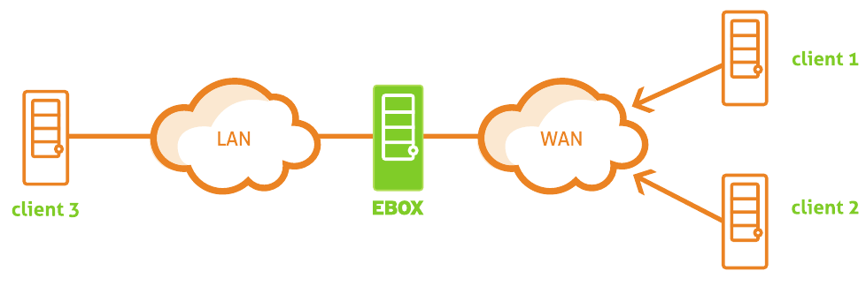

   eBox and remote VPN clients

The goal is to connect the client number 3 with the other two remote clients
(1 and 2) and also connect these two among themselves.

To do this, we need to create a **Certification Authority** and certificates for
the two remote clients. Note that you also need a certificate for the OpenVPN
server itself, however, this certificate is automatically created when you add a
new OpenVPN server. Here, the eBox machine also acts as a CA.

Once we have the certificates, we should configure the OpenVPN server
in eBox using :guilabel:`Create a new server`. To only parameter that you need
to create a working OpenVPN server is its name. An OpenVPN server needs more
parameters to work properly. eBox makes this easy and will try to
automatically set valid parameters for you.

The following configuration parameters will be added by eBox, feel
free to adapt them to your needs: a :guilabel:`port/protocol pair`, a
:guilabel:`certificate` ( eBox will create a certificate using the
OpenVPN server's name) and a :guilabel:`network address` for the VPN. Addresses
belonging to the VPN network are assigned to the server and the
clients. In case you need to change the *network address* and to avoid
conflicts, you have to make sure that the network address is not used
in any other part of your network. Furthermore, the local networks,
i.e. the networks where the network interfaces are attached to, are
advertised through the private network.

The OpenVPN server will be listening on all the external interfaces. Therefore,
we have to mark at least one of our interfaces as external via
:menuselection:`Network -> Interfaces`. In this scenario only two interfaces are
needed, the internal one for the LAN and the external one for the Internet. You
can configure the server to listen also on internal interfaces, activating the
option *Network Address Translation* (NAT), but you can ignore it for
the moment.

If you want the clients to connect to each other using their VPN addresses, you
have to activate the option :guilabel:`Allow connections between clients`.

You can leave the rest of the options with their defaults.

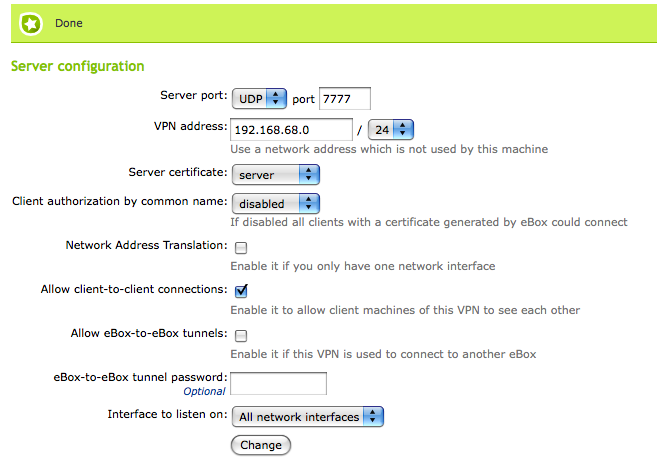

After creating the OpenVPN server you have to enable the service and
save the changes. Subsequently, you should check in
:menuselection:`Dashboard` that the VPN service is running.

After that, you may want to advertise networks through
:guilabel:`Advertised networks` configuration for the VPN
server. These networks will be accessible by OpenVPN authorized
clients. Note that eBox will advertise all your local networks by
default. Obviously, you can remove or add routes at your leisure. In
our example scenario, the local network has been added automatically
to make visible the client number 3 to the two other clients.

Once done, it's time to configure the clients.
The easiest way to configure an OpenVPN client is using
the bundles provided by eBox. These are available in the table in
:menuselection:`VPN -> Servers`, by clicking the icon on the
:guilabel:`Download client bundle` column. There are bundles
for two types of operating system. If you are using
MacOS X or GNU/Linux, you have to choose :guilabel:`Linux` as type.
When a bundle is created, the certificates that will be given to the
client are included, and the external IP address to which VPN clients
have to connect is set. If the selected system is Windows, an
OpenVPN for *Win32* installer is also included. The configuration bundles
should be downloaded by the eBox administrator and he is responsible for
distributing them to the clients in a proper and secure way.

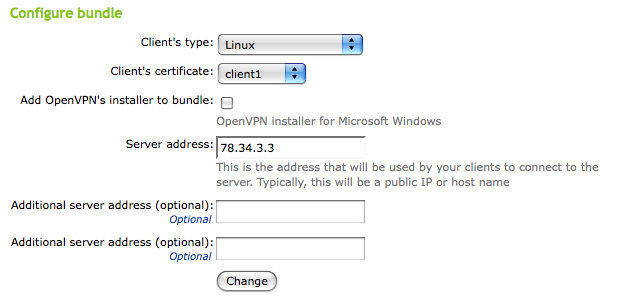

A bundle includes the configuration file and other necessary files
to start a VPN connection. For example, in Linux,
simply extract the archive and execute it, within the
newly created directory, using the following command::

    openvpn --config filename

Now you have access to the client number 3 from the two remote
clients.  Bear in mind that the eBox DNS service will not work through
the private network unless you configure the remote clients to use
eBox as name resolver. That is why you cannot access the services of
the hosts on the LAN by name, you have to do it by IP address. That
also applies to the NetBIOS [#]_ service when accessing Windows shared
resources, to browse the shared resources from the VPN, you must
explicitly allow the broadcast traffic provided by the SMB/CIFS
server.

.. [#] For more information about file sharing, see section
       :ref:`filesharing-chapter-ref`

To enable the remote clients to connect between themselves, you need to activate
the :guilabel:`Allow client-to-client connections` option in the VPN server
configuration. To verify that the configuration is correct, look at the routing
table of the client and check that the new networks were added to the **tapX**
virtual interface.

The current users connected to the VPN service are displayed in eBox
:guilabel:`Dashobard`.

.. _vpn-example-b-ref:

Practical example B
^^^^^^^^^^^^^^^^^^^

This example will configure a VPN server. A client on a computer located
on a external network is going to be configured. Once connected it to the VPN,
it will access another host in the local network, which is only accessible
from the server through an internal interface.

To do this:

#. **Action:**
    Access the eBox interface, go to :menuselection:`Module Status` and
    activate the :guilabel:`VPN` module by checking the box on the
    :guilabel:`Status` column.

    Effect:
      eBox requests permission to perform certain actions.

#. **Action:**
    Read about the actions that are going to be performed and grant permission
    to do them.

    Effect:
      :guilabel:`Save Changes` button is activated.

#. **Action:**
    Access the eBox web interface, enter the :menuselection:`VPN -> Server`
    section, click on :guilabel:`Add new`. A form with the fields
    :guilabel:`Enabled` and :guilabel:`Name` will appear. Enter a name for the
    server and leave it disabled until it is configured correctly.

    Effect:
      The new server appears in the list of servers.

#. **Action:**
    Click on :guilabel:`Save Changes` and accept all the changes.

    Effect:
      The server is active, you can verify its status in the
      :menuselection:`Dashboard`.

#. **Action:**
      To simplify the configuration of the client, download the
      configuration bundle. To do this, click the icon on the
      :guilabel:`Download client bundle` column.
      Fill in the configuration form with the following options:

       * :guilabel:`Client type`: select *Linux*, as it is the client OS.
       * :guilabel:`Client certificate`: select *client1*. If
          This certificate is not created, create it following
          the instructions from the previous example.
       * :guilabel:`Server address`: enter here
          the address that the client has to use to reach the VPN server.
          In this scenario, this address will be the one for the
          external interface connected to the same network as the computer
          client.

      Effect:
       Once the form is completed, a bundle file for the client will be
       downloaded. It will be a compressed file in *.tar.gz* format.

#. **Action:**
      Configure the client computer. For this, decompress the
      bundle in a directory. Note that the bundle contains
      files with the necessary certificates and a configuration file with
      the *.conf* extension. If there have been no mistakes in the steps
      earlier, you have all the necessary configuration and you only have to
      launch the program.

      To launch the client run the following command within the directory::

         openvpn --config [ filename.conf ]

      Effect:
       When launching the command in a terminal window the actions
       will be printed on it. If everything is correct, once the
       connection is ready *Initialization Sequence Completed* will appear
       on the terminal; otherwise error messages will appear to help you
       diagnose the problem.

#. **Action:**
      Before checking if there is a connection between the client and the
      computer on the private network, you have to be sure that the latter has
      a return route to the VPN client. If you are using eBox as the default
      gateway, there will be no problem. Otherwise you will need to add a
      route to the client.

      First you have to check if there is connection by using the **ping**
      command. Run the following command::

         ping -c 3 [ another_computer_ip_address ]

      To verify that there is not only communication, but also access to the
      resources of another computer, launch a remote console session.
      You can do it with the following command from the client computer::

         ssh [ another_computer_ip_address ]

      After accepting the identity of the computer and entering the user
      and the password, you will access the console of the remote computer
      as if it were physically on your local network.

.. _clients-NAT-VPN-ref:

Remote VPN Client with NAT
--------------------------

If you want to have a VPN server that is not the gateway of your LAN, i.e. the
machine has no external interfaces, then you need to activate the
:guilabel:`Network Address Translation` option. As this is a firewall feature,
you have to make sure that the **firewall** module is active, otherwise you will
not be able to activate this option. With this option, the VPN server will act
as a representative of VPN clients within the network. In fact, it will be a
representative of all the advertised networks, and it will receive the response
packets and subsequently forward them through the private network to the
clients. This situation is better explained with the following figure:

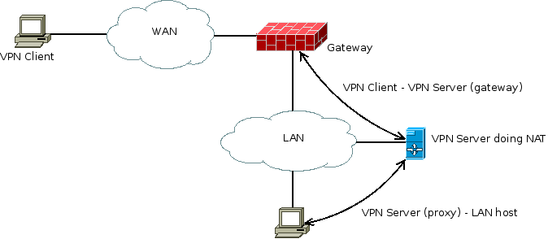

   *GRAPHIC: VPN connection from a client to the LAN using NAT with VPN*

Secure interconnection between local networks
---------------------------------------------

In this scenario there are two offices in different networks that need to
be connected via a private network. To do this, eBox is
used as gateway in both networks. One eBox will act as OpenVPN client
and another as server. The following figure attempts to clarify the
situation:

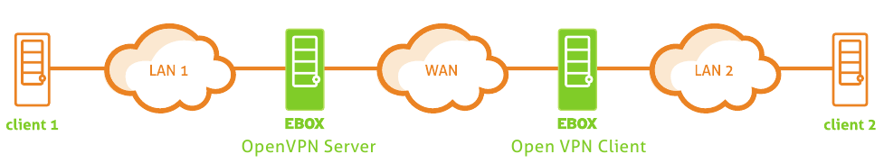

   eBox vs OpenVPN as a server. eBox OpenVPN as a client

The goal is to connect the client on the LAN 1 with client 2
on the LAN 2, as if they were in the same local network. Therefore,
you have to configure an OpenVPN server as done in :ref:`vpn-example-b-ref`.

However, you need to make two small changes. First, enable
the :guilabel:`Allow eBox-to-eBox tunnels` option to exchange
routes between eBox machines. Then enable
:guilabel:`password for the eBox-to-eBox tunnel` to have a more secure
connection environment.  You have to bear in mind that you have to add the
address of the LAN 1 in :guilabel:`Advertised networks`.

To configure eBox as an OpenVPN client, you can do it through
:menuselection:`VPN -> Clients`. You must give a :guilabel:`name` to
activate the client and activate the :guilabel:`service`. You can set
the client configuration manually or automatically using the bundle
from the VPN server, as done in the :ref:`vpn-example-b-ref`.  If not
using the bundle, you will have to enter the :guilabel:`IP address`
and the :guilabel:`Server port` pair where the server is listening. A
:guilabel:`eBox-to-eBox tunnel password` and the
:guilabel:`certificates` used by the client are also required. These
certificates should have been issued by the same CA that is using the
server.

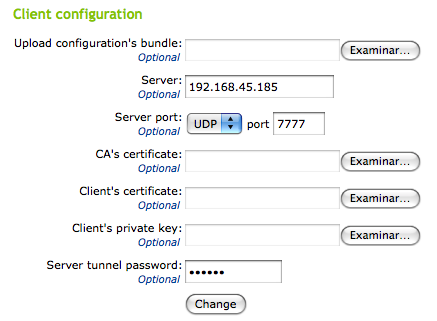

When changes are saved, you can see in :menuselection:`Dashboard`
a new OpenVPN daemon on the network 2 running as a client,
connected to the other eBox in the LAN 1.

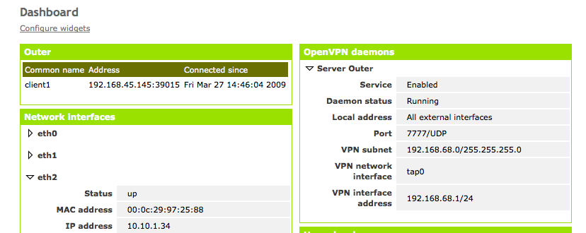

When the connection is complete, the server machine
will have access to all routes of the client machines
through the VPN. However, the client machines will have
access only to the routes that the server has advertised explicitly.

Practical example C
^^^^^^^^^^^^^^^^^^^

This example's goal is to set up a tunnel between two networks that
use eBox servers as gateways to an external network, so that members of both
networks can connect with each other.

#. **Action:**
    Access the web interface of the eBox which is going to act as server in
    the tunnel. Make sure the **VPN** module is enabled and activate it if
    necessary.
    Once you are in the :menuselection:`VPN -> Servers` section, create
    a new server with the following settings:

       * Enable :guilabel:`Allow eBox-to-eBox tunnels`. This is the option
         indicating that it will be a tunnel server.
       * Enter a :guilabel:`eBox-to-eBox tunnel password`.
       * Finally, from the :guilabel:`Interface to listen on` select 
         choose the external interface that the eBox client will
         connect to.

    Effect:
      Once all the above steps are done you have the server running. You can
      verify its status in the :menuselection:`Dashboard`.

#. **Action:**
    To ease the process of configuring the client, you can obtain
    a configuration bundle. To download it from the server,
    log back into the eBox web interface and go to
    :menuselection:`VPN -> Servers`, click on
    :guilabel:`Download bundle client configuration` in
    our server's row. Before the download starts you have to
    enter some parameters in the form:

       * :guilabel:`Client type`: choose *eBox to eBox tunnel*.
       * :guilabel:`Client certificate`: choose a certificate different
         to the server one that is not in use in any other client either.
         If you do not have enough certificates, follow the steps of above
         examples to create a certificate that you can use for the client.
       * :guilabel:`Server address`: you have to enter the
         address which the client will use to connect to the server. In this
         case, the address of the external interface connected to the network
         visible by both server and client will be the appropriate one.

    After entering all the data press the :guilabel:`Download` button.

    Effect:
      You download a *tar.gz* archive containing the configuration data required
      for the client.

#. **Action:**
    Access the eBox server web interface that will take the role of
    client. Check that the **VPN** module is active, go to the
    :menuselection:`VPN --> Clients` section. This section is an empty list
    of clients. To create one, click :guilabel:`Add client`
    and enter a *name* for it. As it is unset, it
    cannot be enabled, so you have to return to the list of clients and
    configure it. Since you have a client configuration bundle you do
    not need to complete the data in the section by hand. Using the
    :guilabel:`Upload configuration's bundle` option, you can select
    the file obtained in the previous step and click on
    :guilabel:`Change`. Once the configuration is loaded, you can
    return to the list of clients and enable it.
    For this, click the :guilabel:`Edit` icon in the
    :guilabel:`Action` column. A form where you can tick the
    :guilabel:`Enable` option will appear. Now
    you have a fully configured client and the only thing left
    is saving changes.

    Effect:
      Once the changes are saved, the client will be active.
      You can check this in the :menuselection:`Dashboard`. If both client
      and server configurations are correct, the
      client will start the connection and the tunnel will be ready in
      a few seconds.

#. **Action:**
    Now you have to check if the hosts in the server's internal networks and
    in the client ones can see each other. Besides the existence of the tunnel,
    there are the following requirements:

      * The hosts must know the return route to the other private network
        If, as in this case, eBox is being used as
        gateway, there is no need to setup additional routes.
      * The firewall must allow connections between the routes for the
        services you want to use.

    Once these requirements are met, you can test the connection.
    From one of the hosts on the private network of the VPN server
    do the following:

       * **Ping** a host on the network of the VPN client.
       * Attempt to initiate an SSH session on a host of the VPN client
         network.

    Once you have checked this, repeat it from a host on
    the network of the VPN client, choosing as target a host
    located in the network of the VPN server.

.. include:: vpn-exercises.rst

