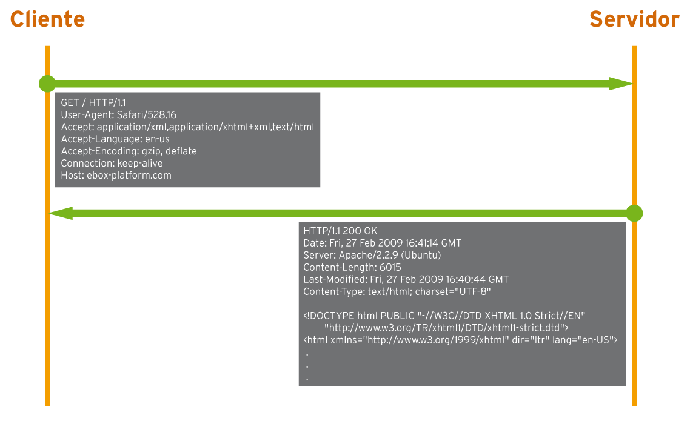
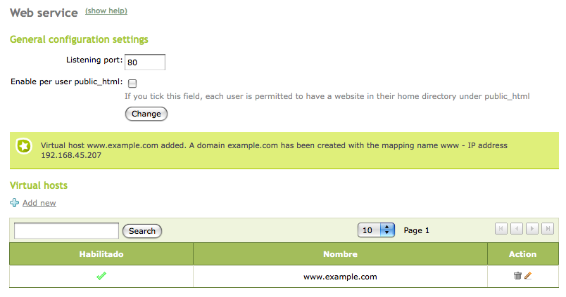

.. _web-section-ref:

Web data publication service (HTTP)
***********************************

.. sectionauthor:: José A. Calvo <jacalvo@ebox-platform.com>
                   Enrique J. Hernández <ejhernandez@ebox-platform.com>
                   Víctor Jiménez <vjimenez@warp.es>

The *Web* is one of the most common services on the Internet, so much that
it has become its visible face for most users.

A website started to become the most convenient way of publishing data on
a network. All that was needed was a web browser, which is installed as
standard in current desktop platforms. A website is easy to create
and can be viewed from any computer.

Over time, the possibilities of web interfaces have improved and
true applications are now available that have nothing to envy of
desktop applications.

But... what is behind the web?

Hyper Text Transfer Protocol
============================

One of the keys to the success of the web has been the application
layer protocol used, **HTTP** (*Hyper Text Transfer Protocol*), as
it is extremely simple yet flexible.

HTTP is a request and response protocol. A client, also known as a *User Agent*,
makes a request to a server. The server processes it and gives a response.

         200 OK response from the server. Routers and *proxies* in between.

   Request schema with GET headers between a client and the
   200 OK response from the server. Routers and *proxies* in between.

By default, HTTP uses TCP port 80 for unencrypted connections and 443 for
encrypted connections (HTTPS) using TLS technology [#]_.

.. [#] TLS (*Transport Layer Security*) and its predecessor SSL (*Secure
       Sockets Layer*) are encryption protocols that provide data
       security and integrity for Internet communications. The
       subject is discussed in further detail in section :ref:`vpn-ref`.

A client request contains the following elements:

* An initial line containing *<method> <resource requested> <HTTP version>*.
  For example, *GET /index.html HTTP/1.1* requests the resource */index.html*
  through GET and using protocol HTTP/1.1.
* Headers, such as *User-Agent: Mozilla/5.0 ... Firefox/3.0.6*, which identify
  the type of client requesting the data.
* A blank line.
* An optional message. This is used, for example, to send files
  to the server using the POST method.

There are several methods [#]_ with which clients can request data. The most
common ones are GET and POST:

.. [#] A more detailed explanation can be found in section 9.
       :RFC:`2616`

GET:
  GET is used to request a resource. It is a harmless method for the
  server, as no file has to be modified in the server if a request is made via
  GET.

POST:
  POST is used to send data to be processed by the server.
  For example, when *Send message* is clicked in a *webmail*, the server is
  given the email data to be sent. The server must process this information
  and send the email.

OPTIONS:
  This is used to request the methods that can be used on a resource.
HEAD:
  Requests the same data as **GET**, although the response will
  not include the text, only the header. Hence, it is possible to obtain
  the metadata of the resource without downloading it.
PUT:
  Requests the text data to be stored and accessible from the
  path indicated.
DELETE:
  Requests the deletion of the resource indicated.
TRACE:
  This informs the server that it must return the header sent by the client.
  It is useful to see how the request is modified by the intermediate *proxies*.
CONNECT:
  The specification reserves this method for tunnels.

The server response has the same structure as the client request,
changing the first row. In this case, the first row
is *<status code> <text reason>*, which corresponds to the response code
and a text with the explanation, respectively.

The most common response codes [#]_ are:

.. [#] The full list of response codes for the HTTP server can be found
       in section 10 of :RFC:`2616`.

200 OK:
  The request has been processed correctly.
403 Forbidden:
  When the client has been authenticated, but does not have permission to
  operate on the resource requested.
404 Not Found:
  When the resource requested has not been found.
500 Internal Server Error:
  When an error has occurred in the server that has prevented the request from
  being correctly run.

HTTP has some **limitations** given its simplicity. It is a
protocol with no state; therefore, the server is unable to remember the
clients between connections. This can be avoided by using
*cookies*. Moreover, the server cannot start a conversation
with the client. Should the client want to be notified by the server
of something, this must be periodically requested.

The HTTP service can offer dynamic data produced by different software
applications. The client requests a certain URL with specific parameters
and the software manages the request to return a result. The first method used
was known as CGI (*Common Gateway Interface*), which runs one command per URL.
This mechanism has mainly been deprecated due to its memory overload and low
performance when compared to other solutions:

*FastCGI*:
  A communication protocol between software applications and the HTTP server,
  with a single process to resolve requests made by the HTTP server.
SCGI (*Simple Common Gateway Interface*):
  This is a simplified version of the *FastCGI* protocol.
Other expansion mechanisms:
  Dependent on the HTTP server allowing the software to be run
  within the server, this solution depends on the HTTP server used.

The Apache Web server
=====================

The **Apache HTTP server** [#]_ has been the most popular program for
serving websites since April 1996. eBox uses this server for both
its web interface and the web server module. Its aim is to
offer a secure, efficient and extendible system in line with
HTTP standards. Its capacity to be extensible is based on adding
features using modules that extend the *core*.

.. [#] Apache HTTP Server project http://httpd.apache.org.

Other programming interfaces include *mod_perl*, *mod_python*,
*TCL* or *PHP*, which allows for websites to be created using programming
languages such as Perl, Python, TCL or PHP. It has several authentication
systems such as *mod_access* and *mod_auth*, among others. Furthermore,
it allows the use of SSL and TLS with *mod_ssl* and provides a proxy module with
*mod_proxy* and a powerful URL rewriting system with
*mod_rewrite*. It has a total of 57 officially documented modules
that add functionality, although this number increases to 168 if you include
those registered for the 2.2 version of Apache [#]_.

.. [#] There is a full list at http://modules.apache.org.

.. _vhost-ref:

Virtual domains
===============

The purpose of a **virtual domain** is to host websites for several domain
names in the same server.

If the server has a public IP address for each website,
a configuration can be made for every network interface. When seen from
outside, they look like several hosts in the same network. The server
will redirect the traffic from each interface to its corresponding website.

However, it is more common to have one or two IPs per host. In this
case, each website will have to be associated with its domain. The web server
will read the headers sent in the client request and, depending on the domain of
the request, will redirect it to one website or another. Each of these
configurations is known as *Virtual Host*, as there is only one host in the network, but the existence of several is simulated.

HTTP server configuration with eBox
===================================

Through :menuselection:`Web`, it is possible to access the web
service configuration.

   Appearance of the **Web** module configuration

In the first form, it is possible to modify the following parameters:

Listening port
  Where the daemon is to listen to HTTP requests.

Enable *public_html* per user
  Through this option, if the **Samba** module
  (:ref:`ebox-samba-ref`) is enabled, users can create a subdirectory
  known as *public_html* in their private directory within **samba**
  that will be displayed by the web server via the URL
  *http://<eboxIP>/~<username>/*, where *username* is the name of the
  user that published contents.

With regard to the :ref:`vhost-ref`, the only configuration needed is the name
for the domain and whether it is enabled or not. When a new domain is created,
simply create an entry in the **DNS** module (if it is installed) so that, if
the domain *www.company.com* is added, the domain *company.com* will be created
with the host name *www*, the IP address of which will be the address of the
first static network interface.

To publish data, it must be under */var/www/<vHostname>*,
where *vHostName* is the name of the virtual domain. If any customized
configuration is to be added, for example capacity to load
applications in Python using *mod_python*, the necessary configuration
files for this virtual domain must be created in the
directory */etc/apache2/sites-available/user-ebox-<vHostName>/*.

Practical example
^^^^^^^^^^^^^^^^^
Enable the web server. Check that it is listening on port 80.
Configure it to listen on a different port and verify that the
change becomes effective.

#. **Action:**
   Access eBox, enter :menuselection:`Module status` and
   enable the :guilabel:`Web server` module by marking the checkbox in the
   :guilabel:`Status` column. This indicates the changes to be made
   in the system. Allow the operation by clicking on the
   :guilabel:`Accept` button.

   Effect:
     The guilabel:`Save changes` button has been enabled.

#. **Action:**
   Save the changes.

   Effect:
     eBox displays the progress while the changes are being applied. Once this
     is complete it indicates as such.

     The web server is enabled by default on port 80.

#. **Action:**
   Using a browser, access the following address:
   `http://eBox_ip/`.

   Effect:
     An **Apache** default page will be displayed with the message *'It
     works!'*.

#. **Action:**
   Access the :menuselection:`Web` menu. Change the port value from 80 to
   1234 and click on the :guilabel:`Change` button.

   Effect:
     The guilabel:`Save changes` button has been enabled.

#. **Action:**
   Save the changes.

   Effect:
     eBox displays the progress while the changes are being applied. Once this
     is complete it indicates as such.

     Now the web server is listening on port 1234.

#. **Action:**
   Use the browser again to try to access `http://<eBox_ip>/`.

   Effect:
     A response is not obtained and, after a while, the browser will indicate
     that it was impossible to connect to the server.

#. **Action:**
   Now try to access `http://<eBox_ip>:1234/`.

   Effect:
     The server responds and the *'It works!'* page is obtained.

.. include:: web-exercises.rst
